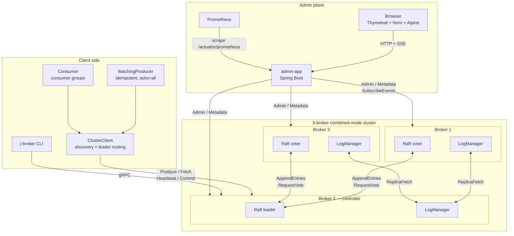

# j-broker

**A log-structured distributed message broker with hand-rolled Raft, written in Java 21.**

j-broker is a Kafka-shaped message broker built from scratch: a Raft-replicated metadata plane, partitioned replicated logs with high-watermark semantics and a `min.insync.replicas` durability floor, consumer groups, idempotent producers, log compaction, mTLS with per-principal ACLs, online cluster membership changes, a cluster-aware failover-transparent client, and a RabbitMQ-management-style web admin UI. No Kafka libraries, no Apache Curator, no Jakarta EE — just Java 21 virtual threads, gRPC, and a small amount of Spring Boot on the admin side. It is a from-scratch distributed log built to production standards, not a Kafka replacement.

**Documentation: [jeremainecheong.github.io/j-broker](https://jeremainecheong.github.io/j-broker/)** — install & deploy, producer/consumer guides with runnable snippets, operations, and security, with live terminal clips throughout.


### System architecture


> Deep-dive diagrams — component view, Kubernetes topology, the produce path, transaction two-phase commit, leader failover, release artifacts: [`docs/architecture/README.md`](docs/architecture/README.md).

> Source: [`docs/diagrams/architecture.drawio`](docs/diagrams/architecture.drawio) — open in [draw.io](https://app.diagrams.net) to edit. Vendor SVG icons live in [`docs/icons/`](docs/icons/).

---

## Why this exists

The goal was to understand distributed systems by writing one rather than reading about one, and to build real fluency in modern Java and concurrency along the way. Kafka was the obvious shape because it packs the broadest surface area into a single bounded artifact: consensus, a replicated log, a fetch protocol, consumer groups, idempotent producers, compaction, an admin plane, observability, ops.

The self-imposed constraint: *no cheating*. No `kafka-clients`, no Kafka server libraries, no Apache Curator, no Jakarta EE. The broker, the client, and the Raft are written from scratch. The only allowances are gRPC + Protobuf for the wire (writing a framing protocol is a different project), Spring Boot for the admin app only (the broker JVM is Spring-free), and Micrometer/Prometheus for metrics export.

The success metric was never feature count — it was *being able to explain every line of behaviour the cluster shows*. That standard drives the design choices documented below and the testing culture in which every "flaky" CI failure gets root-caused rather than rerun.

---

## What it does

**Durability & replication**

- Raft-replicated metadata — topics, partition assignments, producer ids, consumer-group offsets, ACLs, and membership changes survive any minority failure.
- Replicated partition logs — follower pull replication, ISR tracking, high-watermark gating of consumer visibility, `min.insync.replicas` floor on `acks=all`, leader-epoch fencing, ISR-only election.
- Idempotent producer — `(producer_id, epoch, base_sequence)` dedup, rebuilt from the log on restart so it survives failover.
- Transactions — a two-phase coordinator on a compacted internal topic, control-batch markers replicated like data, `read_committed` fetch capped at the last stable offset, and transactional consumer-offset commits, so a consume-transform-produce loop delivers exactly once end to end.
- Log compaction that preserves original absolute offsets, plus time- and size-based retention with per-topic overrides.
- Storage self-protection — CRC-verified crash recovery that logs exactly what it truncates, a disk-headroom watermark that degrades produce to retriable `STORAGE_FULL` instead of filling the volume, an on-disk format marker that refuses data written by a newer broker, and cold backup/restore gated by an offline `verify-log` check.

**Security**

- `auth.mode=mtls` — every gRPC hop is mutual-TLS; the client principal is the certificate CN, extracted at the transport, and principal-less RPCs are rejected before any handler runs.
- ACLs on the Raft metadata log — replicated to every broker, default-deny on produce, fetch, the group coordinator, and every admin path.
- Admin UI/API operator login with bcrypt credentials, revocable bearer tokens, and an audit trail on every mutation.
- The chaos control plane refuses to start without an explicit opt-in and a bearer token on every request.

**Cluster operations**

- Add a broker to a live cluster — it replicates as a non-voting learner and is promoted to Raft voter once its log catches up.
- Decommission — drain a broker's replicas away, then remove its Raft vote.
- Partition reassignment — a durable expand-then-contract driver with a byte-rate throttle on catch-up fetches, cancellable in flight.
- On-demand preferred-leader rebalance.
- All reachable from the REST API, the CLI, and the admin UI.

**Clients**

- `ClusterClient` — bootstrap-list discovery, leader/coordinator routing, `NOT_LEADER` hint following, bounded-backoff retries under a per-call deadline.
- `BatchingProducer` — async size/linger batching with idempotent `acks=all` delivery; a completed future means exactly-once at the reported offsets, through failover.
- `Consumer` — consumer groups with cooperative rebalance, `seek`/`pause`/`resume`, `max.poll.records`, async commits, optional dead-letter routing, and an `isolation.level` switch for `read_committed` polling.
- `TransactionalProducer` — init/begin/send/sendOffsets/commit/abort with an abort-and-retry loop that re-fences on every retry; `TransactionalExactlyOnceIT` kills the transaction coordinator and a partition leader mid-transaction and still requires committed-only, exactly-once, in-order output.
- A protocol-version handshake on first use of every connection, and optional zstd compression of record batches.

**Operations & observability**

- Admin REST + Thymeleaf UI (RabbitMQ-management flavour): topics, partitions with live HWM/LEO, consumer-group lag, Raft state, cluster lifecycle actions, chaos controls, SSE events rail ([admin-app/README.md](admin-app/README.md)).
- Prometheus metrics through a single admin-side scrape point, two auto-provisioned Grafana dashboards, and an opt-in alert pack (seven rules) for Kubernetes.
- [Operator runbooks](deploy/runbooks/README.md) for the six failure modes an operator actually meets.
- Per-principal produce and fetch byte-rate quotas — off by default, denied requests carry a retry-after hint, replication traffic is never charged, and a Redis URL makes the buckets cluster-wide.
- Six custom JFR events on the hot paths.
- A tag-triggered release pipeline: container images to GHCR, the Helm chart as an OCI artifact, client jars to GitHub Packages.

---

## What this is not

Deliberate boundaries, not gaps waiting for a fix:

- **Kafka wire-protocol compatibility** — the founding constraint is no Kafka libraries, and speaking Kafka's frame format would make `kafka-clients` the de-facto test suite for this codebase. The gRPC clients in this repo are the interface.
- **Cross-cluster replication** — one Raft-replicated cluster is the consistency domain this project set out to get right; asynchronous mirroring between clusters is a second, different consistency problem.
- **Tiered storage** — the storage engine is built around local segment files, the page cache, and zero-copy `transferTo`; offloading cold segments to object storage would replace that read path rather than extend it.
- **A schema registry** — records are opaque bytes from producer to consumer; serialization contracts belong to the applications at either end.
- **A stream-processing layer** — the broker stores and moves records; joins, windows, and aggregations live in consumers, where the client API leaves them.

---

## Tech stack

| Layer | Technology | Role |
|---|---|---|
| Language | Java 21 (Temurin) | Virtual threads for all concurrency; records + sealed interfaces + pattern-matching switch for every event/effect/record hierarchy. The broker JVM runs framework-free. |
| Wire protocol | gRPC + Protocol Buffers | Every RPC and record type; single source of truth in [`proto/`](proto/README.md). mTLS optional on every hop; a `buf` job fails PRs on breaking proto changes. |
| Consensus | Hand-written Raft ([`raft-core/`](raft-core/README.md)) | Pure step function, zero dependencies — ArchUnit forbids I/O, threading, Spring, and gRPC imports in the module. Includes learners and config-change entries for live membership changes. |
| Storage | Custom segment files over `java.nio` | `FileChannel` + explicit `force()` for the log (fsync control), `MappedByteBuffer` for sparse indexes (page-cache reads), `transferTo` for zero-copy fetch. |
| Admin backend | Spring Boot | REST under `/api/v1/*`, server-sent events, Thymeleaf rendering. The only Spring JVM in the system. |
| Admin frontend | Thymeleaf + htmx + Alpine.js + Chart.js | Server-rendered pages with partial swaps; no SPA, no bundler, no npm; vendor scripts self-hosted (< 50 KB total client JS). |
| Metrics | Micrometer → Prometheus → Grafana | Broker metrics scraped over gRPC every 5 s and republished as `jbroker_*` gauges; two auto-provisioned dashboards; opt-in PrometheusRule alert pack in the Helm chart. |
| Profiling | JFR custom events, async-profiler | Six hot-path events gated by `event.shouldCommit()` so they cost ~nothing when not recording. |
| Event fan-out / quotas | Redis (hand-rolled RESP client) | Optional: pub/sub bridge so multi-replica admin deployments share one SSE stream, and shared byte-rate quota buckets so per-principal caps hold cluster-wide. The default install never dials Redis — SSE stays in-process and quota buckets stay per-broker. |
| Testing | JUnit 5, jqwik, ArchUnit, Testcontainers, HdrHistogram | Property tests on index math, enforced module boundaries, real-Redis ITs, bench percentiles. |
| Build / CI | Gradle 8.7 (wrapper SHA-verified), GitHub Actions | Every PR runs the full build (unit + integration + two 10,000-seed simulator corpora + VT-pinning checks), perf gates, proto wire-compatibility, and a secured Helm install on a real Kind cluster. |
| Packaging | Docker multi-stage builds, docker compose, Helm, tag-triggered releases | One-command 3-broker cluster; K8s chart with StatefulSet brokers, PDB, anti-affinity, opt-in NetworkPolicy; releases publish GHCR images, an OCI chart, and GitHub Packages jars. |

---

## Quick start

### Docker Compose (recommended)

```bash
docker compose up
```

Or watch the whole system exercise itself — a narrated four-act demo that boots the cluster, runs plain and transactional pipelines, kills a broker mid-transaction, audits exactly-once delivery, and leaves everything running for exploration:

```bash
scripts/demo/full-demo.sh
```

What each act shows and what to explore afterwards: [`scripts/demo/README.md`](scripts/demo/README.md).

| Component | URL / host port |
|---|---|
| **Admin UI** | <http://localhost:15672> |
| Broker 1 (gRPC) | `localhost:9092` |
| Broker 2 (gRPC) | `localhost:9093` |
| Broker 3 (gRPC) | `localhost:9094` |
| Chaos HTTP (opt-in) | `localhost:9100/9101/9102` with `JBROKER_CHAOS_ENABLED=true JBROKER_CHAOS_PORT=9100 JBROKER_CHAOS_TOKEN=<secret>` |

Broker data persists in named volumes `broker{1,2,3}-data`. Wipe with `docker compose down -v`.

Seed a realistic demo (3 topics, a producer loop, a consumer group) for screenshots / exploration:

```bash
docker compose up -d
scripts/demo/seed-for-readme-screenshots.sh
```

### Produce / consume from the CLI

```bash
./gradlew :broker-app:installDist   # builds the CLI used below

./broker-app/build/install/broker-app/bin/broker-app topics create \
  --broker localhost:9092 --topic orders --partitions 3 --replication-factor 3

echo -e "o-1\no-2\no-3" | ./broker-app/build/install/broker-app/bin/broker-app \
  produce --broker localhost:9092 --topic orders --partition 0

./broker-app/build/install/broker-app/bin/broker-app consume \
  --broker localhost:9092 --group order-processor --topic orders
```

Topic creation must reach the controller and produce must reach the partition's leader; when you aim at the wrong broker, the CLI reads the broker's redirect from the refusal and retries once against the right one on its own. Group consume works against any broker. The cluster-aware client below does all of this routing continuously.

Full CLI reference: [broker-app/README.md](broker-app/README.md).

### Prometheus + Grafana

```bash
docker compose -f docker-compose.yml -f docker-compose.monitoring.yml --profile monitoring up
```

Prometheus → <http://localhost:9091>, Grafana → <http://localhost:3000>. Dashboards auto-provisioned.

### Kubernetes (Helm)

```bash
# Build + load the images into a local Kind/minikube cluster:
docker build -f Dockerfile.broker -t jbroker-broker:1.4.0 .
docker build -f Dockerfile.admin  -t jbroker-admin:1.4.0  .
kind load docker-image jbroker-broker:1.4.0 jbroker-admin:1.4.0

# Install with defaults (3-broker plaintext cluster, no TLS, no Redis):
helm install jb deploy/helm/j-broker
kubectl port-forward svc/jb-j-broker-admin 15672:15672
```

Chart reference — values, mTLS setup, NetworkPolicy, ServiceMonitor/alerts: [deploy/helm/j-broker/README.md](deploy/helm/j-broker/README.md). The secured configuration (mTLS + ACL default-deny + admin login, all from Kubernetes Secrets) is installed on a real Kind cluster by CI on every pull request.

### Published artifacts

From the first release onward (the [release pipeline](.github/workflows/release.yml) is dormant until a `v*` tag is pushed):

- **Images** — `ghcr.io/jeremainecheong/jbroker-broker` and `ghcr.io/jeremainecheong/jbroker-admin`; `:latest` tracks stable releases.
- **Helm chart** — `helm install jb oci://ghcr.io/jeremainecheong/charts/j-broker --version <version>`.
- **Client jars** — `io.github.jeremainecheong:{proto,raft-core,raft-transport,broker-storage,broker-core}` from GitHub Packages (`https://maven.pkg.github.com/jeremainecheong/j-broker`). The client classes below live in `broker-core`.

---

## Client usage

A producer needs a bootstrap list and nothing else. `send` returns immediately with a future for the record's absolute offset; a background sender packs records into per-partition batches (64 KiB / 5 ms linger by default) and ships each one with a single idempotent `acks=all` RPC:

```java
import jbroker.broker.client.BatchingProducer;
import jbroker.broker.client.ClusterClient;
import java.util.List;

try (var cluster = new ClusterClient(List.of("localhost:9092", "localhost:9093", "localhost:9094"));
        var producer = BatchingProducer.create(cluster)) {
    long offset = producer.send("orders", 0, "o-1".getBytes()).join();
}
```

A consumer joins a group, polls, and commits; heartbeats, assignment changes, and coordinator discovery all happen inside `poll`:

```java
import jbroker.broker.client.ClusterClient;
import jbroker.broker.client.consumer.*;
import java.time.Duration;
import java.util.List;

var config = ConsumerConfig.builder("order-processor").build();
try (var cluster = new ClusterClient(List.of("localhost:9092", "localhost:9093", "localhost:9094"));
        var consumer = new Consumer<>(config, new StringDeserializer(), new StringDeserializer(), cluster)) {
    consumer.subscribe(List.of("orders"), RebalanceListener.NO_OP);
    while (true) {
        for (var record : consumer.poll(Duration.ofSeconds(1))) {
            System.out.println(record.offset() + ": " + record.value());
        }
        consumer.commitSync();
    }
}
```

A transactional producer makes a consume-transform-produce loop exactly-once end to end: records sent and offsets committed in the same transaction become visible atomically to `read_committed` consumers, or not at all:

```java
import jbroker.broker.client.ClusterClient;
import jbroker.broker.client.TransactionalProducer;
import jbroker.proto.common.TopicPartition;
import java.util.List;
import java.util.Map;

try (var cluster = new ClusterClient(List.of("localhost:9092", "localhost:9093", "localhost:9094"));
        var producer = new TransactionalProducer(cluster, "order-pipeline")) {
    producer.initTransactions();
    producer.beginTransaction();
    producer.send("orders-enriched", 0, "o-1-enriched".getBytes());
    producer.sendOffsetsToTransaction("order-processor",
            Map.of(TopicPartition.newBuilder().setTopic("orders").setPartition(0).build(), 42L));
    producer.commitTransaction();
}
```

The failover contract: when a partition leader or group coordinator moves, the client refreshes its metadata (following the broker's `suggested_leader_*` hints when present) and retries the same idempotent batch against the new leader, which either dedupes it or appends it fresh — so a completed future still means exactly-once at the reported offsets, and the application writes no retry code. `ClientFailoverTransparentIT` proves it: produce and poll loops with zero try/catch run uninterrupted while partition leaders are killed and restarted, and every acked record is consumed exactly once, in order.

---

## Architecture

### Component view (Raft + replication detail)



**Combined mode**: every broker is both a Raft voter (metadata plane) and a data-plane host (partition logs). The Raft leader is the *controller* — it drives topic creation, ISR changes, membership changes, reassignments, and preferred-leader rebalances. Partition leaders for the data plane are a separate (overlapping) election that happens inside the controller via `PartitionChangeRecord`.

---

## How it's built

Each subsystem below links to a module README with the full design detail.

### Raft, from the paper

The consensus core is a pure step function — `RaftCore.step(event) → effects` — with no I/O, no threads, and no clock. The transport layer feeds it events from a single-threaded pump and executes the returned effects (send RPC, fsync state, apply to state machine). It implements pre-vote, conflict-index fast backoff, the §5.4.2 commit rule, fsync-ordered persistent state, and `InstallSnapshot`. Cluster membership is a first-class operation: a joining broker replicates as a non-voting learner and is promoted to voter through a config-change entry once its log catches up.

The purity is load-bearing twice over. It makes every Raft rule unit-testable as `input event → expected effects`, and it lets the deterministic simulator in [`simulator/`](simulator/README.md) drive the *production* consensus code through 10,000 seeded failure scenarios per corpus per CI run — node crashes, message reorders, asymmetric partitions, drops — with `--seed N` reproducing any failure exactly. A second 10,000-seed corpus covers membership-change safety. The simulator caught two real algorithmic bugs on specific seeds that no cluster test would have found: a wrong version of the §5.4.2 commit rule (which can overwrite committed entries across term boundaries) and a wrong version of conflict-index fast backoff (which can truncate committed entries on split-vote paths).

Deep dive: [`raft-core/README.md`](raft-core/README.md) — a paper-shaped reference with pseudocode and a j-broker code reference for every rule, plus a catalogue of the pitfalls each rule exists to prevent.

### The storage engine

Each partition is a directory of segment files (`<base-offset>.log` with `.index` / `.timeindex` sidecars). Appends are sequential writes with fsync at batch boundary; reads resolve through a sparse memory-mapped offset index, then stream segment-to-socket via zero-copy `FileChannel.transferTo`. Retention deletes whole segments past the time or size cutoff (per-topic overrides); crash recovery CRC-verifies segments and truncates torn frames at the tail, logging exactly what it dropped. A disk-headroom watermark turns produces into retriable `STORAGE_FULL` errors before the volume fills, and a `format.version` marker at the data-dir root makes a downgrade onto newer data fail loudly instead of corrupting silently. Record batches can optionally be zstd-compressed by the producer — only the records section is compressed, so replication, recovery scans, and the sparse index keep working on raw bytes.

Compaction keeps the latest value per key, Kafka-style, with one subtlety that separates "works" from "silently breaks every consumer": surviving records keep their **original absolute offsets**. A consumer that committed offset 2 before compaction fetches offset 2 afterwards and gets the next surviving record, not an error — the segment lookup falls forward across the gaps. Deep dive: [`broker-storage/README.md`](broker-storage/README.md).

### Replication and the high watermark

Followers pull from partition leaders (`ReplicaFetch`); the leader tracks each follower's log-end offset and last-fetch time, shrinks/expands the ISR accordingly, and advances the high watermark as `max(prior_hwm, min(LEO across ISR))`. The `max` clamp keeps the HWM monotonic — without it, an ISR shrink can briefly move `min(LEO)` backwards and acked records *visibly disappear*, the worst kind of bug because nothing logs it.

Leader-epoch fencing protects the log across failovers: a deposed leader's appends are rejected with `FENCED_EPOCH`, and a recovering follower calls `OffsetsForLeaderEpoch` and truncates to the returned boundary before fetching again — the only safe way to reconcile divergent logs. `acks=all` produces complete only when the HWM passes the produced offset **and** the ISR still holds at least `min.insync.replicas` members (cluster default 2, per-topic override) — an ISR shrunk to the leader alone gets `NOT_ENOUGH_REPLICAS` before the append rather than a single-copy ack. Election is ISR-only: a partition whose last ISR member dies goes offline with its ISR preserved and recovers onto that member when it returns, instead of promoting a shorter-log replica. Deep dive: [`broker-core/README.md`](broker-core/README.md) §durability model.

### Consumer groups

The protocol is modelled on Kafka's KIP-848 flow: `FindCoordinator` → `ConsumerGroupHeartbeat` (subscribe + receive assignment) → `CommitOffsets` → `FetchOffsets`. The key design idea — the same one Kafka uses — is that the coordinator is *just a partition leader*: `__consumer_offsets` is a regular compacted topic, commits are ordinary appends to it, and coordinator failover is ordinary partition failover followed by replaying the partition into the offset cache. Group state gets the same durability story as any other data, for free. Deep dive: [`broker-core/README.md`](broker-core/README.md) §consumer groups.

### Concurrency: one primitive per contention pattern

The broker holds dozens of long-lived virtual threads converging on shared in-memory state, and each subsystem uses the primitive that fits its contention pattern rather than a blanket `synchronized`:

- **Virtual threads** for one-VT-per-RPC fan-out (cheap park, no pool sizing) — the default for every gRPC handler.
- **A single-threaded event pump** (the `RaftDriver` pattern) where state has too many interlocking invariants to lock individually — all Raft mutations happen on one VT, so the core can't race itself; handlers submit an event and await a future for the response.
- **`ReentrantLock` instead of `synchronized`** on hot paths that do blocking I/O. `synchronized` around `FileChannel` calls pins the carrier OS thread and strangles throughput under load; `ReentrantLock` releases the carrier. CI asserts zero `jdk.VirtualThreadPinned` JFR events across 2,000 concurrent produces + 2,000 fetches (`VtPinningBenchScaleIT`).
- **`ConcurrentHashMap` with epoch fencing** for `GroupCoordinator` membership — lock-free reads, version-stamped invariants instead of a global lock.
- **Per-partition striped locks** in `TopicManager`, so a hot partition never blocks another partition's metadata mutations.
- **`CompletableFuture`** for cross-thread coordination (the `acks=all` HWM wait above) — synchronous-looking blocking code at zero carrier cost when combined with VTs.
- **`AtomicLong`** for monotonic counters (broker epoch, producer-id allocator); **`volatile`** almost nowhere, because one of the above nearly always fits better.

The full thread map — every long-lived VT in the broker JVM annotated with its primitive — is in [`docs/diagrams/broker-threading.png`](docs/diagrams/broker-threading.png) and [`broker-core/README.md`](broker-core/README.md) §threading model.

### Java 21, used in earnest

Every post-records language feature is exercised on real hot paths, not in a demo: pattern-matching switch over sealed `RaftEvent` / `RaftEffect` / `MetadataRecord` hierarchies for compile-time-exhaustive dispatch (adding a record type fails the build at every unhandled site); records for the value types crossing API boundaries; try-with-resources lifecycle discipline down to `ClusterHarness` closing three brokers deterministically; custom JFR events with `shouldCommit()` cost gating; `transferTo` zero-copy fetch; `MappedByteBuffer` sparse indexes; ArchUnit-enforced module boundaries. A JEP-by-JEP walkthrough (444 / 441 / 409 / 395 / 328 plus the relevant `java.nio` APIs) with code references lives in [`broker-core/README.md`](broker-core/README.md) §Java 21.

### Observability from the inside

Six custom JFR events (`RaftTermChange`, `PartitionLeaderChange`, `FsyncDuration`, `ReplicationLag`, `ProduceLatency`, `FetchLatency`) instrument the hot paths, gated by `event.shouldCommit()` so they cost nothing when no recording is active — because every unconditional metric on a hot path is a 1–2 % throughput tax. Micrometer gauges flow through a Prometheus scrape into two auto-provisioned Grafana dashboards. Observability was designed in from the start rather than bolted on, and the instrumentation itself is perf-tested.

### Verification culture

Three layers, each catching a class of bug the others miss:

1. **~865 unit tests** for logic, including property tests (jqwik) on the sparse-index math.
2. **Integration tests against real 3-node loopback clusters** for wiring: coordinator failover, ISR shrink/expand under `acks=all`, broker join and decommission under load, throttled reassignment, dead-broker replacement, cert rotation, graceful rolling restart, failover-transparent client loops, 10k-client smoke.
3. **Deterministic simulation + chaos-under-load** for the bugs that need adversarial scheduling: two 10,000-seed Raft simulator corpora per CI run (chaos, membership changes), and a 10-minute SIGKILL soak (`scripts/chaos/scenario-chaos-with-load.sh`) that kills random brokers under sustained produce/consume load and then audits every acked record.

The operating rule is that **"transient" is not a diagnosis** — every CI failure gets a root-cause fix, never a rerun. That rule has paid for itself repeatedly: failures initially dismissed-looking turned out to be a real fencing liveness bug (a partition leader that never sent a heartbeat could never be fenced), a real dedup-across-failover bug, and a real compaction/concurrent-read race. Patterns permanently hardened against in this tree: port-bind TOCTOU, single-trial perf assertions on shared CI disks, gRPC channel-not-ready on first-election RPCs, VT pinning under load.

### Production hardening

Advertised listeners (brokers in a Docker bridge announce the right host to external clients), mTLS on every gRPC hop with cert-bootstrap scripts and a tested same-CA rotation procedure, a protocol-version handshake so an incompatible client fails loudly at connect instead of obscurely later, a Helm chart hardened with a PodDisruptionBudget, soft anti-affinity, startup probes, opt-in NetworkPolicy lockdown and prometheus-operator objects, controlled shutdown that drains partition leadership before exit, and a release pipeline that stays dormant until a version tag. Plus a deliberate audit discipline: sit down with the running system as a user, write down everything that's wrong, fix all of it. One such audit produced ten fixes; a later one found a view-controller/REST merge divergence that unit tests structurally could not see.

---

## Security

A dev cluster runs plaintext; a broker exposed to a real network authenticates and authorizes:

- **`auth.mode=mtls`** (requires TLS) derives the client principal from the certificate CN at the transport layer and rejects principal-less RPCs before any handler runs.
- **ACLs** — `(principal, topic|group|cluster, name-or-prefix, operation, allow)` — live on the Raft metadata log, replicate to every broker, and enforce default-deny on produce, fetch, the group coordinator, and every admin path. Managed via the `CreateAcl` / `DeleteAcl` / `ListAcls` admin RPCs; `super.users` principals (inter-broker and admin-app identities) bypass checks.
- **Operator login** on the admin UI and API: bcrypt credentials, revocable bearer tokens, an audit trail on every mutation.
- **Chaos gate**: the chaos control plane refuses to bind without an explicit opt-in and rejects requests without the configured bearer token.
- **Secrets, not values**: the Helm chart takes all key material, operator accounts, and the chaos token from Kubernetes Secrets.

CI installs this secured configuration on a real Kind cluster on every pull request and proves that anonymous callers are rejected while a logged-in session reaches a healthy 3-broker cluster over mTLS. Cert rotation under load keeps pre-rotation clients working (`CertRotationIT`, [runbook 5](deploy/runbooks/README.md)).

---

## Operating it

- **Runbooks**: [`deploy/runbooks/README.md`](deploy/runbooks/README.md) covers broker down, disk full, offline partition, lagging consumer group, certificate expiry, and full-cluster cold start — every alert, metric, command, and endpoint in them exists in this repo.
- **Alerts**: opt-in PrometheusRule (`metrics.prometheusRule.enabled` in the [chart values](deploy/helm/j-broker/values.yaml)) with seven rules: under-replicated partitions, replication lag, stalled high watermark, Raft term flapping, unreachable broker, low disk headroom, metrics endpoint down. Failure modes with no backing metric are listed in `values.yaml` as gaps rather than shipped as alerts that can never fire.
- **Dashboards**: two Grafana dashboards (cluster overview, partitions) auto-provisioned by the monitoring compose profile, reusable from [`scripts/monitoring/grafana/dashboards/`](scripts/monitoring/grafana/dashboards/).
- **Cluster lifecycle** from the CLI (the same operations are on the REST API and the admin UI):

```bash
alias j-broker=./broker-app/build/install/broker-app/bin/broker-app

j-broker admin cluster add-broker --id 4 --host broker4 --raft-port 9192 --broker-port 9092
j-broker admin cluster decommission --id 4
j-broker admin cluster reassign --topic orders --partition 0 --replicas 3,2,1
j-broker admin cluster cancel-reassignment --topic orders --partition 0
j-broker admin cluster rebalance-leaders
j-broker admin cluster membership        # join / decommission progress
j-broker admin cluster reassignments     # in-flight reassignments
```

A joining broker catches up as a non-voting learner before receiving a Raft vote; decommission moves every replica off the broker before removing its vote; reassignments run expand-then-contract with a byte-rate throttle so catch-up traffic cannot starve clients.

---

## Admin UI tour

RabbitMQ-management-plugin-inspired dashboard on port 15672. Thymeleaf + htmx + Alpine — no SPA bundler. Full page / component reference: [admin-app/README.md](admin-app/README.md).

### Cluster overview


Summary cards, throughput sparklines, force-directed topology, nodes table. Every live broker shows a concrete role (the view merges self-reports across brokers so peers never stay `UNKNOWN`). Epoch-millis timestamps render as relative time.

### Topics


Topic list with partition counts, replication factor, effective compact flag (OR of the proto field and `cleanup.policy=compact`), creation time.


Per-partition state with ISR pills (green = in-sync), high-watermark + log-end-offset drawn as an offset meter, "Force compact" per partition, "Edit config" modal, delete. HWM/LEO come from a merge across every broker so non-leader sentinels never leak into the UI.

### Consumer groups


Member card shows subscribed topics + owned partitions. Lag table with progress bars, colour-coded by lag size. Reset-offsets + delete-group modals wired to the admin REST.

### Raft / Metrics / Chaos


Raft: per-broker term / commit-index / last-applied / voted-for. Metrics: throughput + p99 latency line charts (5-min window, hydrated from the server-side history ring on load). Chaos: live topology SVG + per-broker kill / pause / force-election / inject-latency buttons, plus the SSE-backed events rail — active only when the brokers run with the chaos opt-in and token.

---

## Modules

Each module has its own README with the design details:

| Module | What's inside |
|---|---|
| [`proto/`](proto/README.md) | `.proto` definitions + generated gRPC stubs. Single source for Producer / Consumer / Admin / Metadata / Cluster / ReplicaConsumer / Raft services. |
| [`raft-core/`](raft-core/README.md) | Pure-Java Raft — step-function, pre-vote, conflict-index backoff, fsync'd state, install-snapshot, learners + config changes. Zero IO/threads/Spring/gRPC (ArchUnit-enforced). |
| [`raft-transport/`](raft-transport/README.md) | gRPC server + outbound peer client + event-loop driver. |
| [`broker-storage/`](broker-storage/README.md) | `LogManager`, `Log`, `LogSegment`, offset/time indexes, leader-epoch checkpoint, compaction + retention, zstd batch codec, format marker, sparse-offset preservation. |
| [`broker-core/`](broker-core/README.md) | Every handler (Produce, Consumer, Admin, ReplicaFetch, Metadata), core state (TopicManager, GroupCoordinator, OffsetCache, ProducerIdRegistry, BrokerFencer, ReassignmentDriver, MembershipController), auth + ACLs, the client (`ClusterClient`, `BatchingProducer`, `Consumer`), JFR events. |
| [`broker-app/`](broker-app/README.md) | `Broker` main + CLI + chaos HTTP endpoints + layered `j-broker.yaml`/env/flag configuration. Spring-free. |
| [`admin-app/`](admin-app/README.md) | Spring Boot REST + Thymeleaf UI + Prometheus scraper + operator auth + Redis pub/sub fanout. |
| [`bench/`](bench/README.md) | `PerfMain` CLI + `ProducerPerfTest`, `ConsumerPerfTest`, `PerfReport`. HdrHistogram + CSV. |
| [`integration-tests/`](integration-tests/README.md) | Real 3-node loopback cluster ITs, stress mode, slow-tag scenarios. |
| [`simulator/`](simulator/README.md) | Deterministic Raft chaos simulator. |

Requires Java 21 (Temurin). Gradle wrapper pinned to 8.7, SHA-256 verified on download.

---

## Performance

Single-broker snapshot on an Apple M2 MacBook Air (16 GB, internal SSD, Darwin 24.2), re-run 2026-07-25 on a warmed broker. End-to-end gRPC, single-record-per-RPC, `acks=1`. See [bench/README.md](bench/README.md) for multi-payload-size tables + `acks=all` variants.

| Workload | rps | MiB/s | p99 |
|---|---|---|---|
| Produce 1KiB | 4,840 | 4.73 | 0.64 ms |
| Consume 1KiB | 36,769 | 35.91 | 124.3 ms |

Consume latency is per-**fetch-RPC**, not per record: each fetch returns up to 1 MiB (hundreds of records), so the p99 is the cost of the largest disk-read + transfer round trips while per-record throughput stays at ~35k/s. Produce latency is per single-record RPC — hence the three-orders-of-magnitude difference.

Regression gate runs on every PR: `.github/workflows/ci.yml` perf-gate jobs assert min-rps + log-append floor (50 MB/s, best-of-3 trials).

---

## Testing

~865 unit tests across `raft-core` (~95), `raft-transport` (~10), `broker-storage` (~75), `broker-core` (~470), `admin-app` (~110), `broker-app` (~110). Add 40 integration tests running real 3-node clusters in `integration-tests/`. `simulator/` adds two deterministic 10,000-seed Raft corpora per run (chaos, membership changes).

```bash
./gradlew test                                  # unit + fast ITs
./gradlew :integration-tests:stressTest         # 100 randomised election cycles
JBROKER_RUN_SLOW_TESTS=1 ./gradlew test         # + 1M-record compaction, 10k concurrent clients, Testcontainers-Redis IT
```

Per-module breakdown in each module's README.

---

## Status

Everything listed under *What it does* is implemented, integration-tested on real 3-node clusters, and exercised by the chaos scenarios in `scripts/chaos/`. The capstone verification is a 10-minute SIGKILL soak under sustained load that audits every acked record afterwards. The latest run with the full write path live: **`acked=8276 consumed=8276 missing=0 duplicated=0` across 15 broker kills** — and the same audit holds with authentication and authorization enabled.

That soak once caught a real acked-record loss ([#115](https://github.com/jeremainecheong/j-broker/issues/115)): wedged DNS starved replication, the ISR shrank to one broker, `acks=all` was satisfied by a single copy, and a shorter-log replica was later promoted over it. Closing it took a six-fix campaign — container logging, channel rebuilds on unresolvable hosts, a `min.insync.replicas` floor, ISR-only election with CAS-guarded metadata, dedup that reflects the log rather than the ack, and lineage-aware replica fetch — with the verification soak itself surfacing the last two. The full derivation of why these close every leg of the loss chain is in [`broker-core/README.md`](broker-core/README.md) §durability model.

No versioned release exists yet. The [release pipeline](.github/workflows/release.yml) is dormant until the first `v*` tag; pushing one publishes the GHCR images, the OCI Helm chart, and the GitHub Packages jars, and creates a GitHub Release with the packaged chart attached.

---

## License

Apache-2.0 — see [LICENSE](LICENSE). j-broker is a personal project, built and tested to the standard described above; evaluate it against your own requirements before trusting it with data you care about.
