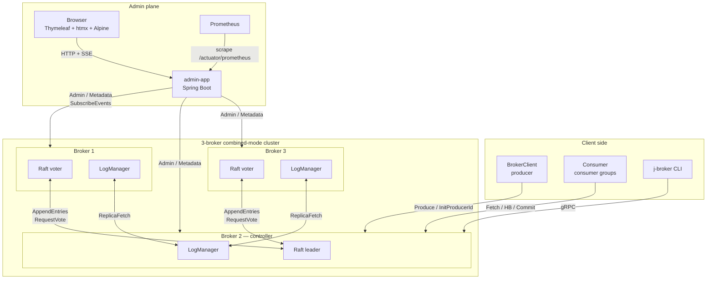

# j-broker

**A log-structured distributed message broker with hand-rolled Raft, written in Java 21.**

j-broker is a Kafka-shaped message broker built from scratch as a learning exercise: a 3-node combined-mode cluster with its own Raft implementation for metadata consensus, Kafka-style partitioned replicated logs with high-watermark semantics, consumer groups with offset commits, idempotent producers, log compaction, and a RabbitMQ-management-style web admin UI. No Kafka libraries, no Apache Curator, no Jakarta EE — just Java 21 virtual threads, gRPC, and a small amount of Spring Boot on the admin side.


### System architecture


> Source: [`docs/diagrams/architecture.drawio`](docs/diagrams/architecture.drawio) — open in [draw.io](https://app.diagrams.net) to edit. Vendor SVG icons live in [`docs/icons/`](docs/icons/).

---

## Why this exists

The goal was to understand distributed systems by writing one rather than reading about one, and to build real fluency in modern Java and concurrency along the way. Kafka was the obvious shape because it packs the broadest surface area into a single bounded artifact: consensus, a replicated log, a fetch protocol, consumer groups, idempotent producers, compaction, an admin plane, observability, ops.

The self-imposed constraint: *no cheating*. No `kafka-clients`, no Kafka server libraries, no Apache Curator, no Jakarta EE. The broker, the client, and the Raft are written from scratch. The only allowances are gRPC + Protobuf for the wire (writing a framing protocol is a different project), Spring Boot for the admin app only (the broker JVM is Spring-free), and Micrometer/Prometheus for metrics export.

The success metric was never feature count — it was *being able to explain every line of behaviour the cluster shows*. That standard drives the design choices documented below and the testing culture in which every "flaky" CI failure gets root-caused rather than rerun.

---

## What it does

- **Durable partitioned log** — per-partition segment files with offset + timestamp indexes, fsync-at-batch-boundary, crash-safe recovery.
- **Raft-replicated metadata** — topic CRUD, partition assignments, producer IDs, consumer-group offsets all survive any minority failure.
- **Replication** — follower ReplicaFetch pulls from leader; ISR tracks in-sync replicas; high-watermark gates consumer visibility; `min.insync.replicas` floors acks=all durability; leader-epoch fencing prevents torn writes on failover; election is ISR-only.
- **Idempotent producer** — `(producer_id, epoch, base_sequence)` triple deduplicates retries server-side; dedup state is rebuilt from the log on restart, so it survives failover.
- **Consumer groups** — join/heartbeat/leave, cooperative-sticky-ish assignment, offset commit + fetch, coordinator-partition sharding over `__consumer_offsets`.
- **Log compaction** — Kafka-style latest-value-per-key; preserves original absolute offsets so pre-compaction consumer offsets still resolve ([broker-storage/README.md](broker-storage/README.md)).
- **Admin REST + Thymeleaf UI** — RabbitMQ-management flavour: list topics, describe partitions with live HWM/LEO, edit topic config, force-compact, reset / delete consumer groups, live-topology chaos controls, SSE events rail ([admin-app/README.md](admin-app/README.md)).
- **Chaos HTTP** — kill / pause / partition / force-election / inject-latency endpoints on each broker, driven from the UI or cURL ([broker-app/README.md](broker-app/README.md)).
- **Prometheus + Grafana** — `/actuator/prometheus` + two auto-provisioned dashboards.
- **JFR + async-profiler** — six custom flight-recorder events on hot paths.
- **Redis quota enforcement + pub/sub admin event fan-out** — cluster-wide byte-rate limits; multi-admin-pod deployments see the same SSE stream.

---

## Tech stack

| Layer | Technology | Role |
|---|---|---|
| Language | Java 21 (Temurin) | Virtual threads for all concurrency; records + sealed interfaces + pattern-matching switch for every event/effect/record hierarchy. The broker JVM runs framework-free. |
| Wire protocol | gRPC + Protocol Buffers | Every RPC and record type; single source of truth in [`proto/`](proto/README.md). mTLS optional on every hop. |
| Consensus | Hand-written Raft ([`raft-core/`](raft-core/README.md)) | Pure step function, zero dependencies — ArchUnit forbids I/O, threading, Spring, and gRPC imports in the module. |
| Storage | Custom segment files over `java.nio` | `FileChannel` + explicit `force()` for the log (fsync control), `MappedByteBuffer` for sparse indexes (page-cache reads), `transferTo` for zero-copy fetch. |
| Admin backend | Spring Boot | REST under `/api/v1/*`, server-sent events, Thymeleaf rendering. The only Spring JVM in the system. |
| Admin frontend | Thymeleaf + htmx + Alpine.js + Chart.js | Server-rendered pages with partial swaps; no SPA, no bundler, no npm; vendor scripts self-hosted (< 50 KB total client JS). |
| Metrics | Micrometer → Prometheus → Grafana | Broker metrics scraped over gRPC every 5 s and republished as `jbroker_*` gauges; two auto-provisioned dashboards. |
| Profiling | JFR custom events, async-profiler | Six hot-path events gated by `event.shouldCommit()` so they cost ~nothing when not recording. |
| Quotas / fan-out | Redis (hand-rolled RESP client) | Cluster-wide byte-rate token buckets, fail-open; pub/sub fan-out so multiple admin pods share one SSE stream. |
| Testing | JUnit 5, jqwik, ArchUnit, Testcontainers, HdrHistogram | Property tests on index math, enforced module boundaries, real-Redis ITs, bench percentiles. |
| Build / CI | Gradle 8.7 (wrapper SHA-verified), GitHub Actions | Unit + integration + perf-gate + VT-pinning-gate + 10k-seed simulator jobs on every PR. |
| Packaging | Docker multi-stage builds, docker compose, Helm | One-command 3-broker cluster; optional monitoring profile; K8s chart with StatefulSet brokers. |

---

## Quick start

### Docker Compose (recommended)

```bash
docker compose up
```

| Component | URL / host port |
|---|---|
| **Admin UI** | <http://localhost:15672> |
| Broker 1 (gRPC) | `localhost:9092` |
| Broker 2 (gRPC) | `localhost:9093` |
| Broker 3 (gRPC) | `localhost:9094` |
| Chaos HTTP (opt-in) | `localhost:9100/9101/9102` when `JBROKER_CHAOS_PORT=9100` is set |

Broker data persists in named volumes `broker{1,2,3}-data`. Wipe with `docker compose down -v`.

Seed a realistic demo (3 topics, a producer loop, a consumer group) for screenshots / exploration:

```bash
JBROKER_CHAOS_PORT=9100 docker compose up -d
scripts/demo/seed-for-readme-screenshots.sh
```

### Produce / consume from the CLI

```bash
./broker-app/build/install/broker-app/bin/broker-app topics create \
  --broker localhost:9092 --topic orders --partitions 3 --replication-factor 3

echo -e "o-1\no-2\no-3" | ./broker-app/build/install/broker-app/bin/broker-app \
  produce --broker localhost:9092 --topic orders --partition 0

./broker-app/build/install/broker-app/bin/broker-app consume \
  --broker localhost:9092 --group order-processor --topic orders
```

Full CLI reference: [broker-app/README.md](broker-app/README.md).

### Prometheus + Grafana

```bash
docker compose -f docker-compose.yml -f docker-compose.monitoring.yml --profile monitoring up
```

Prometheus → <http://localhost:9091>, Grafana → <http://localhost:3000>. Dashboards auto-provisioned.

---

## Architecture

### Component view (Raft + replication detail)



**Combined mode**: every broker is both a Raft voter (metadata plane) and a data-plane host (partition logs). The Raft leader is the *controller* — it drives topic creation, ISR changes, preferred-leader rebalances. Partition leaders for the data plane are a separate (overlapping) election that happens inside the controller via `PartitionChangeRecord`.

---

## How it's built

Each subsystem below links to a module README with the full design detail.

### Raft, from the paper

The consensus core is a pure step function — `RaftCore.step(event) → effects` — with no I/O, no threads, and no clock. The transport layer feeds it events from a single-threaded pump and executes the returned effects (send RPC, fsync state, apply to state machine). It implements pre-vote, conflict-index fast backoff, the §5.4.2 commit rule, fsync-ordered persistent state, and `InstallSnapshot`.

The purity is load-bearing twice over. It makes every Raft rule unit-testable as `input event → expected effects`, and it lets the deterministic simulator in [`simulator/`](simulator/README.md) drive the *production* consensus code through 10,000 seeded failure scenarios per CI run — node crashes, message reorders, asymmetric partitions, drops — with `--seed N` reproducing any failure exactly. The simulator caught two real algorithmic bugs on specific seeds that no cluster test would have found: a wrong version of the §5.4.2 commit rule (which can overwrite committed entries across term boundaries) and a wrong version of conflict-index fast backoff (which can truncate committed entries on split-vote paths).

Deep dive: [`raft-core/README.md`](raft-core/README.md) — a paper-shaped reference with pseudocode and a j-broker code reference for every rule, plus a catalogue of the pitfalls each rule exists to prevent.

### The storage engine

Each partition is a directory of segment files (`<base-offset>.log` with `.index` / `.timeindex` sidecars). Appends are sequential writes with fsync at batch boundary; reads resolve through a sparse memory-mapped offset index, then stream segment-to-socket via zero-copy `FileChannel.transferTo`. Retention deletes whole segments past the time cutoff; crash recovery truncates torn frames at the tail.

Compaction keeps the latest value per key, Kafka-style, with one subtlety that separates "works" from "silently breaks every consumer": surviving records keep their **original absolute offsets**. A consumer that committed offset 2 before compaction fetches offset 2 afterwards and gets the next surviving record, not an error — the segment lookup falls forward across the gaps. Deep dive: [`broker-storage/README.md`](broker-storage/README.md).

### Replication and the high watermark

Followers pull from partition leaders (`ReplicaFetch`); the leader tracks each follower's log-end offset and last-fetch time, shrinks/expands the ISR accordingly, and advances the high watermark as `max(prior_hwm, min(LEO across ISR))`. The `max` clamp keeps the HWM monotonic — without it, an ISR shrink can briefly move `min(LEO)` backwards and acked records *visibly disappear*, the worst kind of bug because nothing logs it.

Leader-epoch fencing protects the log across failovers: a deposed leader's appends are rejected with `FENCED_EPOCH`, and a recovering follower calls `OffsetsForLeaderEpoch` and truncates to the returned boundary before fetching again — the only safe way to reconcile divergent logs. `acks=all` produces complete only when the HWM passes the produced offset **and** the ISR still holds at least `min.insync.replicas` members (cluster default 2, per-topic override) — an ISR shrunk to the leader alone gets `NOT_ENOUGH_REPLICAS` before the append rather than a single-copy ack. Election is ISR-only: a partition whose last ISR member dies goes offline with its ISR preserved and recovers onto that member when it returns, instead of promoting a shorter-log replica. Deep dive: [`broker-core/README.md`](broker-core/README.md) §durability model.

### Consumer groups

The protocol is modelled on Kafka's KIP-848 flow: `FindCoordinator` → `ConsumerGroupHeartbeat` (subscribe + receive assignment) → `CommitOffsets` → `FetchOffsets`. The key design idea — the same one Kafka uses — is that the coordinator is *just a partition leader*: `__consumer_offsets` is a regular compacted topic, commits are ordinary appends to it, and coordinator failover is ordinary partition failover followed by replaying the partition into the offset cache. Group state gets the same durability story as any other data, for free. Deep dive: [`broker-core/README.md`](broker-core/README.md) §consumer groups.

### Concurrency: one primitive per contention pattern

The broker holds dozens of long-lived virtual threads converging on shared in-memory state, and each subsystem uses the primitive that fits its contention pattern rather than a blanket `synchronized`:

- **Virtual threads** for one-VT-per-RPC fan-out (cheap park, no pool sizing) — the default for every gRPC handler.
- **A single-threaded event pump** (the `RaftDriver` pattern) where state has too many interlocking invariants to lock individually — all Raft mutations happen on one VT, so the core can't race itself; handlers submit an event and await a future for the response.
- **`ReentrantLock` instead of `synchronized`** on hot paths that do blocking I/O. `synchronized` around `FileChannel` calls pins the carrier OS thread and strangles throughput under load; `ReentrantLock` releases the carrier. CI asserts zero `jdk.VirtualThreadPinned` JFR events across 2,000 concurrent produces + 2,000 fetches (`VtPinningBenchScaleIT`).
- **`ConcurrentHashMap` with epoch fencing** for `GroupCoordinator` membership — lock-free reads, version-stamped invariants instead of a global lock.
- **Per-partition striped locks** in `TopicManager`, so a hot partition never blocks another partition's metadata mutations.
- **`CompletableFuture`** for cross-thread coordination (the `acks=all` HWM wait above) — synchronous-looking blocking code at zero carrier cost when combined with VTs.
- **`AtomicLong`** for monotonic counters (broker epoch, producer-id allocator); **`volatile`** almost nowhere, because one of the above nearly always fits better.

The full thread map — every long-lived VT in the broker JVM annotated with its primitive — is in [`docs/diagrams/broker-threading.png`](docs/diagrams/broker-threading.png) and [`broker-core/README.md`](broker-core/README.md) §threading model.

### Java 21, used in earnest

Every post-records language feature is exercised on real hot paths, not in a demo: pattern-matching switch over sealed `RaftEvent` / `RaftEffect` / `MetadataRecord` hierarchies for compile-time-exhaustive dispatch (adding a record type fails the build at every unhandled site); records for the ~24 value types crossing API boundaries; try-with-resources lifecycle discipline down to `ClusterHarness` closing three brokers deterministically; custom JFR events with `shouldCommit()` cost gating; `transferTo` zero-copy fetch; `MappedByteBuffer` sparse indexes; ArchUnit-enforced module boundaries. A JEP-by-JEP walkthrough (444 / 441 / 409 / 395 / 328 plus the relevant `java.nio` APIs) with code references lives in [`broker-core/README.md`](broker-core/README.md) §Java 21.

### Observability from the inside

Six custom JFR events (`RaftTermChange`, `PartitionLeaderChange`, `FsyncDuration`, `ReplicationLag`, `ProduceLatency`, `FetchLatency`) instrument the hot paths, gated by `event.shouldCommit()` so they cost nothing when no recording is active — because every unconditional metric on a hot path is a 1–2 % throughput tax. Micrometer gauges flow through a Prometheus scrape into two auto-provisioned Grafana dashboards. Observability was designed in from the start rather than bolted on, and the instrumentation itself is perf-tested.

### Verification culture

Three layers, each catching a class of bug the others miss:

1. **~550 unit tests** for logic, including property tests (jqwik) on the sparse-index math.
2. **~30 integration tests against real 3-node loopback clusters** for wiring: coordinator failover, ISR shrink/expand under `acks=all`, preferred-leader rebalance, compaction round-trips, 10k-client smoke.
3. **Deterministic simulation + chaos-under-load** for the bugs that need adversarial scheduling: 10,000 Raft simulator seeds per CI run, and a 10-minute SIGKILL soak (`scripts/chaos/scenario-chaos-with-load.sh`) that kills random brokers under sustained produce/consume load and then audits every acked record.

The operating rule is that **"transient" is not a diagnosis** — every CI failure gets a root-cause fix, never a rerun. That rule has paid for itself repeatedly: failures initially dismissed-looking turned out to be a real fencing liveness bug (a partition leader that never sent a heartbeat could never be fenced), a real dedup-across-failover bug, and a real compaction/concurrent-read race. Patterns permanently hardened against in this tree: port-bind TOCTOU, single-trial perf assertions on shared CI disks, gRPC channel-not-ready on first-election RPCs, VT pinning under load.

### Production hardening

Advertised listeners (brokers in a Docker bridge announce the right host to external clients), optional mTLS on every gRPC hop with a cert-bootstrap script, a Helm chart whose defaults run a plaintext 3-broker cluster, CI perf gates with best-of-3 floors, and a deliberate post-release audit discipline: sit down with the running system as a user, write down everything that's wrong, fix all of it. One such audit produced ten fixes; a later one found the view-controller/REST merge divergence that unit tests structurally could not see.

---

## Admin UI tour

RabbitMQ-management-plugin-inspired dashboard on port 15672. Thymeleaf + htmx + Alpine — no SPA bundler. Full page / component reference: [admin-app/README.md](admin-app/README.md).

### Cluster overview


Summary cards, throughput sparklines, force-directed topology, nodes table. Every live broker shows a concrete role (the view merges self-reports across brokers so peers never stay `UNKNOWN`). Epoch-millis timestamps render as relative time.

### Topics


Topic list with partition counts, replication factor, effective compact flag (OR of the proto field and `cleanup.policy=compact`), creation time.


Per-partition state with ISR pills (green = in-sync), high-watermark + log-end-offset drawn as an offset meter, "Force compact" per partition, "Edit config" modal, delete. HWM/LEO come from a merge across every broker so non-leader sentinels never leak into the UI.

### Consumer groups


Member card shows subscribed topics + owned partitions. Lag table with progress bars, colour-coded by lag size. Reset-offsets + delete-group modals wired to the admin REST.

### Raft / Metrics / Chaos


Raft: per-broker term / commit-index / last-applied / voted-for. Metrics: throughput + p99 latency line charts (5-min window, hydrated from the server-side history ring on load). Chaos: live topology SVG + per-broker kill / pause / force-election / inject-latency buttons, plus the SSE-backed events rail.

---

## Modules

Each module has its own README with the design details:

| Module | What's inside |
|---|---|
| [`proto/`](proto/README.md) | `.proto` definitions + generated gRPC stubs. Single source for Producer / Consumer / Admin / Metadata / Cluster / ReplicaConsumer / Raft services. |
| [`raft-core/`](raft-core/README.md) | Pure-Java Raft — step-function, pre-vote, conflict-index backoff, fsync'd state, install-snapshot. Zero IO/threads/Spring/gRPC (ArchUnit-enforced). |
| [`raft-transport/`](raft-transport/README.md) | gRPC server + outbound peer client + event-loop driver. |
| [`broker-storage/`](broker-storage/README.md) | `LogManager`, `Log`, `LogSegment`, offset/time indexes, leader-epoch checkpoint, compaction + retention, sparse-offset preservation. |
| [`broker-core/`](broker-core/README.md) | Every handler (Produce, Consumer, Admin, ReplicaFetch, Metadata), core state (TopicManager, GroupCoordinator, OffsetCache, ProducerIdRegistry, BrokerFencer, PreferredLeaderBalancer), quotas, JFR events. |
| [`broker-app/`](broker-app/README.md) | `Broker` main + CLI + chaos HTTP endpoints. Spring-free. |
| [`admin-app/`](admin-app/README.md) | Spring Boot REST + Thymeleaf UI + Prometheus scraper + Redis pub/sub fanout. |
| [`bench/`](bench/README.md) | `PerfMain` CLI + `ProducerPerfTest`, `ConsumerPerfTest`, `PerfReport`. HdrHistogram + CSV. |
| [`integration-tests/`](integration-tests/README.md) | Real 3-node loopback cluster ITs, stress mode, slow-tag scenarios. |
| [`simulator/`](simulator/README.md) | Deterministic Raft chaos simulator. |

Requires Java 21 (Temurin). Gradle wrapper pinned to 8.7, SHA-256 verified on download.

---

## Performance

Single-broker snapshot on Apple-silicon laptop (re-run 2026-07-07). End-to-end gRPC, single-record-per-RPC, `acks=1`. See [bench/README.md](bench/README.md) for multi-payload-size tables + `acks=all` variants.

| Workload | rps | MiB/s | p99 |
|---|---|---|---|
| Produce 1KiB | 5,390 | 5.26 | 0.57 ms |
| Consume 1KiB | 34,651 | 33.84 | 121.8 ms |

Consume latency is per-**fetch-RPC**, not per record: each fetch returns up to 1 MiB (hundreds of records), so the p99 is the cost of the largest disk-read + transfer round trips while per-record throughput stays at ~35k/s. Produce latency is per single-record RPC — hence the three-orders-of-magnitude difference.

Regression gate runs on every PR: `.github/workflows/ci.yml` perf-gate jobs assert min-rps + log-append floor (50 MB/s, best-of-3 trials).

---

## Testing

~550 unit tests across `raft-core` (~80), `raft-transport` (~10), `broker-storage` (~35), `broker-core` (~270), `admin-app` (~70), `broker-app` (~60). Add ~30 integration tests running real 3-node clusters. `simulator/` adds deterministic Raft chaos across 10k seeds per run.

```bash
./gradlew test                                  # unit + fast ITs
./gradlew :integration-tests:stressTest         # 100 randomised election cycles
JBROKER_RUN_SLOW_TESTS=1 ./gradlew test         # + 1M-record compaction, 10k concurrent clients, Testcontainers-Redis IT
```

Per-module breakdown in each module's README.

---

## Status

The broker is feature-complete: everything listed under *What it does* is implemented, integration-tested on real 3-node clusters, and exercised by the chaos scenarios in `scripts/chaos/`. The capstone verification is a 10-minute SIGKILL soak under sustained load that audits every acked record afterwards.

That soak once caught a real acked-record loss ([#115](https://github.com/jeremainecheong/j-broker/issues/115)): wedged DNS starved replication, the ISR shrank to one broker, `acks=all` was satisfied by a single copy, and a shorter-log replica was later promoted over it. Closing it took a six-fix campaign — container logging, channel rebuilds on unresolvable hosts, a `min.insync.replicas` floor, ISR-only election with CAS-guarded metadata, dedup that reflects the log rather than the ack, and lineage-aware replica fetch — with the verification soak itself surfacing the last two. The full derivation of why these close every leg of the loss chain is in [`broker-core/README.md`](broker-core/README.md) §durability model.

Since then the storage and operations lifecycle has been hardened for long-running clusters: time- and size-based retention with per-topic overrides (a follower resuming below the leader's retained log start adopts the leader's earliest batch instead of wedging), a disk-headroom watermark that degrades produces to retriable `STORAGE_FULL` instead of running the disk to zero, CRC-verified crash recovery that logs exactly what it truncates, optional per-topic flush policies, idle-group consumer-offset expiry, layered `j-broker.yaml`/env/flag configuration with a `--validate-config` dry run ([`broker-app/README.md`](broker-app/README.md) §configuration), a cold backup/restore procedure gated by an offline `verify-log` checker, and controlled shutdown that drains partition leadership before exit — a rolling restart under sustained `acks=all` load surfaces zero non-retriable client errors. The latest soak run, with all of that live in the write path: **`acked=8276 consumed=8276 missing=0 duplicated=0` across 15 broker kills**.

A broker exposed to a real network now authenticates and authorizes. With `auth.mode=mtls`, the principal is the client certificate's CN, extracted at the transport and rejected before any handler runs if absent; per-resource ACLs — `(principal, topic|group|cluster, name-or-prefix, operation, allow)` — live on the Raft metadata log, replicate to every broker, and enforce default-deny on produce, fetch, the group coordinator, and every admin path. The admin UI and API sit behind operator login with bcrypt credentials, revocable bearer tokens, and an audit trail on every mutation; the chaos control plane stays off unless explicitly enabled with a bearer token; and the Helm chart takes all key material and operator accounts from Kubernetes Secrets. CI proves the whole thing installs and holds together — a secured install on a real Kind cluster (mTLS + default-deny ACLs + admin login) rejects anonymous callers and serves a logged-in session across three brokers. None of it touched the write path: with authentication and authorization in the build, the same chaos soak audits zero loss (`missing=0 duplicated=0` across 15 kills).

Formerly-known item [#124](https://github.com/jeremainecheong/j-broker/issues/124) (ISR metadata frozen while a partition leader is not the Raft leader) is fixed — client proposals forward from followers to the leader.

---

## License

This is a personal learning project. Unlicensed — feel free to read and learn from it; don't run it in production.
