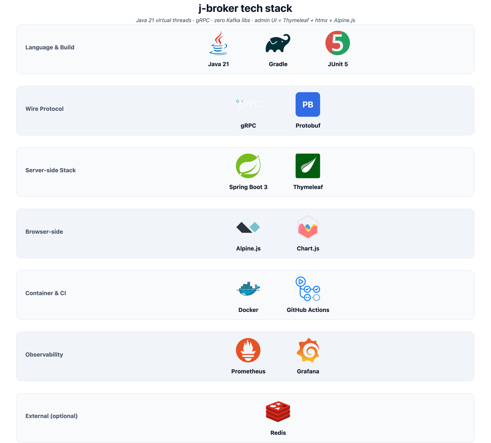
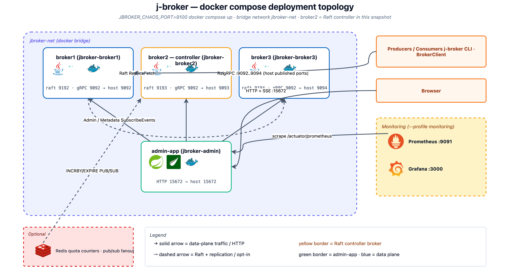
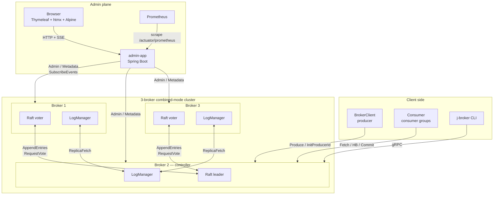

# j-broker

**A log-structured distributed message broker with hand-rolled Raft, written in Java 21.**

j-broker is a Kafka-shaped message broker I built from scratch as a learning exercise. 3-node combined-mode cluster, its own Raft implementation for metadata consensus, Kafka-style partitioned replicated logs with high-watermark semantics, consumer groups with offset commits, idempotent producers, log compaction, and a RabbitMQ-management-style web admin UI. No Kafka libraries, no Apache Curator, no Jakarta EE — just Java 21 virtual threads, gRPC, and a small amount of Spring Boot for the admin side.


### Tech stack



> Source: [`docs/diagrams/tech-stack.drawio`](docs/diagrams/tech-stack.drawio) — open in [draw.io](https://app.diagrams.net) to edit. Vendor SVG icons live in [`docs/icons/`](docs/icons/).

---

## What it does

- **Durable partitioned log** — per-partition segment files with offset + timestamp indexes, fsync-at-batch-boundary, crash-safe recovery.
- **Raft-replicated metadata** — topic CRUD, partition assignments, producer IDs, consumer-group offsets all survive any minority failure.
- **Replication** — follower ReplicaFetch pulls from leader; ISR tracks in-sync replicas; high-watermark gates consumer visibility; leader-epoch fencing prevents torn writes on failover.
- **Idempotent producer** — `(producer_id, epoch, base_sequence)` triple deduplicates retries server-side.
- **Consumer groups** — join/heartbeat/leave, cooperative-sticky-ish assignment, offset commit + fetch, coordinator-partition sharding over `__consumer_offsets`.
- **Log compaction** — Kafka-style latest-value-per-key; preserves original absolute offsets so pre-compaction consumer offsets still resolve ([broker-storage/README.md](broker-storage/README.md)).
- **Admin REST + Thymeleaf UI** — RabbitMQ-management flavour: list topics, describe partitions with live HWM/LEO, edit topic config, force-compact, reset / delete consumer groups, live-topology chaos controls, SSE events rail ([admin-app/README.md](admin-app/README.md)).
- **Chaos HTTP** — kill / pause / partition / force-election / inject-latency endpoints on each broker, driven from the UI or cURL ([broker-app/README.md](broker-app/README.md)).
- **Prometheus + Grafana** — `/actuator/prometheus` + two auto-provisioned dashboards.
- **JFR + async-profiler** — six custom events on hot paths.
- **Redis quota enforcement + pub/sub admin event fan-out** — cluster-wide byte-rate limits; multi-admin-pod deployments see the same SSE stream.

---

## Quick start

### Docker Compose (recommended)

```bash
docker compose up
```

| Component | URL / host port |
|---|---|
| **Admin UI** | <http://localhost:15672> |
| Broker 1 (gRPC) | `localhost:9092` |
| Broker 2 (gRPC) | `localhost:9093` |
| Broker 3 (gRPC) | `localhost:9094` |
| Chaos HTTP (opt-in) | `localhost:9100/9101/9102` when `JBROKER_CHAOS_PORT=9100` is set |

Broker data persists in named volumes `broker{1,2,3}-data`. Wipe with `docker compose down -v`.

Seed a realistic demo (3 topics, a producer loop, a consumer group) for screenshots / exploration:

```bash
JBROKER_CHAOS_PORT=9100 docker compose up -d
scripts/demo/seed-for-readme-screenshots.sh
```

### Produce / consume from the CLI

```bash
./broker-app/build/install/broker-app/bin/broker-app topics create \
  --broker localhost:9092 --topic orders --partitions 3 --replication-factor 3

echo -e "o-1\no-2\no-3" | ./broker-app/build/install/broker-app/bin/broker-app \
  produce --broker localhost:9092 --topic orders --partition 0

./broker-app/build/install/broker-app/bin/broker-app consume \
  --broker localhost:9092 --group order-processor --topic orders
```

Full CLI reference: [broker-app/README.md](broker-app/README.md).

### Prometheus + Grafana

```bash
docker compose -f docker-compose.yml -f docker-compose.monitoring.yml --profile monitoring up
```

Prometheus → <http://localhost:9091>, Grafana → <http://localhost:3000>. Dashboards auto-provisioned.

---

## Admin UI tour

RabbitMQ-management-plugin-inspired dashboard on port 15672. Thymeleaf + htmx + Alpine — no SPA bundler. Full page / component reference: [admin-app/README.md](admin-app/README.md).

### Cluster overview


Summary cards, throughput sparklines, force-directed topology, nodes table. Every live broker shows a concrete role (the view merges self-reports across brokers so peers never stay `UNKNOWN`). Epoch-millis timestamps render as relative time.

### Topics


Topic list with partition counts, replication factor, effective compact flag (OR of the proto field and `cleanup.policy=compact`), creation time.


Per-partition state with ISR pills (green = in-sync), high-watermark + log-end-offset drawn as an offset meter, "Force compact" per partition, "Edit config" modal, delete. HWM/LEO come from a merge across every broker so non-leader sentinels never leak into the UI.

### Consumer groups


Member card shows subscribed topics + owned partitions. Lag table with progress bars, colour-coded by lag size. Reset-offsets + delete-group modals wired to the admin REST.

### Raft / Metrics / Chaos


Raft: per-broker term / commit-index / last-applied / voted-for. Metrics: throughput + p99 latency line charts (5-min window, hydrated from the server-side history ring on load). Chaos: live topology SVG + per-broker kill / pause / force-election / inject-latency buttons, plus the SSE-backed events rail.

---

## Architecture

### Deployment topology



> Source: [`docs/diagrams/deployment.drawio`](docs/diagrams/deployment.drawio).

### Component view



**Combined mode**: every broker is both a Raft voter (metadata plane) and a data-plane host (partition logs). The Raft leader is the *controller* — it drives topic creation, ISR changes, preferred-leader rebalances. Partition leaders for the data plane are a separate (overlapping) election that happens inside the controller via `PartitionChangeRecord`.

---

## Modules

Each module has its own README with the design details:

| Module | What's inside |
|---|---|
| [`proto/`](proto/README.md) | `.proto` definitions + generated gRPC stubs. Single source for Producer / Consumer / Admin / Metadata / Cluster / ReplicaConsumer / Raft services. |
| [`raft-core/`](raft-core/README.md) | Pure-Java Raft — step-function, pre-vote, conflict-index backoff, fsync'd state, install-snapshot. Zero IO/threads/Spring/gRPC (ArchUnit-enforced). |
| [`raft-transport/`](raft-transport/README.md) | gRPC server + outbound peer client + event-loop driver. |
| [`broker-storage/`](broker-storage/README.md) | `LogManager`, `Log`, `LogSegment`, offset/time indexes, leader-epoch checkpoint, compaction + retention, sparse-offset preservation. |
| [`broker-core/`](broker-core/README.md) | Every handler (Produce, Consumer, Admin, ReplicaFetch, Metadata), core state (TopicManager, GroupCoordinator, OffsetCache, ProducerIdRegistry, BrokerFencer, PreferredLeaderBalancer), quotas, JFR events. |
| [`broker-app/`](broker-app/README.md) | `Broker` main + CLI + chaos HTTP endpoints. Spring-free. |
| [`admin-app/`](admin-app/README.md) | Spring Boot REST + Thymeleaf UI + Prometheus scraper + Redis pub/sub fanout. |
| [`bench/`](bench/README.md) | `PerfMain` CLI + `ProducerPerfTest`, `ConsumerPerfTest`, `PerfReport`. HdrHistogram + CSV. |
| [`integration-tests/`](integration-tests/README.md) | Real 3-node loopback cluster ITs, stress mode, slow-tag scenarios. |
| [`simulator/`](simulator/README.md) | Deterministic Raft chaos simulator. |

Requires Java 21 (Temurin). Gradle wrapper pinned to 8.7, SHA-256 verified on download.

---

## Performance

Single-broker snapshot on Apple-silicon laptop. End-to-end gRPC, single-record-per-RPC, `acks=1`. See [bench/README.md](bench/README.md) for multi-payload-size tables + `acks=all` variants.

| Workload | rps | MiB/s | p99 |
|---|---|---|---|
| Produce 1KiB | 5,597 | 5.47 | 0.56 ms |
| Consume 1KiB | 34,922 | 34.10 | 124.72 ms |

Regression gate runs on every PR: `.github/workflows/ci.yml` perf-gate jobs assert min-rps + log-append floor (50 MB/s, best-of-3 trials).

---

## Testing

~550 unit tests across `raft-core` (~80), `raft-transport` (~10), `broker-storage` (~35), `broker-core` (~270), `admin-app` (~70), `broker-app` (~60). Add ~30 integration tests running real 3-node clusters. `simulator/` adds deterministic Raft chaos across 10k seeds per run.

```bash
./gradlew test                                  # unit + fast ITs
./gradlew :integration-tests:stressTest         # 100 randomised election cycles
JBROKER_RUN_SLOW_TESTS=1 ./gradlew test         # + 1M-record compaction, 10k concurrent clients, Testcontainers-Redis IT
```

Per-module breakdown in each module's README.

---

## Roadmap

- [x] **Milestone 0–10** — core broker, Raft, replication, consumer groups, admin UI, observability, Java 21 deep integration.
- [x] **Milestone 11** — Docker + RabbitMQ-style UI polish, snake_case JSON, chaos force-election.
- [x] **Milestone 12** — Perf bench module, sparse-offset compaction, preferred-leader balancer wiring, Redis quota enforcer, admin consumer-group mutations.
- [x] **Milestone 13** — v1.1 correctness-gap closers: force-compact admin RPC, group admin round-trip ITs, 10k-client CI, README bench table, Redis pub/sub SSE fan-out.
- [x] **Milestone 14** — Admin UI reliability: x-cloak modal-flash fix, self-hosted Alpine/htmx/Chart.js, `/metrics/timeseries` hydration ring, coordinator-aware `j-broker consume` CLI.
- [x] **Milestone 15** — Production hardening: advertised listeners, mTLS on gRPC, Helm chart for K8s.
- [x] **Milestone 16** — Admin UI depth + post-merge audit: live chaos topology, view controllers delegate to REST-merge, force-compact + edit-config topic actions, reset-offsets + delete-group actions, unified footer + favicon + relative-time rendering, LAG sentinel em-dash, modal centring (`.modal-overlay` class), Chart.js chart-frame sizing, Compact-column config derivation, Alpine init-race guard, idle `window_seconds: null`.

---

## License

This is a personal learning project. Unlicensed — feel free to read and learn from it; don't run it in production.
