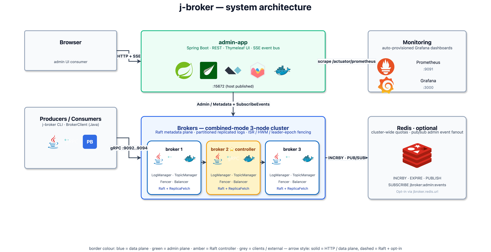
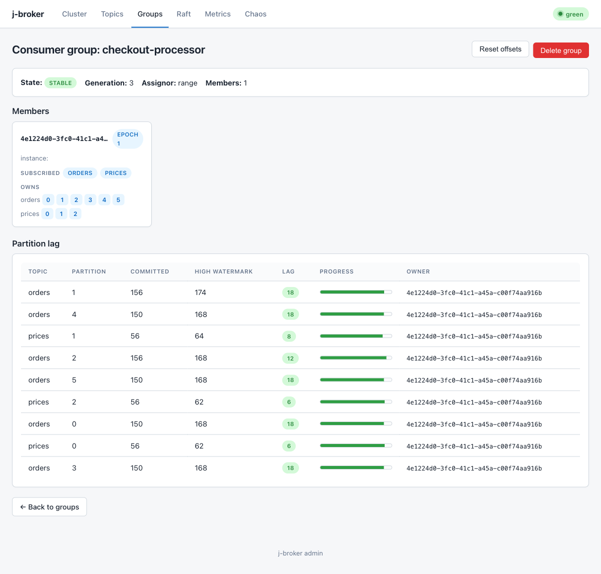
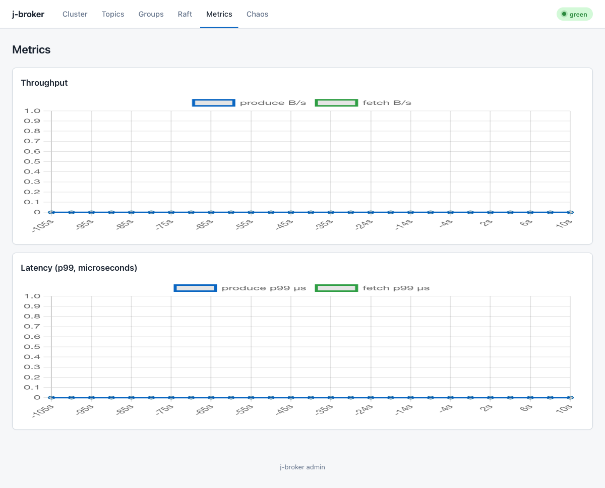
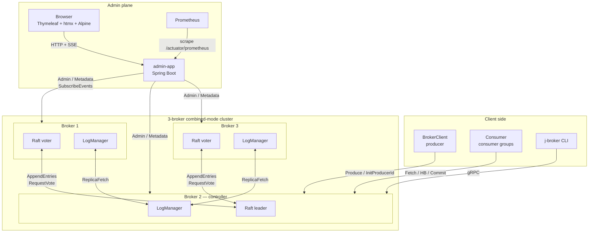

# j-broker

**A log-structured distributed message broker with hand-rolled Raft, written in Java 21.**

j-broker is a Kafka-shaped message broker I built from scratch as a learning exercise. 3-node combined-mode cluster, its own Raft implementation for metadata consensus, Kafka-style partitioned replicated logs with high-watermark semantics, consumer groups with offset commits, idempotent producers, log compaction, and a RabbitMQ-management-style web admin UI. No Kafka libraries, no Apache Curator, no Jakarta EE — just Java 21 virtual threads, gRPC, and a small amount of Spring Boot for the admin side.


### System architecture



> Source: [`docs/diagrams/architecture.drawio`](docs/diagrams/architecture.drawio) — open in [draw.io](https://app.diagrams.net) to edit. Vendor SVG icons live in [`docs/icons/`](docs/icons/).

---

## What I wanted to learn

I built this with three equally serious goals: **understand distributed systems by writing one rather than reading about one**, **master modern Java by exercising every feature it has been adding since I last did this seriously**, and **build real fluency in concurrency** — choosing the right primitive (virtual thread, single-threaded event pump, lock-free map, striped lock, future, atomic) for each contention pattern instead of just defaulting to `synchronized` everywhere. Kafka was the obvious shape because it has the broadest surface area in a single bounded artifact, and a broker is *also* a uniquely good vehicle for the concurrency goal — handlers fan out to thousands of inbound RPCs while shared state, a Raft event loop, and several ticker threads all converge on the same in-memory data structures.

The constraint I gave myself was *no cheating*: no `kafka-clients`, no Apache Curator, no Kafka server libraries, no Jakarta EE; the broker, the client, and the Raft are all written from scratch in Java 21.

Specifically:

- **Raft consensus from the paper, not a library.** Pure step-function (`RaftCore.step(event) → effects`), pre-vote, conflict-index fast backoff, the §5.4.2 commit rule, fsync ordering, snapshots. Why: the figure-8 scenario in §5.4.2 of the paper is the kind of thing you only really understand after you've shipped the wrong version once. Deep dive: [`raft-core/README.md`](raft-core/README.md) — paper-shaped reference with pseudocode + j-broker code references for every rule.
- **Replicated-log semantics done right.** ISR membership, high-watermark monotonicity, leader-epoch fencing on the data plane, idempotent producer dedup that survives leader failover. Why: HWM going backward is silently catastrophic; leader-epoch fencing is the only thing that prevents torn writes on failover. Deep dive: [`broker-core/README.md`](broker-core/README.md) §replication and §HWM advancement.
- **Consumer group protocol modelled on KIP-848.** FindCoordinator → ConsumerGroupHeartbeat → CommitOffsets → FetchOffsets, with `__consumer_offsets` as a regular compacted topic that just happens to back the coordinator role. Why: the conceptual unlock is "the coordinator is just a partition leader." Deep dive: [`broker-core/README.md`](broker-core/README.md) §consumer groups.
- **Mastering modern Java.** Every feature the language has added since records, used in earnest on real hot paths — not a toy demo. Pattern-matching switch on sealed `RaftEvent` / `RaftEffect` / `MetadataRecord` hierarchies for compile-time-exhaustive dispatch; records for every value type that crosses an API boundary (~24 of them); `try-with-resources` lifecycle discipline so closing a `ClusterHarness` reliably shuts down three brokers; JFR custom events with `event.shouldCommit()` cost discipline; `FileChannel.transferTo` zero-copy fetch; `MappedByteBuffer` for sparse indexes; ArchUnit-enforced module boundaries. The goal: be fluent in Java 21 the same way I'd be fluent in any older Java, not just "I read the JEP." Knowing which idioms compose well at this scale and which don't. Deep dive: [`broker-core/README.md`](broker-core/README.md) §Deep dive: Java 21 in j-broker — a JEP-by-JEP walkthrough (JEP 444 / 441 / 409 / 395 / 328 + the relevant `java.nio` APIs) with code references for each.
- **Concurrency: picking the right primitive for each contention pattern.** The broker holds dozens of long-lived virtual threads converging on shared in-memory state. Each subsystem demands a different concurrency choice, and learning *why* was a goal in itself:
  - **Virtual threads** for one-VT-per-RPC fan-out (cheap park, no thread-pool sizing). Default for every gRPC handler.
  - **Single-threaded event pump** (the `RaftDriver` pattern) where state has too many invariants to lock individually — all Raft state mutations happen on one VT, so the core can't race itself. Inbound gRPC handlers submit a request event and `await` a future for the response.
  - **`ReentrantLock` instead of `synchronized`** on hot paths that do blocking I/O — `synchronized` + `FileChannel.read` pins the carrier OS thread; `ReentrantLock` doesn't. The diagnostic is the built-in `jdk.VirtualThreadPinned` JFR event; the CI gate (`E2E_10_2` and `E2E_Audit10_VtPinningBenchScaleIT`) asserts zero pinning across 2 000 concurrent operations.
  - **`ConcurrentHashMap` with epoch fencing** for `GroupCoordinator` membership — lock-free reads, concentrated writes, version-stamped invariants instead of a global lock.
  - **Per-partition striped locks** for `TopicManager` so a hot partition doesn't block every other partition's metadata mutations.
  - **`CompletableFuture` for cross-thread coordination** — every `acks=all` produce holds a future keyed by `(partition, offset)`, completed by whichever VT advances HWM past that offset. Combined with VTs this gives synchronous-looking blocking code at zero carrier cost.
  - **`AtomicLong` and friends** for monotonic counters (broker epoch, producer-id allocator) where lock contention would dominate.
  - **`volatile` only where the memory-model semantics actually fit** — almost never; most of the project reaches for one of the above instead.
  
  The mastery goal here isn't "knows what `synchronized` does" — it's *picking* the right primitive without thinking, then defending the choice when an audit asks why this isn't a `CHM` or that isn't a `ReentrantReadWriteLock`. Where this is most visible: [`docs/diagrams/broker-threading.png`](docs/diagrams/broker-threading.png) — every long-lived VT in the broker JVM mapped to its concurrency primitive — and [`broker-core/README.md`](broker-core/README.md) §threading model.
- **gRPC + Protobuf as the wire.** Every RPC, every record type, single source of truth in [`proto/`](proto/README.md). Plus the lessons: channel-READY is not the same as TCP accept; batched produce gives ~150× throughput over per-record RPCs; zero-copy decode via `ByteString` slicing.
- **Observability from the inside.** Six custom JFR events (`RaftTermChange`, `PartitionLeaderChange`, `FsyncDuration`, `ReplicationLag`, `ProduceLatency`, `FetchLatency`) gated by `event.shouldCommit()` so they cost nothing when not recording. Plus Micrometer → Prometheus → auto-provisioned Grafana dashboards. Why: every metric on a hot path is a 1–2 % throughput tax — observability has to be designed in, not bolted on.
- **A deterministic chaos simulator.** The pure step-function design lets `simulator/` drive `RaftCore` directly with seeded random scenarios — node crashes, message reorders, asymmetric partitions, message drops — across 10 000 seeds per CI run, with `--seed N` reproducing any failure exactly. Why: real-cluster ITs alone catch deployment bugs but miss algorithmic bugs that need exhaustive scenario coverage. The simulator caught the wrong version of the §5.4.2 commit rule and the wrong version of the conflict-index fast-backoff rule on specific seeds.
- **A no-flake testing culture.** Every CI failure gets a root-cause fix, not a rerun. "Transient" is not a diagnosis. Patterns hardened against in this tree: port-bind TOCTOU, single-trial perf assertions on shared CI disks, gRPC-channel-not-ready-yet on first-election RPC, virtual-thread pinning under load. Why: every "transient" failure I've ever shipped without root-causing has come back at the worst time.
- **Production hardening as a discipline, not a feature.** Advertised listeners (so brokers in a Docker bridge announce the right host to external clients), mTLS on every gRPC hop, a Helm chart with sensible defaults, CI perf gates with generous-but-meaningful floors, an audit pass after each major release that turned into 10 numbered fix items. Deep dive: [LEARNINGS.md](LEARNINGS.md) §17 (gitignored personal retrospective).

The success metric I told myself was not "ship a lot of features" but "be able to explain every line of behaviour the cluster shows." That's the throughline for every architectural decision in the project.

For the full multi-iteration retrospective with what was hard, what surprised me, and what I'd do differently — see [`LEARNINGS.md`](LEARNINGS.md) at the repo root (gitignored personal doc). For the algorithmic and language-feature deep dives — see [`raft-core/README.md`](raft-core/README.md) (Raft paper-shaped reference) and [`broker-core/README.md`](broker-core/README.md) (Java 21 JEP-shaped reference).

---

## What it does

- **Durable partitioned log** — per-partition segment files with offset + timestamp indexes, fsync-at-batch-boundary, crash-safe recovery.
- **Raft-replicated metadata** — topic CRUD, partition assignments, producer IDs, consumer-group offsets all survive any minority failure.
- **Replication** — follower ReplicaFetch pulls from leader; ISR tracks in-sync replicas; high-watermark gates consumer visibility; leader-epoch fencing prevents torn writes on failover.
- **Idempotent producer** — `(producer_id, epoch, base_sequence)` triple deduplicates retries server-side.
- **Consumer groups** — join/heartbeat/leave, cooperative-sticky-ish assignment, offset commit + fetch, coordinator-partition sharding over `__consumer_offsets`.
- **Log compaction** — Kafka-style latest-value-per-key; preserves original absolute offsets so pre-compaction consumer offsets still resolve ([broker-storage/README.md](broker-storage/README.md)).
- **Admin REST + Thymeleaf UI** — RabbitMQ-management flavour: list topics, describe partitions with live HWM/LEO, edit topic config, force-compact, reset / delete consumer groups, live-topology chaos controls, SSE events rail ([admin-app/README.md](admin-app/README.md)).
- **Chaos HTTP** — kill / pause / partition / force-election / inject-latency endpoints on each broker, driven from the UI or cURL ([broker-app/README.md](broker-app/README.md)).
- **Prometheus + Grafana** — `/actuator/prometheus` + two auto-provisioned dashboards.
- **JFR + async-profiler** — six custom events on hot paths.
- **Redis quota enforcement + pub/sub admin event fan-out** — cluster-wide byte-rate limits; multi-admin-pod deployments see the same SSE stream.

---

## Quick start

### Docker Compose (recommended)

```bash
docker compose up
```

| Component | URL / host port |
|---|---|
| **Admin UI** | <http://localhost:15672> |
| Broker 1 (gRPC) | `localhost:9092` |
| Broker 2 (gRPC) | `localhost:9093` |
| Broker 3 (gRPC) | `localhost:9094` |
| Chaos HTTP (opt-in) | `localhost:9100/9101/9102` when `JBROKER_CHAOS_PORT=9100` is set |

Broker data persists in named volumes `broker{1,2,3}-data`. Wipe with `docker compose down -v`.

Seed a realistic demo (3 topics, a producer loop, a consumer group) for screenshots / exploration:

```bash
JBROKER_CHAOS_PORT=9100 docker compose up -d
scripts/demo/seed-for-readme-screenshots.sh
```

### Produce / consume from the CLI

```bash
./broker-app/build/install/broker-app/bin/broker-app topics create \
  --broker localhost:9092 --topic orders --partitions 3 --replication-factor 3

echo -e "o-1\no-2\no-3" | ./broker-app/build/install/broker-app/bin/broker-app \
  produce --broker localhost:9092 --topic orders --partition 0

./broker-app/build/install/broker-app/bin/broker-app consume \
  --broker localhost:9092 --group order-processor --topic orders
```

Full CLI reference: [broker-app/README.md](broker-app/README.md).

### Prometheus + Grafana

```bash
docker compose -f docker-compose.yml -f docker-compose.monitoring.yml --profile monitoring up
```

Prometheus → <http://localhost:9091>, Grafana → <http://localhost:3000>. Dashboards auto-provisioned.

---

## Admin UI tour

RabbitMQ-management-plugin-inspired dashboard on port 15672. Thymeleaf + htmx + Alpine — no SPA bundler. Full page / component reference: [admin-app/README.md](admin-app/README.md).

### Cluster overview


Summary cards, throughput sparklines, force-directed topology, nodes table. Every live broker shows a concrete role (the view merges self-reports across brokers so peers never stay `UNKNOWN`). Epoch-millis timestamps render as relative time.

### Topics


Topic list with partition counts, replication factor, effective compact flag (OR of the proto field and `cleanup.policy=compact`), creation time.


Per-partition state with ISR pills (green = in-sync), high-watermark + log-end-offset drawn as an offset meter, "Force compact" per partition, "Edit config" modal, delete. HWM/LEO come from a merge across every broker so non-leader sentinels never leak into the UI.

### Consumer groups




Member card shows subscribed topics + owned partitions. Lag table with progress bars, colour-coded by lag size. Reset-offsets + delete-group modals wired to the admin REST.

### Raft / Metrics / Chaos





Raft: per-broker term / commit-index / last-applied / voted-for. Metrics: throughput + p99 latency line charts (5-min window, hydrated from the server-side history ring on load). Chaos: live topology SVG + per-broker kill / pause / force-election / inject-latency buttons, plus the SSE-backed events rail.

---

## Architecture

### Component view (Raft + replication detail)



**Combined mode**: every broker is both a Raft voter (metadata plane) and a data-plane host (partition logs). The Raft leader is the *controller* — it drives topic creation, ISR changes, preferred-leader rebalances. Partition leaders for the data plane are a separate (overlapping) election that happens inside the controller via `PartitionChangeRecord`.

---

## Modules

Each module has its own README with the design details:

| Module | What's inside |
|---|---|
| [`proto/`](proto/README.md) | `.proto` definitions + generated gRPC stubs. Single source for Producer / Consumer / Admin / Metadata / Cluster / ReplicaConsumer / Raft services. |
| [`raft-core/`](raft-core/README.md) | Pure-Java Raft — step-function, pre-vote, conflict-index backoff, fsync'd state, install-snapshot. Zero IO/threads/Spring/gRPC (ArchUnit-enforced). |
| [`raft-transport/`](raft-transport/README.md) | gRPC server + outbound peer client + event-loop driver. |
| [`broker-storage/`](broker-storage/README.md) | `LogManager`, `Log`, `LogSegment`, offset/time indexes, leader-epoch checkpoint, compaction + retention, sparse-offset preservation. |
| [`broker-core/`](broker-core/README.md) | Every handler (Produce, Consumer, Admin, ReplicaFetch, Metadata), core state (TopicManager, GroupCoordinator, OffsetCache, ProducerIdRegistry, BrokerFencer, PreferredLeaderBalancer), quotas, JFR events. |
| [`broker-app/`](broker-app/README.md) | `Broker` main + CLI + chaos HTTP endpoints. Spring-free. |
| [`admin-app/`](admin-app/README.md) | Spring Boot REST + Thymeleaf UI + Prometheus scraper + Redis pub/sub fanout. |
| [`bench/`](bench/README.md) | `PerfMain` CLI + `ProducerPerfTest`, `ConsumerPerfTest`, `PerfReport`. HdrHistogram + CSV. |
| [`integration-tests/`](integration-tests/README.md) | Real 3-node loopback cluster ITs, stress mode, slow-tag scenarios. |
| [`simulator/`](simulator/README.md) | Deterministic Raft chaos simulator. |

Requires Java 21 (Temurin). Gradle wrapper pinned to 8.7, SHA-256 verified on download.

---

## Performance

Single-broker snapshot on Apple-silicon laptop. End-to-end gRPC, single-record-per-RPC, `acks=1`. See [bench/README.md](bench/README.md) for multi-payload-size tables + `acks=all` variants.

| Workload | rps | MiB/s | p99 |
|---|---|---|---|
| Produce 1KiB | 5,597 | 5.47 | 0.56 ms |
| Consume 1KiB | 34,922 | 34.10 | 124.72 ms |

Regression gate runs on every PR: `.github/workflows/ci.yml` perf-gate jobs assert min-rps + log-append floor (50 MB/s, best-of-3 trials).

---

## Testing

~550 unit tests across `raft-core` (~80), `raft-transport` (~10), `broker-storage` (~35), `broker-core` (~270), `admin-app` (~70), `broker-app` (~60). Add ~30 integration tests running real 3-node clusters. `simulator/` adds deterministic Raft chaos across 10k seeds per run.

```bash
./gradlew test                                  # unit + fast ITs
./gradlew :integration-tests:stressTest         # 100 randomised election cycles
JBROKER_RUN_SLOW_TESTS=1 ./gradlew test         # + 1M-record compaction, 10k concurrent clients, Testcontainers-Redis IT
```

Per-module breakdown in each module's README.

---

## Roadmap

- [x] **Phase 0–10** — core broker, Raft, replication, consumer groups, admin UI, observability, Java 21 deep integration.
- [x] **Phase 11** — Docker + RabbitMQ-style UI polish, snake_case JSON, chaos force-election.
- [x] **Phase 12** — Perf bench module, sparse-offset compaction, preferred-leader balancer wiring, Redis quota enforcer, admin consumer-group mutations.
- [x] **Phase 13** — v1.1 correctness-gap closers: force-compact admin RPC, group admin round-trip ITs, 10k-client CI, README bench table, Redis pub/sub SSE fan-out.
- [x] **Phase 14** — Admin UI reliability: x-cloak modal-flash fix, self-hosted Alpine/htmx/Chart.js, `/metrics/timeseries` hydration ring, coordinator-aware `j-broker consume` CLI.
- [x] **Phase 15** — Production hardening: advertised listeners, mTLS on gRPC, Helm chart for K8s.
- [x] **Phase 16** — Admin UI depth + post-merge audit: live chaos topology, view controllers delegate to REST-merge, force-compact + edit-config topic actions, reset-offsets + delete-group actions, unified footer + favicon + relative-time rendering, LAG sentinel em-dash, modal centring (`.modal-overlay` class), Chart.js chart-frame sizing, Compact-column config derivation, Alpine init-race guard, idle `window_seconds: null`.

---

## License

This is a personal learning project. Unlicensed — feel free to read and learn from it; don't run it in production.
