# j-broker

**A log-structured distributed message broker with hand-rolled Raft, written in Java 21.**

j-broker is a Kafka-shaped message broker that I built from scratch as a learning exercise. It runs as a 3-node combined-mode cluster with its own Raft implementation for metadata consensus, Kafka-style partitioned replicated logs with high-watermark semantics, consumer groups with offset commits, idempotent producers, log compaction, and a RabbitMQ-management-style web admin UI. No Kafka libraries, no Apache Curator, no Jakarta EE — just Java 21 virtual threads, gRPC, and a small amount of Spring Boot for the admin side.

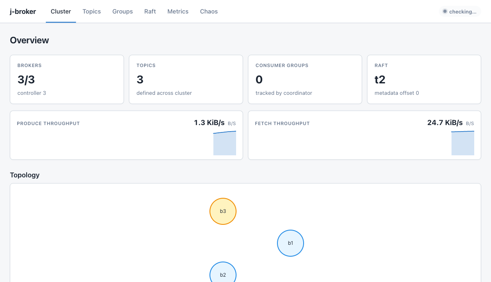

---

## Table of contents

- [What it does](#what-it-does)
- [Quick start](#quick-start)
- [Admin UI tour](#admin-ui-tour)
- [Architecture](#architecture)
- [Feature deep dives](#feature-deep-dives)
  - [Topics + partitions](#topics--partitions)
  - [Producing (acks, idempotent producer)](#producing-acks-idempotent-producer)
  - [Consuming + consumer groups](#consuming--consumer-groups)
  - [Replication (ISR, HWM, fenced epochs)](#replication-isr-hwm-fenced-epochs)
  - [Raft metadata consensus](#raft-metadata-consensus)
  - [Broker heartbeats + fencer](#broker-heartbeats--fencer)
  - [Preferred-leader balancer](#preferred-leader-balancer)
  - [Log compaction + sparse offsets](#log-compaction--sparse-offsets)
  - [Log retention](#log-retention)
  - [Admin REST surface](#admin-rest-surface)
  - [Admin UI pages](#admin-ui-pages)
  - [Server-Sent Events + Redis pub/sub fan-out](#server-sent-events--redis-pubsub-fan-out)
  - [Quota enforcement](#quota-enforcement)
  - [Metrics, JFR, Prometheus](#metrics-jfr-prometheus)
  - [Chaos testing](#chaos-testing)
  - [Bench harness](#bench-harness)
- [CLI reference](#cli-reference)
- [REST reference](#rest-reference)
- [Performance](#performance)
- [Testing](#testing)
- [Modules](#modules)
- [Roadmap](#roadmap)
- [License](#license)

---

## What it does

- **Durable partitioned log** — per-partition segment files with offset + timestamp indexes, fsync-at-batch-boundary, crash-safe recovery.
- **Raft-replicated metadata** — topic CRUD, partition assignments, producer IDs, consumer-group offsets all survive any minority failure.
- **Replication** — follower ReplicaFetch pulls from leader; ISR tracks in-sync replicas; high-watermark gates consumer visibility; leader-epoch fencing prevents torn writes on failover.
- **Idempotent producer** — `(producer_id, epoch, base_sequence)` triple deduplicates retries server-side.
- **Consumer groups** — join/heartbeat/leave, cooperative-sticky-ish assignment, offset commit + fetch, coordinator-partition sharding over `__consumer_offsets`.
- **Log compaction** — Kafka-style latest-value-per-key; preserves original absolute offsets so pre-compaction consumer offsets still resolve (P12.4).
- **Admin REST + Thymeleaf UI** — RabbitMQ-management-plugin flavour: list topics, describe partitions, force-compact, reset/delete consumer groups, Raft state, metrics sparklines, chaos controls.
- **Chaos HTTP** — kill / pause / network-partition / force-election endpoints on each broker, driven from the admin Chaos page or cURL.
- **Prometheus + Grafana** — `/actuator/prometheus` on admin-app, two dashboards auto-provisioned.
- **JFR + async-profiler** — six custom JFR events on hot paths (`RaftTermChange`, `PartitionLeaderChange`, `FsyncDuration`, `ReplicationLag`, `ProduceLatency`, `FetchLatency`).
- **Redis quota enforcement** — cluster-wide produce/fetch byte-rate limiting with fail-open fallback to in-memory.
- **Redis pub/sub admin event fan-out** — multi-admin-pod deployments see the same event stream (P13.7).

---

## Quick start

### Docker Compose (recommended)

```bash
docker compose up
```

Brings up a 3-broker cluster + admin UI in an isolated bridge network:

| Component | URL / host port |
|---|---|
| **Admin UI** | <http://localhost:15672> |
| Broker 1 (gRPC) | `localhost:9092` |
| Broker 2 (gRPC) | `localhost:9093` |
| Broker 3 (gRPC) | `localhost:9094` |
| Chaos HTTP (opt-in) | `localhost:9100/9101/9102` when `JBROKER_CHAOS_PORT=9100` is set |

Broker data (Raft state + partition logs) persists in named volumes `broker{1,2,3}-data`. Wipe with `docker compose down -v`.

Enable chaos endpoints for failure-injection testing:

```bash
JBROKER_CHAOS_PORT=9100 docker compose up
```

### Gradle single-broker dev

```bash
./gradlew :broker-app:installDist
./broker-app/build/install/broker-app/bin/broker-app server \
  --data-dir /tmp/broker --broker-port 9092 --raft-port 9192
```

Combined with the admin app:

```bash
./gradlew :admin-app:bootRun                   # binds :9090
# browser → http://localhost:9090
```

### Produce / consume from the CLI

```bash
# Create a topic
./broker-app/build/install/broker-app/bin/broker-app topics create \
  --broker localhost:9092 --topic orders --partitions 3 --replication-factor 3

# Produce (stdin, one record per line)
echo -e "o-1\no-2\no-3" | ./broker-app/build/install/broker-app/bin/broker-app \
  produce --broker localhost:9092 --topic orders --partition 0

# Consume
./broker-app/build/install/broker-app/bin/broker-app console-consumer \
  --broker localhost:9092 --topic orders --partition 0 --from-beginning
```

### Prometheus + Grafana

```bash
docker compose -f docker-compose.yml -f docker-compose.monitoring.yml --profile monitoring up
```

- **Prometheus** → <http://localhost:9091>
- **Grafana** → <http://localhost:3000> (anonymous admin)
- Dashboards auto-provisioned from `scripts/monitoring/grafana/dashboards/`.

---

## Admin UI tour

The admin UI is a RabbitMQ-management-plugin-inspired dashboard served from `admin-app` on port `15672`. Thymeleaf templates + htmx + Alpine.js — no SPA bundler.

### Cluster overview

High-level counts, live throughput, and a force-directed topology of the cluster. Controller (Raft leader) is rendered with a yellow ring.


### Topics

List of user + internal topics with partition counts, replication factor, compact-policy flag, and creation time.

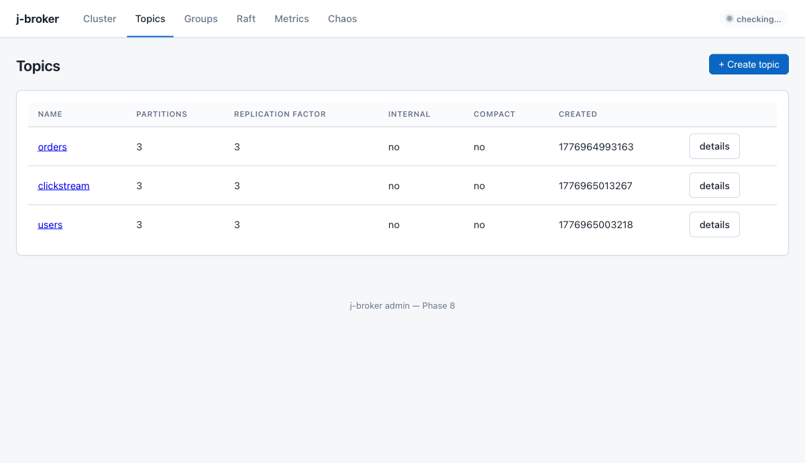

Creating a topic uses a modal that posts `{name, partitions, replication_factor, config}` to `POST /api/v1/topics`.

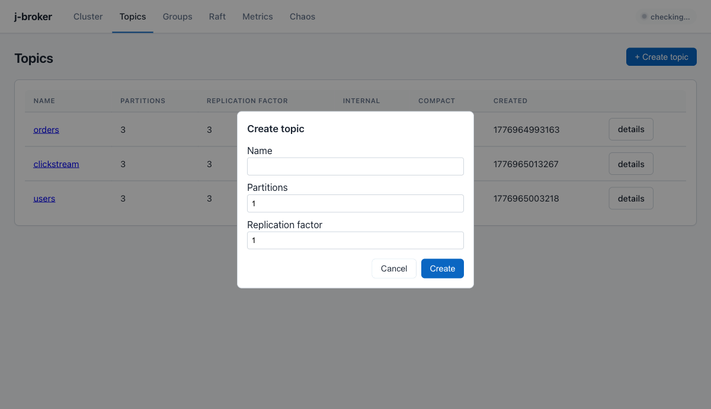

### Topic detail

Per-partition state: leader broker, leader epoch, ISR (green pills for in-sync replicas), high-watermark and log-end-offset when the partition has a live leader.

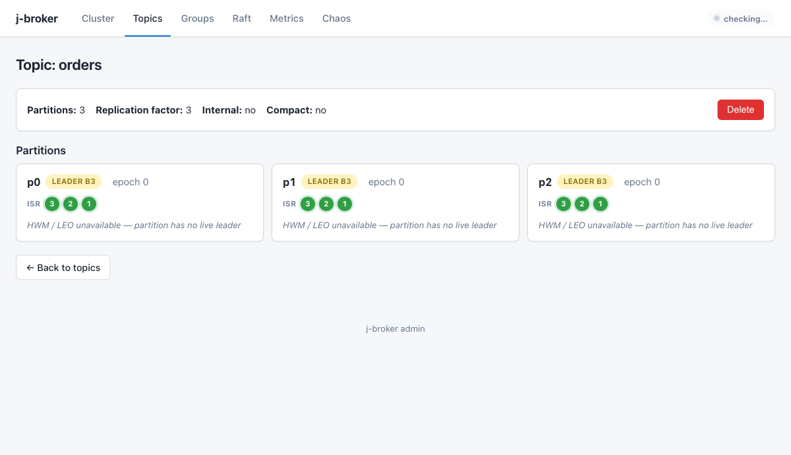

Force-compact sends `POST /api/v1/topics/{name}/partitions/{p}/compact`, fans across every broker hosting the partition, sums the retained counts and returns `{records_kept, brokers_compacted}`.

### Consumer groups

Lists every group tracked by the coordinator with state, member count, generation, and the `__consumer_offsets` partition that owns it. The group detail view (not pictured, populates when a real consumer joins) shows members, assigned partitions, and per-partition lag.

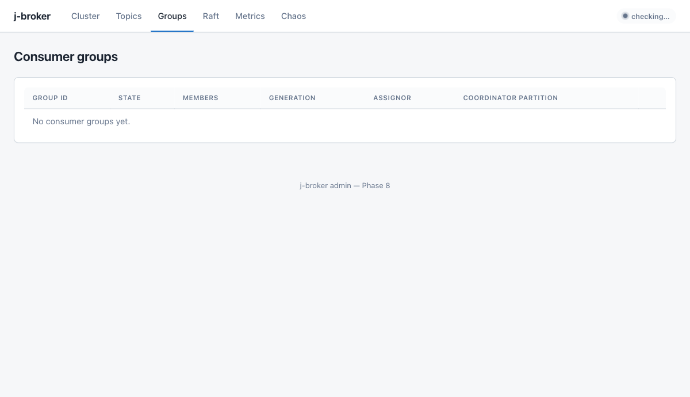

### Raft

Per-broker Raft state — current role, term, commit index, last applied, voted-for, log end — pulled via `Metadata.DescribeRaft` and fanned across every broker.

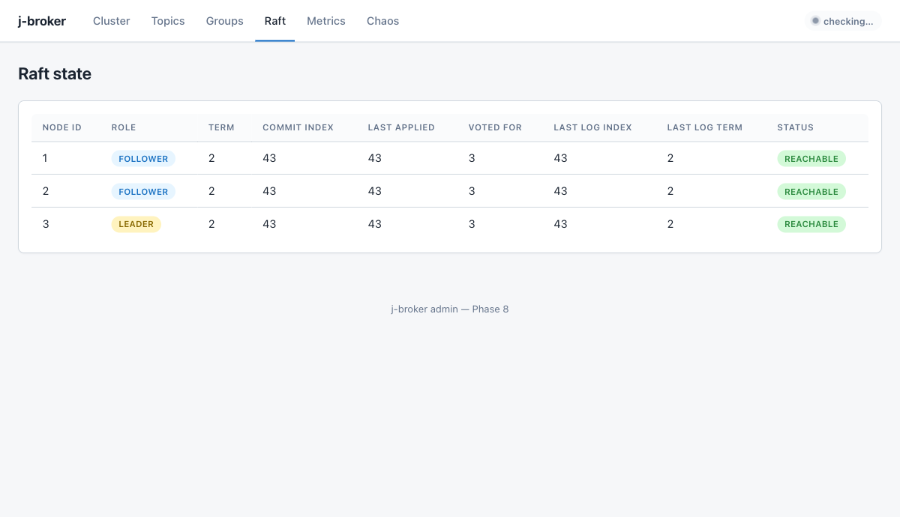

### Chaos

Live failure-injection controls. Requires `JBROKER_CHAOS_PORT` to be set in the compose env. Actions:

- **Kill** a broker (process exits, Docker's restart policy brings it back).
- **Pause / Resume** — freezes the broker's reactor without closing sockets, so heartbeats stop flowing.
- **Force election** — sends the broker a self-addressed `TimeoutNow` to trigger immediate candidate transition.
- **Network partition** — bidirectional block between two brokers on the gRPC plane.
- The SSE-backed **Live events** panel on the right replays broker events as they happen.

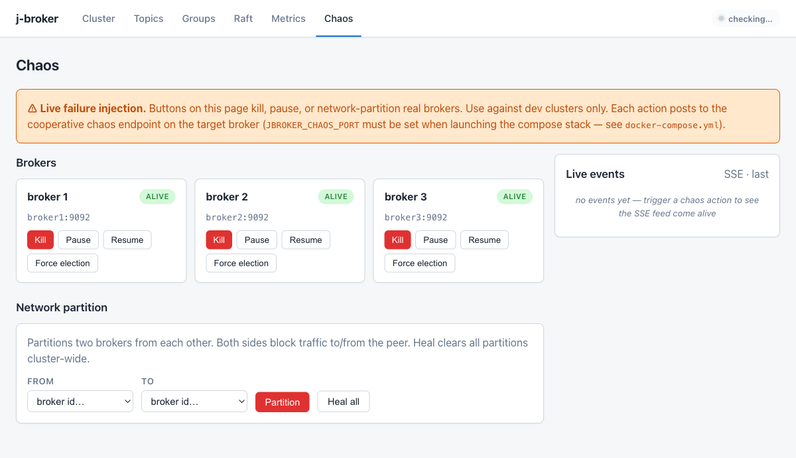

---

## Architecture

### High-level system view

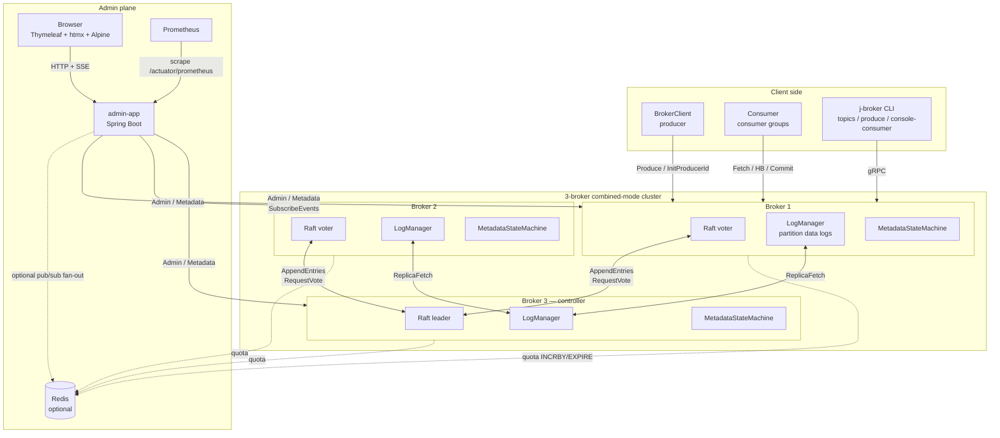

**Combined mode** means every broker is both a Raft voter (metadata plane) and a data-plane host (partition logs). The Raft leader is the *controller* — it drives topic creation, ISR changes, preferred-leader rebalances. Partition leaders for the data plane are a separate (overlapping) election that happens inside the controller via `PartitionChangeRecord`.

### Layered architecture

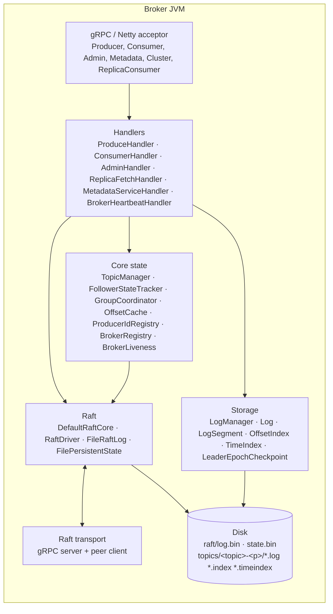

Storage, raft-core, and raft-transport have **no** gRPC or Spring dependencies — ArchUnit blocks those imports at build time. Broker-app is the only Spring-Boot-free thing that wires it all up; admin-app is the Spring side.

### Single-broker request flow (produce → fetch)

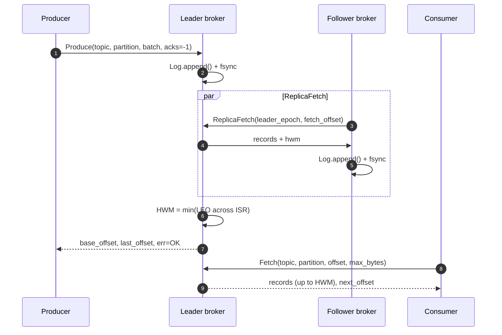

When `acks=0/1`, the leader returns as soon as its local append succeeds (step 2 → 6). With `acks=-1` the reply is held until HWM passes the produced last-offset. If any ISR member falls more than `replica.lag.time.max.ms` behind, the fencer removes it from the ISR and HWM advances from the remaining replicas.

---

## Feature deep dives

### Topics + partitions

Topics are Raft-replicated metadata, not per-broker state. Creation flow:

1. Admin REST `POST /api/v1/topics {name, partitions, replication_factor, config}`
2. Fanned via `BrokerAdminClientPool.firstNonNotLeader` to the Raft leader.
3. `AdminHandler.createTopic` builds a `CreateTopicRecord` + one `PartitionChangeRecord` per partition and proposes the bundle through Raft.
4. Every broker's `MetadataStateMachine.apply` loads the record, registers the topic in `TopicManager`, and — if this broker is in the replica set — opens a `Log` handle and begins ReplicaFetching from the leader.

Deletion (`DELETE /api/v1/topics/{name}`) proposes a `DeleteTopicRecord`. Each broker evicts its local `Log` handles and best-effort deletes the on-disk partition directory; `LogManager.deleteTopicDir` swallows `IOException` so a single slow unmount doesn't block the apply path.

Config updates (`PATCH /api/v1/topics/{name}/config`) merge via `UpdateTopicConfigRecord`. Known keys:
- `cleanup.policy=compact` — flips compaction on for the topic.

### Producing (acks, idempotent producer)

The produce API exposes three durability modes via the `acks` field:

| `acks` | Semantics | When to use |
|---|---|---|
| `0` / `1` (default) | Leader appends locally and returns. Lost on leader failure. | High-throughput, tolerant of occasional loss. |
| `-1` (all) | Leader holds the reply until HWM has advanced past the produced last-offset — i.e. every ISR member has replicated the record. Rejected with `NOT_ENOUGH_REPLICAS` if the wait times out (default 5s). | Durable producers. |

Idempotent retries: call `Producer.InitProducerId` once per producer session to get a `(producer_id, producer_epoch)` pair; the controller persists the next-id counter through Raft so it survives restart. Every `ProduceRequest` carries `(producer_id, producer_epoch, base_sequence)`; the leader's `ProducerIdRegistry` rejects out-of-order sequences with `OUT_OF_ORDER_SEQUENCE` and silently drops duplicates, preventing double-writes on client retry.

```java
try (var client = new BrokerClient("127.0.0.1", 9092)) {
    long producerId = client.initProducerId();
    for (int seq = 0; seq < 100; seq++) {
        client.idempotentProduce("orders", 0,
            ("order-" + seq).getBytes(),
            producerId, /* epoch */ 0, /* baseSequence */ seq);
    }
}
```

### Consuming + consumer groups

**Simple consumption** uses `Consumer.Fetch(topic, partition, offset, max_bytes)` — returns a byte string of concatenated record batches bounded by the HWM. The client decodes `RecordBatch` from the bytes and advances its own offset.

**Consumer groups** — modelled on Kafka's KIP-848 cooperative-sticky flow:

1. Client calls `Consumer.FindCoordinator(group_id)` → resolves to the broker that leads `__consumer_offsets-${hash(group_id) % 50}`.
2. Client calls `Consumer.ConsumerGroupHeartbeat(group_id, member_id=0, subscribed_topics=[...])`.
3. Coordinator assigns `member_id`, picks an assignor (round-robin in Phase 7), returns the assignment in the heartbeat reply.
4. Client polls → fetches each assigned (topic, partition) from the partition leader, updates local offsets.
5. `Consumer.CommitOffsets(group_id, member_epoch, commits)` persists offsets into `__consumer_offsets` via an internal produce.
6. `Consumer.FetchOffsets(group_id, tps)` reads back committed offsets from the `OffsetCache` (warmed from `__consumer_offsets` on coordinator startup).
7. Leaving: send a heartbeat with `member_epoch = -1`.

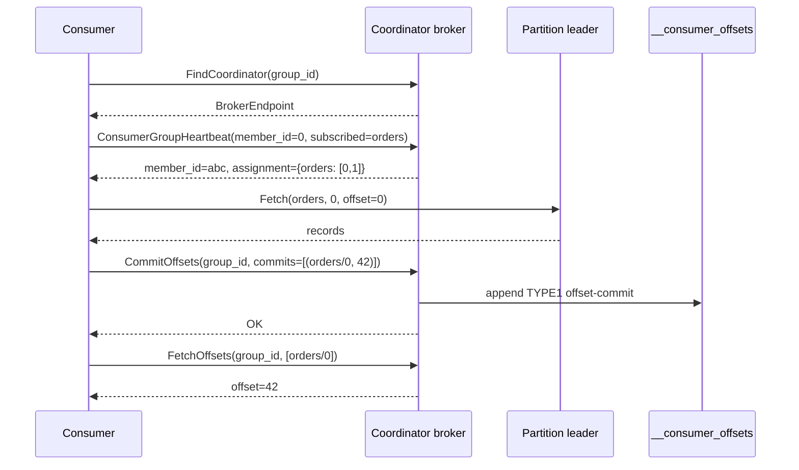

**Admin-initiated mutations** (P12.7):

- `DELETE /api/v1/consumer-groups/{id}` → `ConsumerHandler.deleteConsumerGroupAdmin` drops `GroupCoordinator` state AND `OffsetCache.dropGroup`. Subsequent `FetchOffsets` returns `OFFSET_OUT_OF_RANGE` (`-1`); a rejoin with the same group id gets a fresh member slot.
- `POST /api/v1/consumer-groups/{id}/reset-offsets` body `{resets: [{topic, partition, offset, leader_epoch}]}` → writes new commit records and updates the cache. Kafka-authoritative: can pre-seed offsets for a group that hasn't joined yet.

### Replication (ISR, HWM, fenced epochs)

Followers pull from the leader via the **ReplicaConsumer** service. On every `ReplicaFetch`:

1. Leader validates `leader_epoch`. If stale → `FENCED_EPOCH`. Follower then calls `OffsetsForLeaderEpoch(leader_epoch)` to get the end-offset of that epoch, truncates its log back to that point, and retries.
2. Leader appends the follower's fetch to `FollowerStateTracker`: `(broker_id, leo, last_fetch_millis)`.
3. Leader recomputes HWM: `max(prior_hwm, min(LEO across ISR))`.
4. Leader replies with records (up to `max_bytes`) + new HWM.

HWM advancement unblocks any `acks=-1` produces waiting on that offset.

**ISR shrink** happens when a follower hasn't fetched for `replica.lag.time.max.ms` (default 10s, driven by the fencer tick):

```mermaid
flowchart LR
    Fencer[BrokerFencer<br/>250ms tick] -->|reads| Liveness[BrokerLiveness<br/>last heartbeat]
    Liveness -->|stale &gt; 3s| Fencer
    Fencer -->|proposes| PartitionChange[PartitionChangeRecord<br/>leader=surviving isr&#91;0&#93;<br/>isr=isr minus dead<br/>leaderEpoch+1]
    PartitionChange -->|Raft commit| Apply[every broker.apply]
    Apply -->|MetadataStateMachine| NewState[PartitionState<br/>new leader, shrunk ISR]
```

**ISR expand** happens on the replication path: when a previously-out-of-sync follower catches up within `replica.lag.time.max.ms` of the leader's LEO, the leader proposes a `PartitionChangeRecord` that adds the broker back to ISR. HWM can then advance past any byte-range that only the reconnected broker was blocking.

### Raft metadata consensus

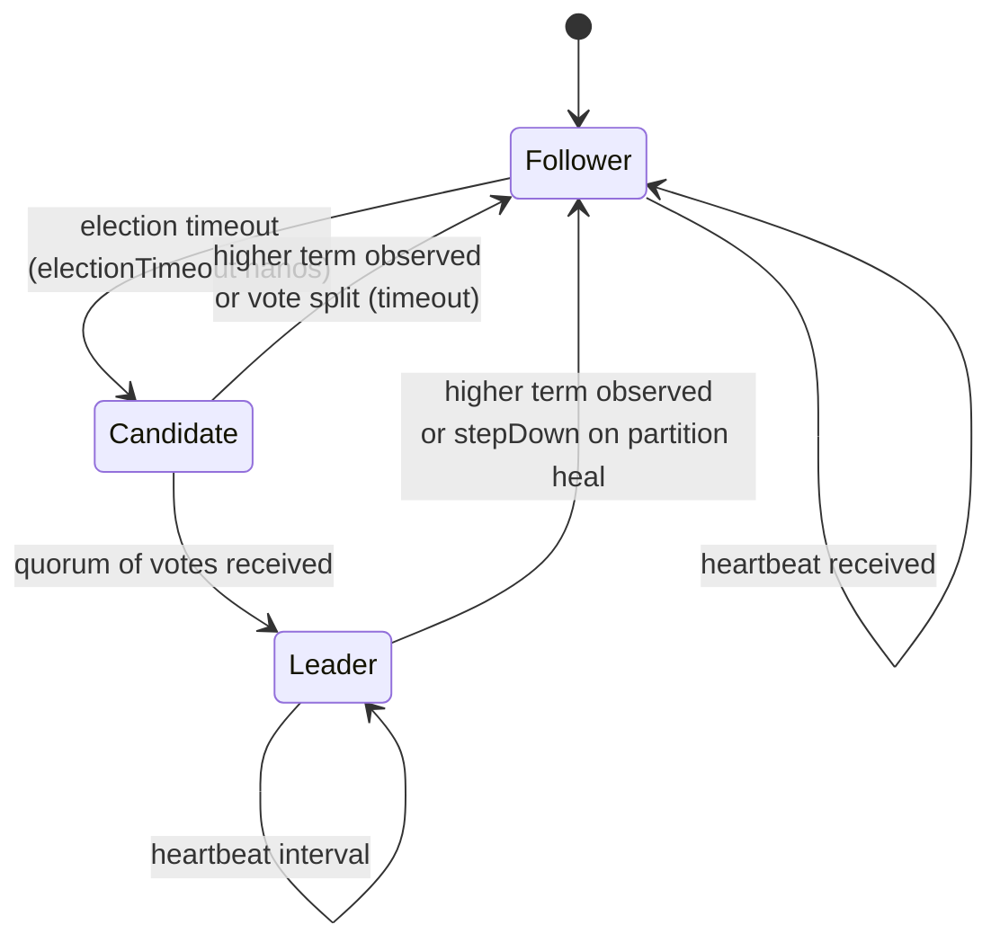

Key design decisions baked into `raft-core`:

- **Pure step-function** — `RaftCore.step(RaftEvent) → List<RaftEffect>`. The event loop and I/O live in `RaftDriver` (raft-transport); the core is deterministic and side-effect-free, which made Phase 3's chaos simulator trivial to build.
- **Pre-vote** — candidates issue `pre_vote=true` `RequestVote` before actually incrementing their term. Stale nodes can't disrupt a healthy leader by forcing re-elections.
- **Conflict-index fast backoff** — on `AppendEntries` rejection, follower returns the first index of its conflicting term. Leader jumps `nextIndex[peer]` there directly instead of decrementing by 1 (P1.5).
- **Commit rule §5.4.2** — leader only advances `commitIndex` by majority-match on entries of *its own term*. Prevents overwrite of already-committed entries after a term change.
- **fsynced persistent state** — `currentTerm` and `votedFor` are flushed to disk before any outbound `RequestVote` reply. `FilePersistentState` uses a checksum-prefixed length-framed format; torn writes are recovered by skipping the incomplete trailing frame.
- **Install-snapshot** — `DefaultRaftCore` supports chunked `InstallSnapshot` RPCs so a far-behind follower can bootstrap from the leader's latest snapshot instead of streaming the full log.

### Broker heartbeats + fencer

Brokers run a point-to-point heartbeat every 250ms to every peer (excluding self):

```
Cluster.BrokerHeartbeat(broker_id, current_metadata_offset) → OK
```

Receivers update `BrokerLiveness` with the wall-clock of the last heartbeat per broker. The `BrokerFencer` (controller-only, 250ms tick) declares any broker unheard-from for `> 3s` as dead and proposes ISR-shrink `PartitionChangeRecord`s to move partition leadership off it.

Why point-to-point instead of Raft-log-based liveness: the P6.5.a attempt to push `BrokerHeartbeatRecord`s through the Raft log revealed that follower-originated proposals are silently dropped (only the leader can propose). Direct RPC matches real KRaft's approach and was explicitly listed as the spec's perf-tuning fallback.

### Preferred-leader balancer

After a wave of failovers, partition leadership drifts onto whichever broker recovered last. The `PreferredLeaderBalancer` (controller-only, 15s tick, 30s stability window in production) proposes leadership moves back to `replicas[0]`:

```java
// PreferredLeaderBalancer.proposeRebalances
if (!isActiveController) return [];
if (now - lastLeaderChangeMillis < stabilityWindowMillis) return [];
for (partition : topicManager.allPartitionAssignments()) {
    int preferred = partition.replicas()[0];
    if (partition.leader() == preferred) continue;
    if (!partition.isr().contains(preferred)) continue;
    proposals.add(new Proposal(
        partition.topic(), partition.partition(),
        preferred, partition.leaderEpoch() + 1));
}
return proposals;
```

Integration tests compress tick + stability via `Broker.Config.withBalancerTiming(300ms, 300ms)` so the rebalance fires in ~2–3s.

### Log compaction + sparse offsets

Log compaction keeps the latest value per key (Kafka-style). The subtle part is **sparse-offset preservation** (P12.4): a consumer holding a pre-compaction offset should still resolve to the right post-compaction record, even if every intermediate record between the consumer's offset and the surviving record was tombstoned.

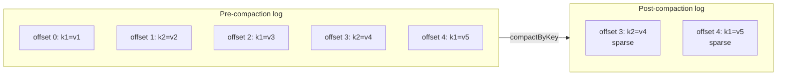

A consumer that last committed offset 2 and resumes after compaction calls `Fetch(topic, partition, offset=2, max_bytes)`. `Log.segmentContaining(2)` falls forward to the segment whose base is above 2 and returns records `[3, 4]` — consumer sees `{k2=v4, k1=v5}` with correct absolute offsets.

Force-compact (P13.1) lets tests and operators trigger compaction synchronously instead of waiting on the 5-minute cleaner cadence:

```bash
curl -X POST http://localhost:15672/api/v1/topics/prices/partitions/0/compact
# => {"records_kept":5,"brokers_compacted":3}
```

### Log retention

`LogManager.Config.retentionMillis` (default 7 days) is enforced by the same background cleaner that handles compaction. On each tick (60s by default):

1. `log.retain(cutoff = now - retentionMillis)` — closes and deletes any segment whose last timestamp is older than the cutoff. The active segment is never eligible.
2. For compact-policy topics, also call `log.compactByKey()` — merges segments, sparse-offset preserving.

### Admin REST surface

All paths are under `/api/v1/`. JSON is snake_case throughout (Jackson configured in `admin-app/src/main/resources/application.yml`).

| Method | Path | Purpose |
|---|---|---|
| `GET` | `/topics` | List topics |
| `GET` | `/topics/{name}` | Describe topic (fans out to all brokers + merges leader-reported HWM/LEO) |
| `GET` | `/topics/{name}/partitions/{p}` | Single partition state |
| `POST` | `/topics` | Create topic |
| `DELETE` | `/topics/{name}` | Delete topic |
| `PATCH` | `/topics/{name}/config` | Update topic config (e.g. `cleanup.policy`) |
| `POST` | `/topics/{name}/partitions/{p}/compact` | Force-compact (P13.1) |
| `GET` | `/consumer-groups` | List groups |
| `GET` | `/consumer-groups/{id}` | Describe group (members, partition lag) |
| `DELETE` | `/consumer-groups/{id}` | Delete group (P12.7) |
| `POST` | `/consumer-groups/{id}/reset-offsets` | Reset offsets (P12.7) |
| `GET` | `/cluster` | Cluster overview (controller, nodes, term, metadata offset) |
| `GET` | `/nodes`, `/nodes/{id}` | Broker listing / single broker |
| `GET` | `/raft` | Raft state (fans to all brokers) |
| `GET` | `/raft/nodes/{id}` | Single broker's Raft state |
| `GET` | `/metrics/throughput` | Rolling throughput window |
| `GET` | `/metrics/latency` | p50/p99/p999 latencies |
| `GET` | `/events` | Server-Sent Events stream (`Last-Event-ID` supported) |
| `GET` | `/health/badge` | 5s-polled health pill for the top nav |
| `POST` | `/chaos/kill-broker/{id}` | Exit the broker process (requires chaos port) |
| `POST` | `/chaos/pause-broker/{id}` | Freeze the broker's reactor |
| `POST` | `/chaos/resume-broker/{id}` | Unfreeze |
| `POST` | `/chaos/force-election/{id}` | Send the broker a self-addressed `TimeoutNow` |
| `POST` | `/chaos/partition` | Bi-directional partition `{from, to}` |
| `POST` | `/chaos/heal-partition` | Clear all partitions cluster-wide |
| `POST` | `/chaos/inject-latency/{id}` | Add gRPC reply latency on a broker |

All mutating calls route to the Raft leader via `BrokerAdminClientPool.firstNonNotLeader` — a non-leader responds with `NOT_LEADER` + `suggested_leader_*` hints and the pool iterates. Fetches use `firstSuccessful`.

### Admin UI pages

The admin app serves eight Thymeleaf pages under the same top-nav shell (`fragments/shell.html`):

| Route | Template | What it shows |
|---|---|---|
| `/` | `index.html` | Overview dashboard + topology |
| `/topics` | `topics.html` | Topic list + create modal |
| `/topics/{name}` | `topic-detail.html` | Per-partition state + delete button |
| `/groups` | `groups.html` | Consumer group list |
| `/groups/{id}` | `group-detail.html` | Members + partition lag |
| `/raft` | `raft.html` | Raft state table |
| `/metrics` | `metrics.html` | Throughput + latency sparklines |
| `/chaos` | `chaos.html` | Failure-injection panel |

The top-nav carries a live health pill (green/yellow/red) polled from `/api/v1/health/badge` every 5s. Pages use htmx for partial refreshes and Alpine.js for tiny interactions (modals, toggles) — no build step, no webpack.

### Server-Sent Events + Redis pub/sub fan-out

Each broker emits `EventMessage` records on state changes:
- `leader_changed`, `isr_shrink`, `isr_expand`, `raft_term_change`, `broker_registered`, `broker_fenced`, `consumer_group_rebalance`.

`admin-app`'s `AdminEventBus` opens a `Metadata.SubscribeEvents` stream to every configured broker, ingests the events, and fans them out to every live `/api/v1/events` SSE subscriber. A 2048-slot ring buffer backs `Last-Event-ID` replay.

**Multi-pod fan-out (P13.7)** — opt-in via `jbroker.redis.url`:

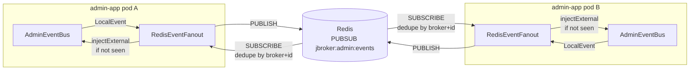

De-duplication runs on `(brokerEndpoint, brokerEventId)` so a broker event arriving via BOTH a pod's direct gRPC subscription AND a peer's Redis echo is broadcast to SSE subscribers exactly once. Hand-rolled RESP client (PUBLISH + SUBSCRIBE) matches the P12.6 quota-enforcer pattern — no Jedis or Lettuce dependency.

### Quota enforcement

Per-principal byte-rate quotas on produce and fetch. Two backends:

- **In-memory** (default) — token bucket per `(principal, op)`. Refills at configured bytes/sec, capped at 1s burst. Per-broker state, so a multi-broker cluster enforces per-broker not cluster-wide.
- **Redis** (opt-in via `jbroker.quota.redis.url`) — hand-rolled RESP `INCRBY + EXPIRE 2` per second-granularity bucket. Cluster-wide because all brokers see the same counters. Fail-open: any Redis I/O error falls back to the in-memory enforcer, so a Redis outage never blocks the data plane.

Exceeded quotas return `QUOTA_VIOLATED` (86) with a `throttle_ms` hint for the client to back off.

### Metrics, JFR, Prometheus

Brokers expose `Metadata.DescribeMetrics` per broker — rolling window (default 30s) of:
- Produce / fetch counts + bytes
- Produce / fetch p50 / p99 / p999 latency (nanos)
- Incremental fetch session hit count
- Per-partition ISR size, HWM, LEO, replication-lag-per-follower

`admin-app`'s `MetricsScraper` pulls `DescribeMetrics` from every broker every 5s and republishes as Micrometer `jbroker_*` gauges tagged by `broker_id`. Prometheus scrapes `/actuator/prometheus`; the auto-provisioned Grafana dashboards (`scripts/monitoring/grafana/dashboards/`) chart them:

- *j-broker Cluster Overview* — produce/fetch throughput + latency percentiles + Raft state per broker.
- *j-broker Partitions* — ISR size, HWM, per-follower replication lag per (topic, partition).

**JFR** — six custom events under category `j-broker`:

| Event | Where | Fields |
|---|---|---|
| `jbroker.RaftTermChange` | `DefaultRaftCore.becomeFollower` | oldTerm, newTerm, reason |
| `jbroker.PartitionLeaderChange` | `TopicManager.onPartitionChange` | topic, partition, oldLeader, newLeader, leaderEpoch |
| `jbroker.FsyncDuration` | `LogSegment.force` | baseOffset, durationNanos, sizeBytes |
| `jbroker.ReplicationLag` | `ReplicaFetchHandler.handle` | topic, partition, followerBrokerId, lagRecords |
| `jbroker.ProduceLatency` | `ProduceHandler.handle` | topic, partition, latencyNanos, bytes, acks |
| `jbroker.FetchLatency` | `FetchHandler.handle` | topic, partition, latencyNanos, bytes |

Start a JFR recording on a running broker:

```bash
jcmd <PID> JFR.start duration=30s filename=broker.jfr settings=profile
```

Open `broker.jfr` in [JDK Mission Control](https://www.oracle.com/java/technologies/jdk-mission-control.html); custom events appear under *Event Browser → j-broker*.

**async-profiler** (flame graphs, allocation profiles, lock contention):

```bash
asprof -d 30 -f flame.html <PID>             # CPU
asprof -d 30 -e alloc -f alloc.html <PID>    # allocation
asprof -d 30 -e lock -f lock.html <PID>      # watch virtual-thread pinning
```

### Chaos testing

When the broker is started with `--chaos-port P`, it exposes a cooperative chaos HTTP server on that port:

| Endpoint | Effect |
|---|---|
| `POST /debug/chaos/kill` | `System.exit(1)` — Docker's restart policy brings it back. |
| `POST /debug/chaos/pause` | Reactor paused; heartbeats stop flowing; the broker gets fenced within 3s. |
| `POST /debug/chaos/resume` | Unpause. |
| `POST /debug/chaos/force-election` | `TimeoutNow` self-RPC so this broker immediately becomes a candidate. |
| `POST /debug/chaos/partition?peer=ID` | Bidirectional block to/from `peer`. Called on both sides for a full partition. |
| `POST /debug/chaos/heal-partition` | Clear all partitions cluster-wide. |
| `POST /debug/chaos/inject-latency?ms=N` | Add `N`ms to every outbound gRPC reply. |

The admin UI's Chaos page proxies these via `POST /api/v1/chaos/*`.

### Bench harness

`bench/j-broker-bench producer|consumer` — HdrHistogram-backed perf harness with CSV append:

```bash
./bench/build/install/bench/bin/bench producer \
  --broker localhost:9092 --topic bench --partition 0 \
  --records 5000 --payload-size 1024 \
  --csv docs/bench/results.csv

./bench/build/install/bench/bin/bench consumer \
  --broker localhost:9092 --topic bench --partition 0 \
  --records 5000 --csv docs/bench/results.csv
```

Each run prints a percentile table (p50/p99/p999/max) + records/s + bytes/s. Re-run the snapshot: `scripts/bench/run-readme-bench.sh`.

---

## CLI reference

`broker-app/build/install/broker-app/bin/broker-app` (alias this to `j-broker` for your shell):

```text
j-broker server   --data-dir DIR --broker-port P [--raft-port P] [--id N]
                  [--voters ID@HOST:RAFT:BROKER,...] [--chaos-port P]
                  [--consumer-offsets-partitions N]

j-broker topics   create|list|describe --broker HOST:PORT [...]
j-broker produce  --broker HOST:PORT --topic T --partition N   (stdin = one msg per line)
j-broker console-consumer --broker HOST:PORT --topic T --partition N [--from-beginning]
j-broker admin    cluster-info | topics ... | groups ... | raft  [--admin URL]
```

`bench/build/install/bench/bin/bench` — perf harness (see above).

---

## REST reference

See [Admin REST surface](#admin-rest-surface) for the full table. Quick examples:

```bash
# Create a topic
curl -X POST http://localhost:15672/api/v1/topics \
  -H 'Content-Type: application/json' \
  -d '{"name":"orders","partitions":3,"replication_factor":3}'

# Describe a topic (fans out for leader-reported HWM/LEO)
curl http://localhost:15672/api/v1/topics/orders | jq

# Compact every replica of a partition
curl -X POST http://localhost:15672/api/v1/topics/prices/partitions/0/compact

# Reset consumer group offsets
curl -X POST http://localhost:15672/api/v1/consumer-groups/order-processor/reset-offsets \
  -H 'Content-Type: application/json' \
  -d '{"resets":[{"topic":"orders","partition":0,"offset":5,"leader_epoch":0}]}'

# Kill broker 2 (chaos port must be enabled)
curl -X POST http://localhost:15672/api/v1/chaos/kill-broker/2

# Stream live events
curl -N http://localhost:15672/api/v1/events
```

---

## Performance

Single-broker snapshot (`scripts/bench/run-readme-bench.sh`) on Apple-silicon laptop (Darwin 24.2, M-series, SSD). End-to-end gRPC path; producer bench issues one-record-per-RPC with `acks=1`, consumer bench fetches via `Consumer.Fetch`. Multi-broker acks=all numbers will differ.

### Producer

| Payload | Records | rps | MiB/s | p50 | p99 | p999 |
|---|---|---|---|---|---|---|
| 256B | 5,000 | 5,362 | 1.31 | 0.14ms | 0.60ms | 1.21ms |
| 1024B | 5,000 | 5,597 | 5.47 | 0.13ms | 0.56ms | 1.18ms |
| 4096B | 5,000 | 5,494 | 21.46 | 0.13ms | 0.58ms | 2.89ms |

### Consumer

| Payload | Records | rps | MiB/s | p50 | p99 | p999 |
|---|---|---|---|---|---|---|
| 256B | 5,100 | 37,057 | 9.05 | 5.40ms | 131.92ms | 131.92ms |
| 1024B | 5,100 | 34,922 | 34.10 | 4.34ms | 124.72ms | 124.72ms |
| 4096B | 5,020 | 25,189 | 98.40 | 3.37ms | 130.55ms | 130.55ms |

Raw CSV in `docs/bench/results.csv`. Regenerate via `scripts/bench/run-readme-bench.sh`.

---

## Testing

- **Unit tests** — ~200 across `raft-core`, `raft-transport`, `broker-storage`, `broker-core`, `admin-app`. Log append/read/fsync/recovery, Raft election safety, log-matching + truncation, conflict-index backoff, HWM advancement, sparse-offset compaction, consumer-group coordinator, idempotent producer dedup, admin-REST merging.
- **Integration tests** — in `integration-tests/` and `broker-app/src/test`. Multi-broker replication, acks=all durability, partition-leader failover, group churn, chaos-kill-broker, 10k concurrent clients (CI-grade variant), 1M-record compaction (@slow), force-compact round-trip, preferred-leader balancer convergence.
- **Stress** — `./gradlew :integration-tests:stressTest` — 100 randomized election cycles.
- **Chaos simulator** — `simulator/` runs deterministic Raft scenarios with crash injection and invariant assertions across 10k seeds.
- **Property tests** — jqwik covers batch encoding, offset index binary search, log-matching invariants.

@Tag("slow") gates the heavy tests (1M compaction, full 10k-concurrent, Testcontainers-Redis IT). Opt in via `JBROKER_RUN_SLOW_TESTS=1 ./gradlew test`.

---

## Modules

| Module | What's inside |
|---|---|
| `proto/` | `.proto` definitions + generated gRPC stubs. Single source for Producer / Consumer / Admin / Metadata / Cluster / ReplicaConsumer services. |
| `raft-core/` | Pure-Java Raft: step-function `RaftCore`, `RaftLog`, `FileRaftLog`, `FilePersistentState`, `DefaultRaftCore`. Zero IO/threads/Spring/gRPC — ArchUnit enforces. |
| `raft-transport/` | gRPC server + outbound `RaftPeerClient` + `RaftDriver` event loop. |
| `broker-storage/` | `LogManager`, `Log`, `LogSegment`, offset/time indexes, leader-epoch checkpoint, compaction + retention. |
| `broker-core/` | `ProduceHandler`, `ConsumerHandler`, `AdminHandler`, `ReplicaFetchHandler`, `MetadataStateMachine`, `TopicManager`, `GroupCoordinator`, `OffsetCache`, `BrokerFencer`, `PreferredLeaderBalancer`, quota enforcers, producer-id registry, JFR events. |
| `broker-app/` | `Broker` main + CLI (`server`, `topics`, `produce`, `console-consumer`, `admin`). Wires everything together. Spring-free. |
| `admin-app/` | Spring Boot REST + Thymeleaf UI. `TopicsController`, `ConsumerGroupsController`, `ClusterController`, `RaftController`, `MetricsController`, `EventsController`, `ChaosController`. Scraper + Prometheus binder. `RedisEventFanout` for multi-pod SSE. |
| `bench/` | `PerfMain` CLI + `ProducerPerfTest`, `ConsumerPerfTest`, `PerfReport`. HdrHistogram + CSV. |
| `integration-tests/` | Real 3-node loopback cluster ITs. |
| `simulator/` | Deterministic Raft chaos simulator. |

Requires Java 21 (Temurin). Gradle wrapper pinned to 8.7; SHA-256-verified on download.

---

## Roadmap

Where the project is, phase by phase:

- [x] **Phase 0** — Scaffolding, ArchUnit, CI.
- [x] **Phase 1** — Raft core: election, log replication, fsync'd persistent state, conflict-index backoff.
- [x] **Phase 2** — Raft snapshots, membership changes, leadership transfer, pre-vote, read-index.
- [x] **Phase 3** — Deterministic chaos simulator with crash + partition injection.
- [x] **Phase 4** — Metadata state machine, topic CRUD, producer-ID assignment through Raft.
- [x] **Phase 5** — Broker data plane: ProduceHandler, FetchHandler, LogManager.
- [x] **Phase 6** — Multi-broker: replication, ISR, HWM, fenced leader epoch, acks=all, idempotent producer.
- [x] **Phase 7** — Consumer groups: coordinator, heartbeat, offset commit/fetch, recovery from `__consumer_offsets`.
- [x] **Phase 8** — Admin REST + UI (topics, groups, cluster, raft, events SSE).
- [x] **Phase 9** — Observability: metrics/Prometheus/Grafana, JFR, compaction, quotas.
- [x] **Phase 10** — Java 21 deep integration: virtual threads everywhere, zero pinning on the produce path, structured fan-out.
- [x] **Phase 11** — Docker image hardening, RabbitMQ-style UI polish, snake_case JSON, chaos force-election.
- [x] **Phase 12** — Perf bench module, sparse-offset compaction, preferred-leader balancer wiring, real-RESP Redis quota enforcer, admin consumer-group mutations.
- [x] **Phase 13** — v1.1 correctness-gap closers: force-compact admin RPC + IT, consumer-group admin-mutation round-trip ITs, balancer-rebalance IT, CI-grade 10k-client smoke, README bench table, Redis pub/sub SSE fan-out.

Possible future phases:
- mTLS between brokers + admin (multi-tenant security).
- Helm charts for Kubernetes.
- Globally-monotonic SSE ids backed by `Redis INCR` or a stream-backed ring.
- Admin-originated audit events.

---

## License

This is a personal learning project. Unlicensed — feel free to read and learn from it; don't run it in production.
