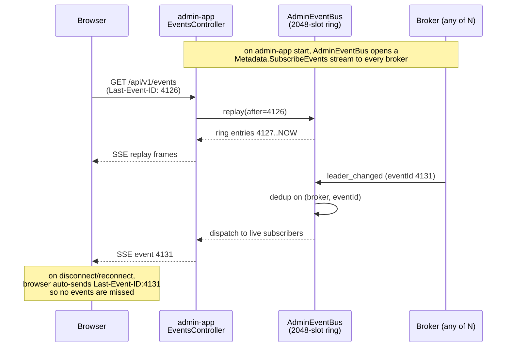
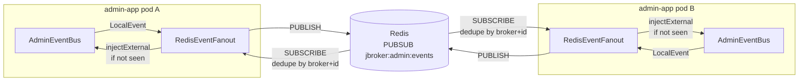

# admin-app

Spring Boot REST + Thymeleaf admin UI for the cluster. `application.yml` binds port 9090; the Docker image and Helm chart override to 15672 (RabbitMQ-management convention) via `SERVER_PORT`. No SPA bundler — Thymeleaf pages + htmx for partial refreshes + Alpine.js for tiny interactions + Chart.js for the metrics line charts. Everything self-hosted under `/vendor/` so Chrome ORB doesn't block external CDNs.

## REST surface

All paths under `/api/v1/`. JSON is snake_case (Jackson in `application.yml`).

| Method | Path | Purpose |
|---|---|---|
| `GET` | `/topics` | List topics |
| `GET` | `/topics/{name}` | Describe topic — fans out to all brokers + merges leader-reported HWM/LEO |
| `GET` | `/topics/{name}/partitions/{p}` | Single partition state |
| `POST` | `/topics` | Create topic |
| `DELETE` | `/topics/{name}` | Delete topic |
| `PATCH` | `/topics/{name}/config` | Update topic config (e.g. `cleanup.policy`) |
| `POST` | `/topics/{name}/partitions/{p}/compact` | Force-compact a partition |
| `GET` | `/consumer-groups` | List groups |
| `GET` | `/consumer-groups/{id}` | Describe group (members, partition lag) |
| `DELETE` | `/consumer-groups/{id}` | Delete group |
| `POST` | `/consumer-groups/{id}/reset-offsets` | Reset offsets |
| `GET` | `/cluster` | Cluster overview — fans out + merges self-reported roles |
| `GET` | `/cluster/membership` | Voter/observer membership view (fans to the controller) |
| `POST` | `/cluster/add-broker` | Join a new broker into the Raft voter set |
| `POST` | `/cluster/decommission/{brokerId}` | Drain leadership + replicas off a broker, then remove it |
| `GET` | `/cluster/reassignments` | In-flight partition reassignments |
| `POST` | `/cluster/reassignments` | Start a partition reassignment |
| `DELETE` | `/cluster/reassignments/{topic}/{partition}` | Cancel an in-flight reassignment |
| `POST` | `/cluster/rebalance-leadership` | On-demand preferred-leader rebalance |
| `GET` | `/nodes`, `/nodes/{id}` | Broker listing / single broker |
| `GET` | `/raft` | Raft state (fans to all brokers) |
| `GET` | `/raft/nodes/{id}` | Single broker's Raft state |
| `GET` | `/metrics/throughput` | Rolling throughput window — `window_seconds: null` when idle |
| `GET` | `/metrics/latency` | p50/p99/p999 latencies |
| `GET` | `/metrics/timeseries?window=5m` | Server-side history ring for sparklines |
| `GET` | `/events` | Server-Sent Events stream (`Last-Event-ID` supported) |
| `GET` | `/health/badge` | 5s-polled green/yellow/red pill for the top nav |
| `GET` | `/chaos/state` | Per-broker chaos snapshot — drives the live-topology SVG |
| `POST` | `/chaos/kill-broker/{id}` | Exit the broker process (requires chaos port) |
| `POST` | `/chaos/pause-broker/{id}` | Freeze the broker's reactor |
| `POST` | `/chaos/resume-broker/{id}` | Unfreeze |
| `POST` | `/chaos/force-election/{id}` | Send a self-addressed `TimeoutNow` |
| `POST` | `/chaos/partition` | Bi-directional partition `{from, to}` |
| `POST` | `/chaos/heal-partition` | Clear all partitions cluster-wide |
| `POST` | `/chaos/inject-latency/{id}` | Add gRPC reply latency on a broker |

Mutating calls route to the Raft leader via `BrokerAdminClientPool.firstNonNotLeader` — a non-leader responds with `NOT_LEADER` + `suggested_leader_*` hints and the pool iterates. Reads use `firstSuccessful` for single-broker snapshots or `allSuccessful` when a merge is needed.

## Operator auth

Opt-in via `jbroker.admin.auth.users` (comma-separated `name:bcrypt-hash` pairs; empty = auth disabled with a startup warning, matching pre-auth deployments). When enabled, `AdminAuthFilter` gates every surface: a session from the `/login` form or an `Authorization: Bearer` token authenticates; unauthenticated API calls get `401` JSON, UI paths redirect to `/login`. `POST /api/v1/tokens` mints API tokens, `POST /api/v1/tokens/revoke` kills one. `/login`, `/logout`, static assets and `/actuator/*` stay open. Every authenticated mutation is written to the `jbroker.audit` logger as `who method path`.

## UI pages

| Route | Template | What it shows |
|---|---|---|
| `/` | `index.html` | Overview — summary cards, throughput sparklines, topology SVG, nodes table (delegates to `ClusterController.cluster()` merge), cluster-lifecycle actions (add-broker, decommission, cancel-reassignment, rebalance-leaders via `/ui/cluster/*`) |
| `/topics` | `topics.html` | Topic list + create modal |
| `/topics/{name}` | `topic-detail.html` | Per-partition state + force-compact buttons + edit-config modal + delete (delegates to `TopicsController.describeTopic` merge) |
| `/groups` | `groups.html` | Consumer group list |
| `/groups/{id}` | `group-detail.html` | Members + partition lag + reset-offsets modal + delete-group button |
| `/raft` | `raft.html` | Raft state table |
| `/metrics` | `metrics.html` | Throughput + latency line charts (Chart.js inside `.chart-frame` wrappers for stable sizing) |
| `/chaos` | `chaos.html` | Live topology SVG + per-broker action grid + SSE events rail |

Top-nav carries a live health pill polled from `/api/v1/health/badge` every 5s. Every Alpine modal uses `x-cloak` + the `.modal-overlay` class (CSS handles centring so `x-show` doesn't stomp inline `display: flex`). Epoch-millis columns render as relative time via a small `epoch.js` helper.

### View controllers delegate to REST-merge

Thymeleaf view controllers (`ClusterViewController`, `TopicsViewController`) DO NOT call `BrokerAdminClientPool.firstSuccessful` directly for cluster / topic state. They call the REST controller's typed method — `ClusterController.cluster()` or `TopicsController.describeTopic(name)` — which fans out and merges. Skipping the merge was the root cause of the 2026-04-24 audit: peers rendered as `UNKNOWN` and partitions rendered "HWM / LEO unavailable" next to real leader badges.

## Server-Sent Event flow



Reliable delivery without WebSockets, without a message queue, without a polling loop. The browser's built-in `EventSource` handles reconnection; the server's ring buffer handles replay; everything between is plain HTTP.

## Server-Sent Events + Redis pub/sub fan-out

Each broker emits `EventMessage` records on state changes:
- `leader_changed`, `isr_shrink`, `isr_expand`, `raft_term_change`, `broker_registered`, `broker_fenced`, `consumer_group_rebalance`.

`AdminEventBus` opens a `Metadata.SubscribeEvents` stream to every configured broker, ingests the events, and fans them out to every live `/api/v1/events` SSE subscriber. A 2048-slot ring buffer backs `Last-Event-ID` replay.

**Multi-pod fan-out** — opt-in via `jbroker.redis.url`:



De-dup keys on `(brokerEndpoint, brokerEventId)` so an event arriving via both a pod's direct gRPC subscription and a peer's Redis echo is broadcast to SSE subscribers exactly once. Hand-rolled RESP client (PUBLISH + SUBSCRIBE) — no Jedis or Lettuce dependency.

## Metrics, Prometheus, Grafana

`MetricsScraper` pulls `Metadata.DescribeMetrics` from every broker every 5s and republishes as Micrometer `jbroker_*` gauges tagged by `broker_id`. Prometheus scrapes `/actuator/prometheus`; the auto-provisioned Grafana dashboards (`scripts/monitoring/grafana/dashboards/`) chart them:

- *j-broker Cluster Overview* — produce/fetch throughput + latency percentiles + Raft state per broker.
- *j-broker Partitions* — ISR size, HWM, per-follower replication lag per (topic, partition).

Run with:
```bash
docker compose -f docker-compose.yml -f docker-compose.monitoring.yml --profile monitoring up
```

- **Prometheus** → <http://localhost:9091>
- **Grafana** → <http://localhost:3000> (anonymous admin)

## Testing

~70 unit + IT tests: REST merge logic, view-controller delegation, health-badge polling, Redis fanout dedup, `AlpineCloakIT` pinning every modal's `x-cloak` attribute, `UiViewMergesMultiBrokerIT` pinning the 3-broker role-merge contract, `UiPolishIT` covering footer unification + favicon + relative-time.
