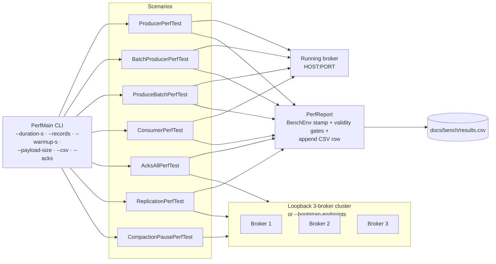

# bench

HdrHistogram-backed perf harness with an environment-stamped, append-only CSV. `PerfMain` is the CLI entrypoint; verbs: `producer`, `batch-producer`, `produce-batch`, `consumer`, `acks-all`, `replication`, `compaction`, `create-topic`, `check-batch`, plus the chaos-soak drivers `soak-produce` / `soak-verify` (`SoakRun` — the acks=all idempotent load and exactly-once verification halves of `scripts/chaos/scenario-chaos-with-load.sh`, held to the `SoakLedger` invariant: every acked record consumed exactly once).

## Harness layout



`producer` / `batch-producer` / `produce-batch` / `consumer` talk to an already-running broker; `acks-all` / `replication` / `compaction` start an in-process 3-broker cluster themselves (`acks-all` targets an external cluster instead when `--bootstrap` or env `BENCH_BOOTSTRAP` is set, and refuses to run — "N of M brokers reachable, replication factor R requires R" — when too few endpoints answer).

## Scenarios and latency semantics

Latency numbers with different semantics are never blended into one column: every row carries its `latency_kind`, and rows of different kinds must not be compared against each other.

| verb | CSV `mode` | `latency_kind` | one histogram sample is |
|---|---|---|---|
| `producer` | `producer` | `per_rpc` | one produce RPC round trip (`--batch-size N` records per sample; acks per `--acks`) |
| `batch-producer` | `batch-producer` | `per_record` | one record: `BatchingProducer.send()` return → future completion. INCLUDES the linger wait and queueing behind earlier batches, under the closed-loop load set by `--max-outstanding` (default 10,000 unacked records) — what a client-library user actually experiences at that offered load. Under saturation this latency is queueing-dominated and scales with the outstanding window, so compare per_record rows only at equal `--max-outstanding` |
| `produce-batch` | `produce-batch` | `per_rpc` | one `BrokerClient.produceBatch` round trip carrying `--batch-records` records (capped so the encoded batch fits `--max-batch-bytes`, default 1 MiB = the broker's `max.message.bytes` default; the effective count lands in `batch_size`) |
| `consumer` | `consumer` | `per_fetch_rpc` | one fetch RPC round trip that returned records (empty end-of-log probes are counted separately and excluded) |
| `acks-all` | `cluster-producer` | `per_rpc` | one single-record produce RPC against the RF=3 topic, routed to the partition leader; with `--acks all` the sample includes the leader's wait for the in-sync replicas |
| `replication` | `replication` | — | no histogram: the row carries follower catch-up throughput only (`samples` = 0, latency cells empty) |

A scenario that keeps two histograms emits one row per histogram with identical throughput fields and different `latency_kind` values.

## Duration and warmup

Steady-state scenarios are duration-bounded by default: 30 s measured (`--duration-s`), with `--records N` as the alternative bound (`replication` defaults to records-bounded, 50k, because its seed phase is a direct log append with no backpressure).

Every run starts with a real warmup pass against the same topic — max(10 s, 20% of the measured duration), overridable via `--warmup-s` — whose samples are excluded from the histogram and from every throughput counter. The `warmup_records` column reports how many records the warmup actually sent, so the exclusion is auditable. `--warmup-s 0` exists for smoke-testing the plumbing; rows produced that way are not publishable.

## CSV schema

`docs/bench/results.csv` is append-only history — the snapshot script never truncates it. Header:

```
timestamp,git_sha,hostname,os,cpu_model,jdk_version,mode,latency_kind,acks,partitions,replication_factor,min_insync_replicas,payload_size,batch_size,linger_ms,warmup_records,compression,records,bytes,elapsed_s,records_per_s,bytes_per_s,samples,p50_us,p99_us,p999_us,max_us
```

- `timestamp` — ISO-8601 UTC at emit time; `git_sha` — short commit (env `BENCH_GIT_SHA`, else `git rev-parse --short HEAD`, else `unknown`); `cpu_model` — `sysctl -n machdep.cpu.brand_string` on macOS, `/proc/cpuinfo` on Linux; `jdk_version` — the running JVM.
- Fields that do not apply to a mode are EMPTY cells, never 0 (e.g. `linger_ms` for the single-record producer, all latency cells for `replication`).
- `batch_size` is mode-relative: encoded batch bytes for `batch-producer` (`--batch-bytes`), records per RPC for `producer` (`--batch-size`) and `produce-batch` (`--batch-records`).
- `partitions` / `replication_factor` / `min_insync_replicas` are resolved from the broker's own topic metadata where the scenario has a client (`min_insync_replicas` only when an explicit per-topic override exists — the cluster default is not observable from the client, so the cell stays empty rather than guessing).

**Percentile validity:** `p99_us` requires ≥ 100 histogram samples and `p999_us` requires ≥ 1,000; below the threshold the cell is left empty and the harness prints a stderr warning naming the threshold and the actual count. `samples` always carries the histogram count, so every percentile in the file can be audited against it.

Rows written before this schema (2026-07, six rows without environment stamps, warmup accounting or validity gates) were removed rather than mixed in; they are preserved in git history of `docs/bench/results.csv`.

## Regenerating the snapshot

```bash
./gradlew :bench:installDist
# start a broker on 127.0.0.1:9092 (RF=1 baseline + flush scenarios run against it)
scripts/bench/run-readme-bench.sh
```

The script appends one full pass to `docs/bench/results.csv` and distills only this run's rows into `docs/bench/current-snapshot.csv` (gitignored) for README table generation. It covers: the single-broker baseline (`producer`, `batch-producer`, `produce-batch`, `consumer` × 256/1024/4096 B), the replicated path on a 3-partition RF=3 cluster (acks=1, acks=all, acks=all + `min.insync.replicas=2` × three sizes, plus `replication` catch-up), and the flush-policy comparison below. `BENCH_DURATION_S` overrides the per-scenario measured duration; `BENCH_WARMUP_S` shrinks the warmup for plumbing smokes (never for published rows); `BENCH_BOOTSTRAP` points the RF=3 scenarios at an external cluster. Script-created topics carry `retention.bytes=2147483648` so each converges to ~2 GiB on disk — the high-throughput scenarios write segments at hundreds of MB/s, and the broker refuses produces below its low-disk-space watermark, so give the data volume real headroom. The script bakes in no expected numbers — it writes rows, humans read them.

Ad-hoc single runs work the same way:

```bash
./bench/build/install/bench/bin/bench producer \
  --broker localhost:9092 --topic bench --partition 0 \
  --duration-s 30 --payload-size 1024 \
  --csv docs/bench/results.csv
```

## Flush policy and the durability cost of fsync

Verified against `broker-storage/.../Log.java`: the storage default is `flush.messages=-1` / `flush.ms=-1` — fsync happens on segment roll, on explicit `force()`, and on clean shutdown (`LogSegment.close()` fsyncs the active segment); between fsyncs, durability comes from replication, not the local disk. The per-topic overrides bound the unflushed window: `flush.messages=N` forces after N appended records, `flush.ms=M` is enforced by LogManager's flush tick.

The snapshot script measures what that trade costs: it runs the single-record producer against a topic created with `--config flush.messages=1` (fsync on every record) and against an identical default-policy topic, 1024 B payloads — the two `producer` rows in the CSV differing only in topic flush policy are the measured price of eager fsync.

## Batched produce

`BrokerClient.produceBatch(topic, partition, List<byte[]>)` issues ONE RPC with N records instead of N RPCs, amortizing the fixed per-call cost (encode, gRPC, handler dispatch, Log-append lock). The measured difference on this hardware is the `producer` vs `produce-batch` rows in `docs/bench/results.csv` — measured, see results; no multiplier is quoted here because throughput ratios are hardware- and payload-dependent.

## CI perf-gate

`.github/workflows/ci.yml` runs two perf-gate jobs on every PR with deliberately generous regression floors:

- `PerfGateIT` — end-to-end produce+consume with min-rps assertions.
- `AppendThroughputTest` — log-append throughput floor, best-of-3 trials (PR #107 deflake).

These catch catastrophic regressions (VT pinning, missing batching, serialisation blowup) without flaking on GitHub Actions shared-disk noise. The floors are gate thresholds, not performance claims.
