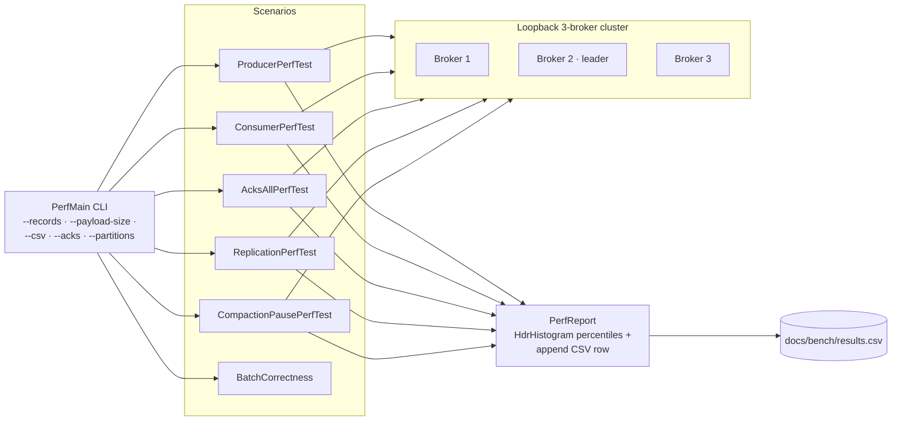

# bench

HdrHistogram-backed perf harness with CSV append. `PerfMain` is the CLI entrypoint; verbs: `producer`, `consumer`, `acks-all`, `replication`, `compaction`, `check-batch`, plus the chaos-soak drivers `soak-produce` / `soak-verify` (`SoakRun` — the acks=all idempotent load and exactly-once verification halves of `scripts/chaos/scenario-chaos-with-load.sh`, held to the `SoakLedger` invariant: every acked record consumed exactly once).

## Harness layout



Every scenario shares the same `BenchCluster` bootstrap so timing assumptions stay consistent. The CSV is the input to the README's perf table — regenerated by `scripts/bench/run-readme-bench.sh`.

## Usage

```bash
./bench/build/install/bench/bin/bench producer \
  --broker localhost:9092 --topic bench --partition 0 \
  --records 5000 --payload-size 1024 \
  --csv docs/bench/results.csv

./bench/build/install/bench/bin/bench consumer \
  --broker localhost:9092 --topic bench --partition 0 \
  --records 5000 --csv docs/bench/results.csv
```

Each run prints a percentile table (p50/p99/p999/max) + records/s + bytes/s, and appends a row to the CSV for regression tracking.

Regenerate the README snapshot: `scripts/bench/run-readme-bench.sh`.

## Current snapshot

From `scripts/bench/run-readme-bench.sh` on an Apple M2 MacBook Air (16 GB, internal SSD, Darwin 24.2), re-run 2026-07-25 on a warmed broker. End-to-end gRPC path; producer bench is single-record-per-RPC with `acks=1`, consumer bench uses `Consumer.Fetch`. Multi-broker `acks=all` numbers will differ.

### Producer

| Payload | Records | rps | MiB/s | p50 | p99 | p999 |
|---|---|---|---|---|---|---|
| 256B | 5,000 | 4,888 | 1.19 | 0.15ms | 0.56ms | 1.02ms |
| 1024B | 5,000 | 4,840 | 4.73 | 0.14ms | 0.64ms | 1.59ms |
| 4096B | 5,000 | 4,774 | 18.65 | 0.15ms | 0.56ms | 1.18ms |

### Consumer

| Payload | Records | rps | MiB/s | p50 | p99 | p999 |
|---|---|---|---|---|---|---|
| 256B | 6,427 | 48,292 | 11.79 | 9.59ms | 123.27ms | 123.27ms |
| 1024B | 5,738 | 36,769 | 35.91 | 6.07ms | 124.26ms | 124.26ms |
| 4096B | 5,020 | 25,324 | 98.92 | 3.87ms | 117.77ms | 117.77ms |

Raw CSV in `docs/bench/results.csv`.

## Batched produce

`BrokerClient.produceBatch(topic, partition, List<Record>)` issues ONE RPC with N records instead of N RPCs. ~150× throughput improvement on a laptop (PR #99). Use this when you care about throughput more than exact per-record commit visibility.

## CI perf-gate

`.github/workflows/ci.yml` runs two perf-gate jobs on every PR with generous regression floors (~3-5× over observed dev numbers):

- `PerfGateIT` — end-to-end produce+consume with min-rps assertions.
- `AppendThroughputTest` — log-append MB/s with a 50 MB/s floor, best-of-3 trials (PR #107 deflake).

These catch catastrophic regressions (VT pinning, missing batching, serialisation blowup) without flaking on GitHub Actions shared-disk noise.
