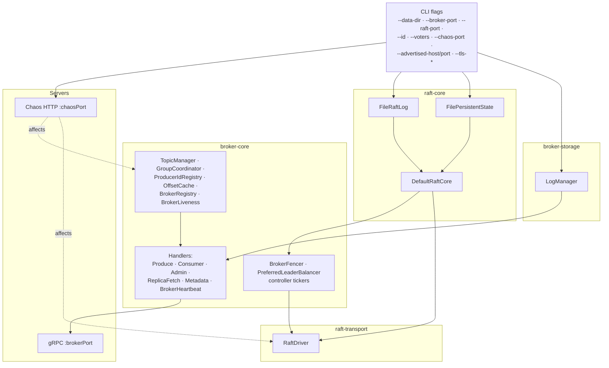

# broker-app

The broker JVM entrypoint and CLI. Spring-free — wires `raft-core` + `raft-transport` + `broker-storage` + `broker-core` into a running process by hand. Shipping binary built by `./gradlew :broker-app:installDist` and packaged into the `jbroker-broker:local` Docker image.

## Bootstrap wiring

How `Broker.main` assembles a running broker out of the four core modules:



No Spring, no DI container — just constructor wiring inside `Broker.start()`. Every dependency edge above is a constructor argument.

## CLI

`broker-app/build/install/broker-app/bin/broker-app` (alias this to `j-broker` for your shell):

```text
j-broker server   --data-dir DIR --broker-port P [--raft-port P] [--id N]
                  [--voters ID@HOST:RAFT:BROKER,...] [--chaos-port P]
                  [--consumer-offsets-partitions N]
                  [--advertised-host HOST] [--advertised-port N]
                  [--tls-cert PATH --tls-key PATH --tls-trust PATH]

j-broker topics   create|list|describe --broker HOST:PORT [...]
j-broker produce  --broker HOST:PORT --topic T --partition N   (stdin = one msg per line)
j-broker console-consumer --broker HOST:PORT --topic T --partition N [--from-beginning]
j-broker consume  --broker HOST:PORT --group G --topic T [--topic T2 ...]   (P14.4, coordinator-aware)
j-broker admin    cluster-info | topics ... | groups ... | raft  [--admin URL]
```

## Chaos HTTP endpoints

When the broker is started with `--chaos-port P`, it exposes a cooperative chaos HTTP server on that port:

| Endpoint | Effect |
|---|---|
| `POST /debug/chaos/kill` | `System.exit(1)` — Docker's restart policy brings it back. |
| `POST /debug/chaos/pause` | Reactor paused; heartbeats stop flowing; the broker gets fenced within 3s. |
| `POST /debug/chaos/resume` | Unpause. |
| `POST /debug/chaos/force-election` | `TimeoutNow` self-RPC so this broker immediately becomes a candidate. |
| `POST /debug/chaos/partition?peer=ID` | Bidirectional block to/from `peer`. |
| `POST /debug/chaos/heal-partition` | Clear all partitions cluster-wide. |
| `POST /debug/chaos/inject-latency?ms=N` | Add `N`ms to every outbound gRPC reply. |
| `GET /debug/chaos/state` | Read back current chaos state — paused, latency_ms, blocked peers. Drives the admin UI's live-topology SVG. |

The admin UI's Chaos page proxies these via `POST /api/v1/chaos/*`.

## TLS / mTLS (P15.2)

Pass `--tls-cert --tls-key --tls-trust` and the gRPC server binds on the configured port with mTLS enforced. Admin-app dials with matching client certs when `jbroker.admin.tls.enabled=true`. Plain mode stays supported for dev/test — no TLS by default.

## Advertised listeners (P15.1)

`--advertised-host` + `--advertised-port` override what the broker announces in `DescribeCluster`. Useful when brokers run inside a docker bridge network but clients connect via published host ports: tell broker2 to advertise `localhost:9093` instead of `broker2:9092`.

## Tests

~60 ITs wiring real 3-node clusters (loopback) — see `integration-tests/README.md` for the heavier scenarios.
