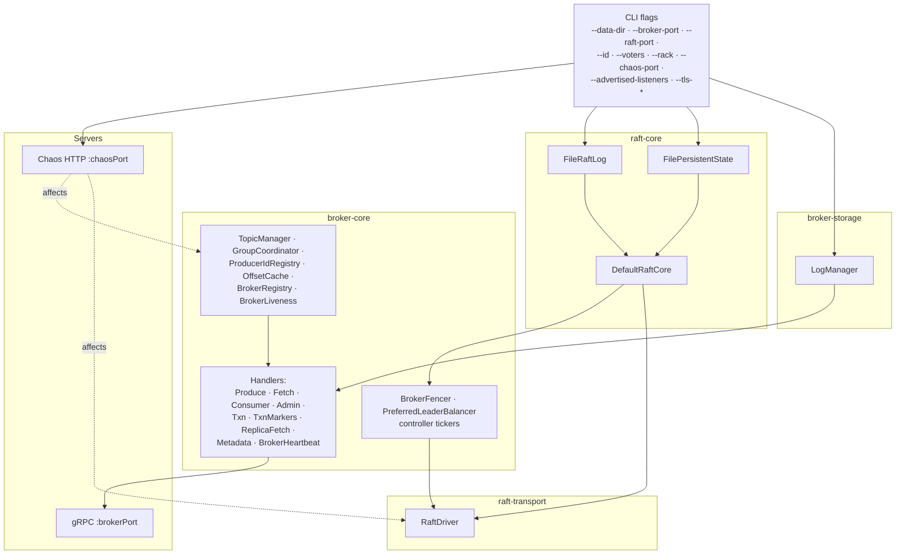

# broker-app

The broker JVM entrypoint and CLI. Spring-free — wires `raft-core` + `raft-transport` + `broker-storage` + `broker-core` into a running process by hand. Shipping binary built by `./gradlew :broker-app:installDist` and packaged into the `jbroker-broker:local` Docker image.

## Bootstrap wiring

How `Broker.main` assembles a running broker out of the four core modules:



No Spring, no DI container — just constructor wiring inside `Broker.start()`. Every dependency edge above is a constructor argument.

## CLI

`broker-app/build/install/broker-app/bin/broker-app` (alias this to `j-broker` for your shell):

```text
j-broker server   [--config j-broker.yaml] [--validate-config]
                  [--data-dir DIR] [--broker-port P] [--raft-port P] [--id N]
                  [--voters ID@HOST:RAFT:BROKER,...] [--rack ZONE]
                  [--chaos-port P] [--enable-chaos]
                  [--consumer-offsets-partitions N] [--min-insync-replicas N]
                  [--advertised-listeners ID=HOST:PORT,...]
                  [--auth-mode none|mtls]
                  [--tls-enabled --tls-cert PATH --tls-key PATH --tls-trust PATH]

j-broker topics   create|list|describe --broker HOST:PORT [...]
j-broker produce  --broker HOST:PORT --topic T --partition N   (stdin = one msg per line)
j-broker console-consumer --broker HOST:PORT --topic T --partition N [--from-beginning]
j-broker consume  --broker HOST:PORT --group G --topic T [--topic T2 ...]   (coordinator-aware)
j-broker admin    cluster-info | topics ... | groups ... | raft
                  | cluster membership|add-broker|decommission|reassign|reassignments
                            |cancel-reassignment|rebalance-leaders
                  | verify-log  [--admin URL]
```

`topics` and `produce` follow leader hints: a `NOT_LEADER`-shaped refusal naming broker N gets one redial against the hinted broker instead of a bare failure — `topics` retries the failed call there, `produce` retries the failed line and keeps the redirected connection for the rest of stdin. `admin` verbs go through the admin REST API (default `http://localhost:9090`, the bare `bootRun` port — pass `--admin http://localhost:15672` against the Docker/Helm deployment), whose broker pool does its own leader routing; `admin cluster ...` drives the lifecycle surface (membership view, join, drain/decommission, partition reassignment, preferred-leader rebalance).

## Configuration

Server settings resolve in layers: built-in defaults ← `--config j-broker.yaml` ← `JBROKER_*` environment variables ← flags. The YAML file is a flat map of dotted keys; unknown keys in the file are startup errors (they are almost always typos), unrecognized `JBROKER_*` variables only warn. `j-broker server --validate-config` prints every resolved key with its value and source, reports all validation problems at once, and exits 0/2 without binding a port.

The table below is generated from the same key table that drives validation (`ServerConfig.renderReference()`), so it cannot drift from the code:

| Key | Default | Env | Flag | Description |
|---|---|---|---|---|
| `node.id` | `1` | `JBROKER_NODE_ID` | `--id` | Broker id. Must appear in the voter list. |
| `data.dir` | `./var/broker` | `JBROKER_DATA_DIR` | `--data-dir` | Data directory (Raft log + partition logs). |
| `broker.port` | `9092` | `JBROKER_BROKER_PORT` | `--broker-port` | Client and inter-broker gRPC port. |
| `raft.port` | `9192` | `JBROKER_RAFT_PORT` | `--raft-port` | Raft peer RPC port. |
| `voters` | `(empty)` | `JBROKER_VOTERS` | `--voters` | Cluster voter list, `ID@HOST:RAFT:BROKER,...`. Empty runs a single-broker cluster with self as the only voter. |
| `advertised.listeners` | `(empty)` | `JBROKER_ADVERTISED_LISTENERS` | `--advertised-listeners` | Client-facing address overlay, `ID=HOST:PORT,...`. Ids absent from the overlay advertise their bind address. |
| `rack` | `(empty)` | `JBROKER_RACK` | `--rack` | Rack / availability-zone label for this broker (e.g. the `topology.kubernetes.io/zone` value). When brokers span two or more racks, topic placement spreads replicas across them. Empty = no rack. |
| `chaos.port` | `-1` | `JBROKER_CHAOS_PORT` | `--chaos-port` | Cooperative chaos HTTP port. -1 disables. |
| `chaos.enabled` | `false` | `JBROKER_CHAOS_ENABLED` | `--enable-chaos` | Explicit opt-in for the chaos control plane. chaos.port refuses to bind without it. |
| `chaos.token` | `(empty)` | `JBROKER_CHAOS_TOKEN` | — | Bearer token every chaos HTTP request must present. Required when the chaos port is enabled. |
| `consumer.offsets.partitions` | `50` | `JBROKER_CONSUMER_OFFSETS_PARTITIONS` | `--consumer-offsets-partitions` | Partition count for the internal `__consumer_offsets` topic. Fixed at first boot. |
| `min.insync.replicas` | `2` | `JBROKER_MIN_INSYNC_REPLICAS` | `--min-insync-replicas` | Cluster default acks=all durability floor. Per-topic config overrides; RF-1 topics clamp down. |
| `max.message.bytes` | `1048576` | `JBROKER_MAX_MESSAGE_BYTES` | — | Cluster default for the largest serialized produce batch. Per-topic config overrides; hard cap 8 MiB (gRPC frame limits bound every hop). |
| `log.segment.bytes` | `134217728` | `JBROKER_LOG_SEGMENT_BYTES` | — | Cluster default segment roll threshold. Per-topic `segment.bytes` overrides. |
| `log.retention.ms` | `604800000` | `JBROKER_LOG_RETENTION_MS` | — | Cluster default time retention (7 days). -1 = unlimited. Per-topic `retention.ms` overrides. |
| `log.retention.bytes` | `-1` | `JBROKER_LOG_RETENTION_BYTES` | — | Cluster default size-retention budget per partition. -1 = unlimited. Per-topic `retention.bytes` overrides. |
| `log.flush.messages` | `-1` | `JBROKER_LOG_FLUSH_MESSAGES` | — | Cluster default flush count trigger. -1 = off (fsync on segment roll + replication). Per-topic `flush.messages` overrides. |
| `log.flush.ms` | `-1` | `JBROKER_LOG_FLUSH_MS` | — | Cluster default flush age trigger, ms. -1 = off. Per-topic `flush.ms` overrides. |
| `log.cleaner.interval.ms` | `300000` | `JBROKER_LOG_CLEANER_INTERVAL_MS` | — | Retention/compaction cleaner tick interval, ms. |
| `offsets.retention.ms` | `604800000` | `JBROKER_OFFSETS_RETENTION_MS` | — | Committed offsets of groups with no live members expire once their newest commit is older than this (7 days). -1 disables expiry. |
| `shutdown.timeout.ms` | `30000` | `JBROKER_SHUTDOWN_TIMEOUT_MS` | — | SIGTERM drain budget: how long the broker spends handing led partitions to other ISR members before closing. 0 skips the drain. |
| `storage.headroom.bytes` | `1073741824` | `JBROKER_STORAGE_HEADROOM_BYTES` | — | Disk-headroom watermark. Below it, client produces get retriable STORAGE_FULL while fetch/replication/admin keep serving. |
| `auth.mode` | `none` | `JBROKER_AUTH_MODE` | `--auth-mode` | Client authentication: none or mtls. mtls derives the principal from the client certificate CN, rejects principal-less RPCs, and requires tls.enabled. |
| `super.users` | `(empty)` | `JBROKER_SUPER_USERS` | — | Comma-separated principals that bypass ACL checks. Put inter-broker certificate CNs here before turning on auth.mode=mtls. |
| `tls.enabled` | `false` | `JBROKER_TLS_ENABLED` | — | Enable mTLS on every gRPC listener and inter-broker client. |
| `tls.cert` | `(empty)` | `JBROKER_TLS_CERT` | `--tls-cert` | PEM certificate chain. Required when tls.enabled. |
| `tls.key` | `(empty)` | `JBROKER_TLS_KEY` | `--tls-key` | PEM private key. Required when tls.enabled. |
| `tls.trust` | `(empty)` | `JBROKER_TLS_TRUST` | `--tls-trust` | PEM trust bundle peers are verified against. Required when tls.enabled. |

Per-topic keys (`min.insync.replicas`, `max.message.bytes`, `retention.ms`, `retention.bytes`, `segment.bytes`, `flush.messages`, `flush.ms`) are set at topic create/update through the admin API and override the cluster default for that topic.

## Chaos HTTP endpoints

When the broker is started with `--chaos-port P` (plus the explicit `--enable-chaos` opt-in and a `chaos.token` bearer token — see the config table), it exposes a cooperative chaos HTTP server on that port:

| Endpoint | Effect |
|---|---|
| `POST /debug/chaos/kill` | `System.exit(1)` — Docker's restart policy brings it back. |
| `POST /debug/chaos/pause` | Reactor paused; heartbeats stop flowing; the broker gets fenced within 3s. |
| `POST /debug/chaos/resume` | Unpause. |
| `POST /debug/chaos/force-election` | `TimeoutNow` self-RPC so this broker immediately becomes a candidate. |
| `POST /debug/chaos/partition?peer=ID` | Bidirectional block to/from `peer`. |
| `POST /debug/chaos/heal-partition` | Clear all partitions cluster-wide. |
| `POST /debug/chaos/inject-latency?ms=N` | Add `N`ms to every outbound gRPC reply. |
| `GET /debug/chaos/state` | Read back current chaos state — paused, latency_ms, blocked peers. Drives the admin UI's live-topology SVG. |

The admin UI's Chaos page proxies these via `POST /api/v1/chaos/*`.

## TLS / mTLS

Pass `--tls-cert --tls-key --tls-trust` and the gRPC server binds on the configured port with mTLS enforced. Admin-app dials with matching client certs when `jbroker.admin.tls.enabled=true`. Plain mode stays supported for dev/test — no TLS by default.

## Advertised listeners

`--advertised-listeners ID=HOST:PORT,...` overlays what each broker announces in `DescribeCluster` (ids absent from the overlay advertise their bind address). Useful when brokers run inside a docker bridge network but clients connect via published host ports: tell broker 2 to advertise `localhost:9093` instead of `broker2:9092`.

## Tests

~50 ITs wiring real clusters on loopback — multi-broker replication/failover, transactions (`TxnCommitAbortIT`, `TransactionalExactlyOnceIT`), rack-aware placement (`RackSpreadPlacementIT`), compression round-trips, quotas, and the version handshake (`ApiVersionsIT`). See `integration-tests/README.md` for the heavier scenarios.
