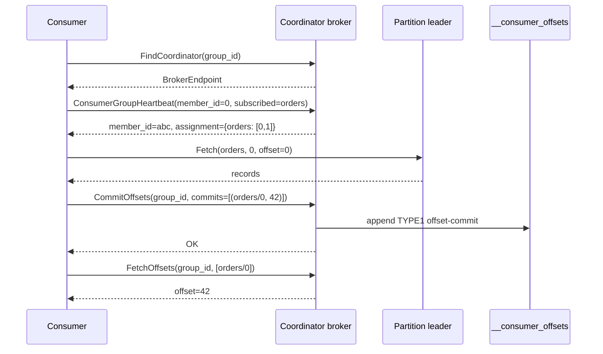

# broker-core

The broker's brain. Handlers for every RPC, core state for topics/groups/offsets/producers, the fencer that drives ISR changes, the preferred-leader balancer, quota enforcement, and JFR instrumentation. Spring-free — the only non-core JVM dep is the proto-generated gRPC stubs.

## Handlers

| Handler | RPCs |
|---|---|
| `ProduceHandler` | `Producer.Produce`, `Producer.InitProducerId` |
| `ConsumerHandler` | `Consumer.Fetch`, `Consumer.FindCoordinator`, `Consumer.ConsumerGroupHeartbeat`, `Consumer.CommitOffsets`, `Consumer.FetchOffsets` |
| `AdminHandler` | `Admin.CreateTopic`, `Admin.DeleteTopic`, `Admin.UpdateTopicConfig`, `Admin.ListTopics`, `Admin.DescribeTopic`, `Admin.ForceCompactPartition`, `Admin.DeleteConsumerGroup`, `Admin.ResetConsumerGroupOffsets` |
| `ReplicaFetchHandler` | `ReplicaConsumer.ReplicaFetch`, `ReplicaConsumer.OffsetsForLeaderEpoch` |
| `MetadataServiceHandler` | `Metadata.DescribeCluster`, `Metadata.DescribeTopicPartitions`, `Metadata.DescribeRaft`, `Metadata.DescribeMetrics`, `Metadata.SubscribeEvents` |
| `BrokerHeartbeatHandler` | `Cluster.BrokerHeartbeat` |

## Core state

| Type | Purpose |
|---|---|
| `TopicManager` | Partition state machine per topic. Applies `PartitionChangeRecord`s from Raft; exposes `partitionState(topic, p)` and `allPartitionAssignments()`. |
| `FollowerStateTracker` | Leader-side bookkeeping of `(broker_id, LEO, last_fetch_millis)` per partition. Drives HWM advancement. |
| `GroupCoordinator` | In-memory consumer-group membership. Heartbeat + assignment + epoch fencing. |
| `OffsetCache` | `(group, topic, partition) → offset` lookup warmed from `__consumer_offsets` on coordinator-broker startup. |
| `ProducerIdRegistry` | Idempotent-producer dedup window per `(producer_id, epoch)`. Rejects out-of-order sequences with `OUT_OF_ORDER_SEQUENCE`, silently drops duplicates. |
| `BrokerRegistry` | Advertised host/port + alive/dead per broker. Seeded from Raft voter config + BrokerHeartbeat signals. |
| `BrokerLiveness` | Wall-clock of the last-seen heartbeat per peer. Used by `BrokerFencer` to declare brokers dead. |
| `BrokerFencer` | Controller-only 250ms tick. Reads `BrokerLiveness` + partition assignments, proposes `PartitionChangeRecord`s to move leadership off fenced brokers. |
| `PreferredLeaderBalancer` | Controller-only 15s tick. Rebalances leadership back to `replicas[0]` (the preferred leader) once the stability window has passed. |
| `MetadataStateMachine` | Applies every `MetadataRecord` from Raft (CreateTopic, DeleteTopic, PartitionChange, CommitOffset, UpdateTopicConfig, ...). |

## Producing (acks, idempotent)

Three durability modes via `acks`:

| `acks` | Semantics | When to use |
|---|---|---|
| `0` / `1` (default) | Leader appends locally and returns. Lost on leader failure. | High-throughput, tolerant of occasional loss. |
| `-1` (all) | Leader holds the reply until HWM has advanced past the produced last-offset — every ISR member has replicated. Rejected with `NOT_ENOUGH_REPLICAS` if the wait times out (default 5s). | Durable producers. |

Idempotent retries: `Producer.InitProducerId` returns a `(producer_id, producer_epoch)` pair; the controller persists the next-id counter through Raft so it survives restart. Every `ProduceRequest` carries `(producer_id, producer_epoch, base_sequence)`; `ProducerIdRegistry` rejects out-of-order sequences and silently drops dupes, so retries are safe.

```java
try (var client = new BrokerClient("127.0.0.1", 9092)) {
    long producerId = client.initProducerId();
    for (int seq = 0; seq < 100; seq++) {
        client.idempotentProduce("orders", 0,
            ("order-" + seq).getBytes(),
            producerId, /* epoch */ 0, /* baseSequence */ seq);
    }
}
```

## Consumer groups

Modelled on Kafka's KIP-848 cooperative-sticky flow:



Admin-initiated mutations (P12.7):
- `Admin.DeleteConsumerGroup` drops `GroupCoordinator` state AND `OffsetCache.dropGroup`. Subsequent `FetchOffsets` returns `OFFSET_OUT_OF_RANGE`.
- `Admin.ResetConsumerGroupOffsets` writes new commit records and updates the cache. Can pre-seed offsets for a group that hasn't joined yet.

## Replication (ISR, HWM, fenced epochs)

Followers pull from the leader via `ReplicaConsumer`. On every `ReplicaFetch`:
1. Leader validates `leader_epoch`. If stale → `FENCED_EPOCH`. Follower then calls `OffsetsForLeaderEpoch` to get the end-offset of that epoch, truncates back, and retries.
2. Leader updates `FollowerStateTracker`: `(broker_id, leo, last_fetch_millis)`.
3. Leader recomputes HWM: `max(prior_hwm, min(LEO across ISR))`.
4. Leader replies with records (up to `max_bytes`) + new HWM.

HWM advancement unblocks any `acks=-1` produces waiting on that offset.

**ISR shrink** — follower hasn't fetched for `replica.lag.time.max.ms` (default 10s):

```mermaid
flowchart LR
    Fencer[BrokerFencer<br/>250ms tick] -->|reads| Liveness[BrokerLiveness<br/>last heartbeat]
    Liveness -->|stale &gt; 3s| Fencer
    Fencer -->|proposes| PartitionChange[PartitionChangeRecord<br/>leader=surviving isr&#91;0&#93;<br/>isr=isr minus dead<br/>leaderEpoch+1]
    PartitionChange -->|Raft commit| Apply[every broker.apply]
    Apply -->|MetadataStateMachine| NewState[PartitionState<br/>new leader, shrunk ISR]
```



**ISR expand** — when a previously-out-of-sync follower catches up within `replica.lag.time.max.ms` of the leader's LEO, the leader proposes a `PartitionChangeRecord` that adds the broker back. HWM can then advance past any byte range that only the reconnected broker was blocking.

## Broker heartbeats + fencer

Brokers run a point-to-point heartbeat every 250ms to every peer:
```
Cluster.BrokerHeartbeat(broker_id, current_metadata_offset) → OK
```

Receivers update `BrokerLiveness` with the wall-clock of the last heartbeat per broker. The `BrokerFencer` (controller-only, 250ms tick) declares any broker unheard-from for `> 3s` as dead and proposes ISR-shrink `PartitionChangeRecord`s.

Why point-to-point instead of Raft-log-based liveness: the P6.5.a attempt to push `BrokerHeartbeatRecord`s through the Raft log revealed that follower-originated proposals are silently dropped — only the leader can propose. Direct RPC matches real KRaft's approach and was the spec's perf-tuning fallback.

## Preferred-leader balancer

After a wave of failovers, partition leadership drifts onto whichever broker recovered last. `PreferredLeaderBalancer` (controller-only, 15s tick, 30s stability window in production) proposes leadership moves back to `replicas[0]`:

```java
if (!isActiveController) return [];
if (now - lastLeaderChangeMillis < stabilityWindowMillis) return [];
for (partition : topicManager.allPartitionAssignments()) {
    int preferred = partition.replicas()[0];
    if (partition.leader() == preferred) continue;
    if (!partition.isr().contains(preferred)) continue;
    proposals.add(new Proposal(
        partition.topic(), partition.partition(),
        preferred, partition.leaderEpoch() + 1));
}
return proposals;
```

Integration tests compress tick + stability via `Broker.Config.withBalancerTiming(300ms, 300ms)` so the rebalance fires in ~2–3s.

## Quota enforcement

Per-principal byte-rate quotas on produce and fetch. Two backends:

- **In-memory** (default) — token bucket per `(principal, op)`. Refills at configured bytes/sec, capped at 1s burst. Per-broker state.
- **Redis** (opt-in via `jbroker.quota.redis.url`) — hand-rolled RESP `INCRBY + EXPIRE 2` per second-granularity bucket. Cluster-wide because all brokers see the same counters. Fail-open: any Redis I/O error falls back to the in-memory enforcer.

Exceeded quotas return `QUOTA_VIOLATED` (86) with a `throttle_ms` hint.

## JFR events

Six custom events under category `j-broker`:

| Event | Where | Fields |
|---|---|---|
| `jbroker.RaftTermChange` | `DefaultRaftCore.becomeFollower` | oldTerm, newTerm, reason |
| `jbroker.PartitionLeaderChange` | `TopicManager.onPartitionChange` | topic, partition, oldLeader, newLeader, leaderEpoch |
| `jbroker.FsyncDuration` | `LogSegment.force` | baseOffset, durationNanos, sizeBytes |
| `jbroker.ReplicationLag` | `ReplicaFetchHandler.handle` | topic, partition, followerBrokerId, lagRecords |
| `jbroker.ProduceLatency` | `ProduceHandler.handle` | topic, partition, latencyNanos, bytes, acks |
| `jbroker.FetchLatency` | `FetchHandler.handle` | topic, partition, latencyNanos, bytes |

```bash
jcmd <PID> JFR.start duration=30s filename=broker.jfr settings=profile
```

## Testing

~270 unit tests covering every handler, state-machine transitions, HWM advancement, idempotent producer dedup, group coordinator flows, fencer proposals, balancer decisions, quota enforcement, and the admin merge logic.
