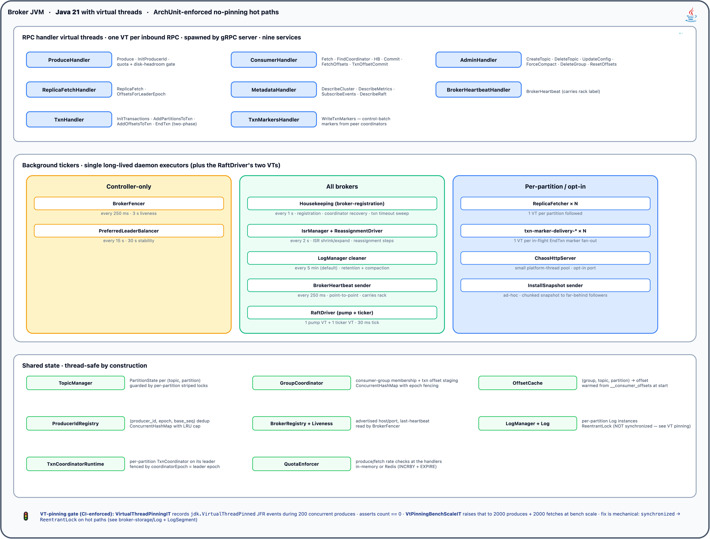
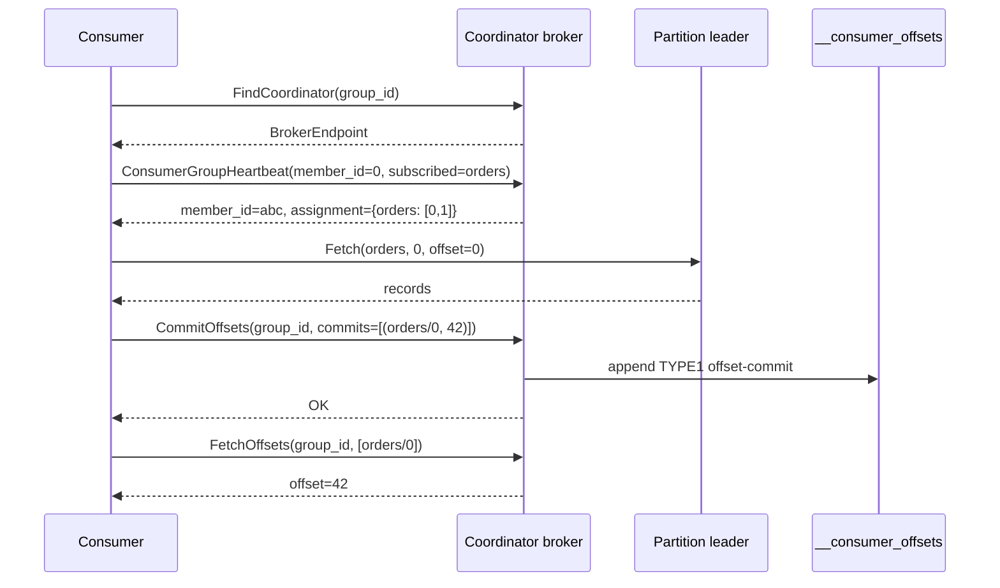
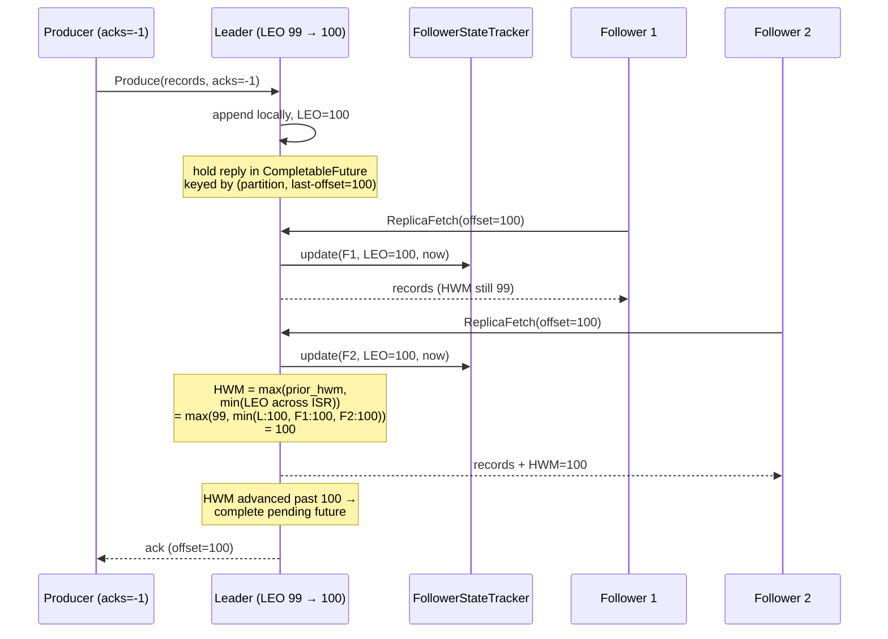

# broker-core

The broker's brain. Handlers for every RPC, core state for topics/groups/offsets/producers, the transaction coordinator, the fencer that drives ISR changes, the preferred-leader balancer, rack-aware replica placement, quota enforcement, the Java client (`jbroker.broker.client`), and JFR instrumentation. Spring-free — the only non-core JVM dep is the proto-generated gRPC stubs.

## Threading model



> Source: [`docs/diagrams/broker-threading.drawio`](../docs/diagrams/broker-threading.drawio) · regenerate via `python3 scripts/diagrams/generate-broker-threading.py`.

Inside one broker JVM:

- **gRPC handler virtual threads** — one VT per inbound RPC, spawned by the gRPC server. Nine services (Producer, Consumer, Admin, ReplicaConsumer, Metadata, Cluster, Txn, TxnOffsets, TxnMarkers) all run concurrently on this pool.
- **Background tickers** — long-lived single threads (daemon `ScheduledExecutorService`s, plus the RaftDriver's two VTs). Split into three groups:
  - *Controller-only* (BrokerFencer 250 ms, PreferredLeaderBalancer 15 s) — only act on the Raft leader.
  - *All brokers* (housekeeping 1 s: broker registration, offset/group/txn-coordinator recovery, transaction-timeout sweep; IsrManager 2 s; LogManager cleaner 5 min default; BrokerHeartbeat sender 250 ms; RaftDriver pump + ticker).
  - *Per-partition / opt-in* (ReplicaFetcher × N, txn marker-delivery VTs — one per in-flight fan-out, `txn-marker-delivery-*` — ChaosHttpServer, InstallSnapshot sender).
- **Shared state** — every state manager is thread-safe by construction (`ConcurrentHashMap`, per-partition striped locks, or `ReentrantLock` on hot paths).

The `synchronized` → `ReentrantLock` swap on `Log` + `LogSegment` was the project's biggest perf unlock at scale. Blocking I/O inside `synchronized` pins the carrier OS thread; under 200+ concurrent VTs that strangles the whole reactor. CI gates the regression: `VirtualThreadPinningIT` (200 concurrent produces, JFR `VirtualThreadPinned` count == 0) and `VtPinningBenchScaleIT` (2000 produces + 2000 fetches at bench scale).

## Handlers

| Handler | RPCs |
|---|---|
| `ProduceHandler` | `Producer.Produce` |
| `InitProducerIdHandler` | `Producer.InitProducerId` |
| `FetchHandler` | `Consumer.Fetch` |
| `ConsumerHandler` | `Consumer.ListOffsets`, `Consumer.FindCoordinator`, `Consumer.ConsumerGroupHeartbeat`, `Consumer.CommitOffsets`, `Consumer.FetchOffsets`, `TxnOffsets.TxnOffsetCommit` |
| `AdminHandler` | `Admin.CreateTopic`, `Admin.DeleteTopic`, `Admin.UpdateTopicConfig`, `Admin.ListTopics`, `Admin.DescribeTopic`, `Admin.ForceCompactPartition`, `Admin.DeleteConsumerGroup`, `Admin.ResetConsumerGroupOffsets`, `Admin.CreateAcl`/`DeleteAcl`/`ListAcls`, `Admin.AddBroker`, `Admin.DecommissionBroker`, `Admin.DescribeMembership`, `Admin.ReassignPartition`, `Admin.ListReassignments`, `Admin.CancelReassignment`, `Admin.RebalanceLeadership` |
| `TxnHandler` | `Txn.InitTransactions`, `Txn.AddPartitionsToTxn`, `Txn.EndTxn`, `Txn.AddOffsetsToTxn` |
| `TxnMarkersHandler` | `TxnMarkers.WriteTxnMarkers` (broker ↔ broker) |
| `ReplicaFetchHandler` / `OffsetsForLeaderEpochHandler` | `ReplicaConsumer.ReplicaFetch`, `ReplicaConsumer.OffsetsForLeaderEpoch` |
| `MetadataServiceHandler` | `Metadata.DescribeCluster`, `Metadata.DescribeTopicPartitions`, `Metadata.ListConsumerGroups`, `Metadata.DescribeConsumerGroup`, `Metadata.DescribeRaft`, `Metadata.ApiVersions`, `Metadata.DescribeMetrics`, `Metadata.SubscribeEvents` |
| `BrokerHeartbeatHandler` | `Cluster.BrokerHeartbeat` |

## Core state

| Type | Purpose |
|---|---|
| `TopicManager` | Partition state machine per topic. Applies `PartitionChangeRecord`s from Raft; exposes `partitionState(topic, p)` and `allPartitionAssignments()`. |
| `FollowerStateTracker` | Leader-side bookkeeping of `(broker_id, LEO, last_fetch_millis)` per partition. Drives HWM advancement. |
| `GroupCoordinator` | In-memory consumer-group membership. Heartbeat + assignment + epoch fencing. |
| `OffsetCache` | `(group, topic, partition) → offset` lookup warmed from `__consumer_offsets` on coordinator-broker startup. |
| `ProducerIdRegistry` | Idempotent-producer dedup window per `(producer_id, epoch)`. Rejects out-of-order sequences with `OUT_OF_ORDER_SEQUENCE`, silently drops duplicates. |
| `BrokerRegistry` | Advertised host/port + alive/dead per broker. Seeded from Raft voter config + BrokerHeartbeat signals. |
| `BrokerLiveness` | Wall-clock of the last-seen heartbeat per peer. Used by `BrokerFencer` to declare brokers dead. |
| `BrokerFencer` | Controller-only 250ms tick. Reads `BrokerLiveness` + partition assignments, proposes `PartitionChangeRecord`s to move leadership off fenced brokers. |
| `PreferredLeaderBalancer` | Controller-only 15s tick. Rebalances leadership back to `replicas[0]` (the preferred leader) once the stability window has passed. |
| `ReplicaPlacer` | Pure placement function for topic creation. Rack-blind clusters get the original first-`rf`-candidates policy; two or more distinct racks round-robin so a replica set spans as many racks as it can. The proposing controller always leads the partitions it creates. |
| `TxnCoordinator` / `TxnCoordinatorRuntime` | Transaction coordination per `__transaction_state` partition this broker leads — see the transactions section below. |
| `TxnOffsetStaging` | Group-coordinator side of transactional offsets: staged commits keyed by `(group, producerId)`, decided by the transaction marker. |
| `TxnPartitionEpochs` | Partition-local producer-epoch floors; a transactional produce below the floor is `PRODUCER_FENCED` at the data partition itself. |
| `MetadataStateMachine` | Applies every `MetadataRecord` from Raft (topic create/delete, partition changes, broker registration, producer-id assignment, topic config, ACLs, reassignments). |

## Producing (acks, idempotent)

Three durability modes via `acks`:

| `acks` | Semantics | When to use |
|---|---|---|
| `0` / `1` (default) | Leader appends locally and returns. Lost on leader failure. | High-throughput, tolerant of occasional loss. |
| `-1` (all) | Rejected with `NOT_ENOUGH_REPLICAS` **before the append** when the ISR is below `min.insync.replicas` (cluster default 2, per-topic override). Otherwise the leader holds the reply until HWM has advanced past the produced last-offset with the ISR still at or above the floor — every ISR member has replicated, and there are enough of them. Rejected with `NOT_ENOUGH_REPLICAS` on an ISR shrink below the floor mid-wait or on timeout (default 5s). | Durable producers. |

Idempotent retries: `Producer.InitProducerId` returns a `(producer_id, producer_epoch)` pair; the controller persists the next-id counter through Raft so it survives restart. Every `ProduceRequest` carries `(producer_id, producer_epoch, base_sequence)`; `ProducerIdRegistry` rejects out-of-order sequences and silently drops dupes, so retries are safe.

```java
try (var client = new BrokerClient("127.0.0.1", 9092)) {
    long producerId = client.initProducerId();
    for (int seq = 0; seq < 100; seq++) {
        client.idempotentProduce("orders", 0,
            ("order-" + seq).getBytes(),
            producerId, /* epoch */ 0, /* baseSequence */ seq);
    }
}
```

## Consumer groups

Modelled on Kafka's KIP-848 cooperative-sticky flow:



Admin-initiated mutations:
- `Admin.DeleteConsumerGroup` drops `GroupCoordinator` state AND `OffsetCache.dropGroup`. Subsequent `FetchOffsets` returns `OFFSET_OUT_OF_RANGE`.
- `Admin.ResetConsumerGroupOffsets` writes new commit records and updates the cache. Can pre-seed offsets for a group that hasn't joined yet.

## HWM advancement under acks=all



The `max(prior_hwm, ...)` guard is the line between "works" and "consumers occasionally see records vanish." Without it, a transient ISR shrink can cause `min(LEO across ISR)` to spike upward and then dip back down — non-monotonic HWM is silently catastrophic for `acks=all` durability.

## Replication (ISR, HWM, fenced epochs)

Followers pull from the leader via `ReplicaConsumer`. On every `ReplicaFetch`:
1. Leader validates `leader_epoch`. If stale → `FENCED_EPOCH`. Follower then calls `OffsetsForLeaderEpoch` to get the end-offset of that epoch, truncates back, and retries.
2. Leader updates `FollowerStateTracker`: `(broker_id, leo, last_fetch_millis)`.
3. Leader recomputes HWM: `max(prior_hwm, min(LEO across ISR))`.
4. Leader replies with records (up to `max_bytes`) + new HWM.

HWM advancement unblocks any `acks=-1` produces waiting on that offset.

**ISR shrink** — follower hasn't fetched for `replica.lag.time.max.ms` (default 10s):

```mermaid
flowchart LR
    Fencer[BrokerFencer<br/>250ms tick] -->|reads| Liveness[BrokerLiveness<br/>last heartbeat]
    Liveness -->|stale &gt; 3s| Fencer
    Fencer -->|proposes| PartitionChange[PartitionChangeRecord<br/>leader=surviving isr&#91;0&#93;, else -1<br/>isr=isr minus dead, else preserved<br/>leaderEpoch+1, CAS-guarded]
    PartitionChange -->|Raft commit| Apply[every broker.apply]
    Apply -->|MetadataStateMachine| NewState[PartitionState<br/>new leader, shrunk ISR]
```



With no surviving ISR member the partition goes **offline** (`leader = -1`) with its ISR preserved, and the fencer's recovery pass re-elects a preserved-ISR member once it heartbeats again — see the durability model below.

**ISR expand** — when a previously-out-of-sync follower catches up within `replica.lag.time.max.ms` of the leader's LEO, the leader proposes a `PartitionChangeRecord` that adds the broker back. HWM can then advance past any byte range that only the reconnected broker was blocking.

## Durability model (acks=all)

The contract: **a record acked under `acks=all` survives any single broker loss.** Four mechanisms hold it up; each closes a leg of a real loss chain found by the chaos soak ([#115](https://github.com/jeremainecheong/j-broker/issues/115)), where a record was acked by an ISR of one and then erased by a shorter-log promotion.

**1. The `min.insync.replicas` floor.** HWM advance over the current ISR is necessary but not sufficient — an ISR shrunk to just the leader satisfies it with a single copy. The floor (cluster default 2, `--min-insync-replicas`, per-topic `min.insync.replicas` config) is enforced twice in `ProduceHandler`: before the append (`NOT_ENOUGH_REPLICAS`, nothing written, trivially retriable) and inside the HWM wait, where an ISR shrink below the floor fails the produce instead of false-acking — the shrink itself is what makes `computeHwm` jump to the leader's LEO, so HWM advance only counts while the ISR that produced it is floor-sized. Rejections are conservative (a shrink racing the ack can reject a batch that did replicate); the error stays retriable and idempotent producers dedup the retry. Topics with replication factor below the cluster default clamp down (RF=1 dev topics keep working); an explicit per-topic override wins verbatim and is validated against RF at create/update.

**2. ISR-only election, preserved offline ISR.** The ISR is, by construction, the set of replicas guaranteed to hold every committed record — so it is the only set leadership may come from. When the fencer demotes a dead leader with no surviving ISR member, the partition goes offline (`leader = -1`) **with its ISR preserved**: blanking it would erase the one fact recovery needs. The fencer's recovery pass re-elects a preserved-ISR member once it is demonstrably alive (fresh heartbeat, or it is the controller itself); replicas outside the preserved ISR are never considered, however alive. Availability is sacrificed, never consistency.

**3. CAS-guarded metadata.** Every partition-change proposal derived from state (fencer demotions and recoveries, ISR flips, preferred-leader moves) names the `(leader_epoch, partition_epoch)` it was derived from; apply drops the record if the state has moved on, and the proposer re-derives next tick. This closes a race accept-if-newer merging cannot catch: a freshly elected controller whose state-machine apply lags its Raft log fences with an outdated ISR — the stale proposal carries a *higher* epoch than the state it should have been derived from. The check is deterministic across brokers (every apply sees the same prior state in the same order).

**4. Idempotent dedup reflects the log, not the ack.** An acks=all produce that appends and then fails its replication wait leaves the batch on disk — so producer state records it anyway, and a retry dedups to the cached offsets and **re-runs the replication wait on them**. Without this, every retry of an appended-but-unacked batch appends another copy (the verification soak found eight copies of one record at consecutive offsets, seeding replica divergence), and a cached retry would instant-ack a record that was never committed.

**5. Lineage-aware replica fetch.** Every batch carries the leader epoch that wrote it; followers derive offset-accurate leader-epoch checkpoints from replicated batch headers and advertise the epoch owning their last local batch on every fetch. The leader fences (`FENCED_EPOCH`) when that doesn't match its own lineage at the fetch offset — a follower whose tail was written under a rejected leadership must truncate to the epoch intersection before it may take more records. Matching *metadata* epochs prove nothing about the *logs*; without this check a diverged follower glues the leader's records on top of junk and reports a healthy LEO for bytes it doesn't hold.

**6. Leader-epoch fencing.** A deposed leader's appends are rejected with `FENCED_EPOCH`, and a recovering follower truncates to the `OffsetsForLeaderEpoch` boundary before fetching — divergent tails are reconciled toward the elected (ISR-member) leader's log, never the other way.

Against the full #115 chain: replication starves (channels rebuild after consecutive unresolvable-host failures) → ISR shrinks to the leader → **acks=all refuses the write** instead of acking a single copy → retries of the unacked write **dedup instead of re-appending** → the leader dies → the partition goes **offline with ISR preserved** instead of promoting a shorter log → the ISR member returns, is re-elected, and any follower that diverged meanwhile **truncates to the lineage intersection** before rejoining → nothing acked was lost. Deliberately *not* guaranteed: `acks=0/1` records (at-most-once by contract on leader loss), and topics explicitly configured to `min.insync.replicas=1`.

## Transactions

Atomic multi-partition produces plus consumer-offset commits — the consume-transform-produce exactly-once loop. The contract: **everything a committed transaction wrote becomes visible together, nothing an aborted one wrote is ever surfaced to a `read_committed` consumer, and a zombie producer cannot decide a transaction it no longer owns.** Kafka's shape throughout: a coordinator over an internal compacted topic, two-phase outcome with control-batch markers, epoch fencing.

**Coordinator-as-partition-leader.** The coordinator for a `transactional_id` is the leader of `__transaction_state` partition `Math.floorMod(txnId.hashCode(), 50)` (`TxnStateTopic`) — the same scheme the group coordinator uses over `__consumer_offsets`. A non-coordinator broker answers `NOT_COORDINATOR` with `suggested_coordinator_*` hints; the client re-points its cache and retries. On gaining leadership of a coordinator partition, the broker replays it into a fresh core (`TxnStateRecovery`, latest record per key — exactly what compaction preserves) and resumes any marker deliveries the previous coordinator left unfinished.

**Pure core, I/O shell.** `TxnCoordinator` is a pure state machine: every input returns the `TxnStateRecord` to append and/or the `MarkerInstruction`s to deliver — the same returns-effects philosophy as `RaftCore.step`. `TxnCoordinatorRuntime` executes the effects in a pinned order: **append before answer** (every state record is appended to the coordinator partition and replicated acks=all before the client sees a response or any marker leaves the broker; a failed append deactivates the partition and the next access rebuilds from the log, the only source of truth), then **deliver markers, then confirm** (Complete is logged only after every partition acks its marker — logging Complete first would let a crash strand undelivered markers with no record of the obligation, leaving the data partitions' LSO stuck forever).

**Two-phase with markers.** `EndTxn` logs `PREPARE_COMMIT`/`PREPARE_ABORT`; from that moment the outcome is irrevocable, and the record carries the full partition set so any successor coordinator can regenerate and redeliver the markers. Delivery runs on background VTs through `TxnMarkerWriter` — locally for partitions this broker leads, via the inter-broker `TxnMarkers.WriteTxnMarkers` RPC otherwise. Each marker append is leader-checked, fenced by `coordinator_epoch` (a deposed coordinator still flushing its queue is refused), idempotent under retry, and confirmed only after the same ISR replication wait the produce path uses — a marker confirmed but lost with its leader would leave the partition undecided forever.

**Epoch fencing.** `InitTransactions` bumps the producer epoch (int16 ceiling 65 535, then the id rolls); every later call carrying the older epoch — at the coordinator, the group coordinator, or the data partition (`TxnPartitionEpochs` in `ProduceHandler`) — answers `PRODUCER_FENCED`. An in-flight transaction left by the previous epoch is aborted by the bump itself; one abandoned by a dead producer falls to the timeout sweep (`TxnCoordinator.tick`, default 60 s).

**Staged transactional offsets.** `AddOffsetsToTxn` registers the group's `__consumer_offsets` partition in the transaction; `TxnOffsetCommit` then appends the offsets to that partition as a TRANSACTIONAL batch and stages them in `TxnOffsetStaging` — invisible to `FetchOffsets` until the transaction's marker lands on that same partition: COMMIT folds them into the `OffsetCache` (and re-appends them as regular commit records for durability), ABORT discards them. Recovery replays transactional batches back through the staging map, so a coordinator restart reconstructs staged-but-undecided transactions exactly.

**read_committed fetch.** `FetchHandler` caps a `read_committed` read at the partition's **last stable offset** — `min(first offset of the earliest ongoing transaction, HWM)`, tracked by storage (`Log.lastStableOffset`) — by trimming whole batches on plaintext headers, no record decode. The response carries the aborted-transaction ranges overlapping the fetch window; the client (`Consumer` with `isolation.level=read_committed`) drops aborted producers' batches from each range's start to its ABORT marker and skips control batches in both isolation levels. `TransactionalProducer.transact(Runnable)` closes the loop client-side: any abortable failure aborts the attempt, re-inits (the epoch bump prevents a resend deduping against aborted data), and re-runs the body — aborted attempts are invisible to `read_committed` readers, so the retry is exactly-once end to end. A COMMIT failure is never retried into an abort: the decision may already be logged, and a decision is never reversed.

End-to-end gates: `TxnCommitAbortIT` and `TransactionalExactlyOnceIT` (broker-app) drive commit/abort visibility and the full consume-transform-produce loop against real clusters.

## Broker heartbeats + fencer

Brokers run a point-to-point heartbeat every 250ms to every peer:
```
Cluster.BrokerHeartbeat(broker_id, current_metadata_offset) → OK
```

Receivers update `BrokerLiveness` with the wall-clock of the last heartbeat per broker. The `BrokerFencer` (controller-only, 250ms tick) declares any broker unheard-from for `> 3s` as dead and proposes ISR-shrink `PartitionChangeRecord`s.

Why point-to-point instead of Raft-log-based liveness: an early attempt to push `BrokerHeartbeatRecord`s through the Raft log revealed that follower-originated proposals are silently dropped — only the leader can propose. Direct RPC matches real KRaft's approach and was the spec's perf-tuning fallback.

## Preferred-leader balancer

After a wave of failovers, partition leadership drifts onto whichever broker recovered last. `PreferredLeaderBalancer` (controller-only, 15s tick, 30s stability window in production) proposes leadership moves back to `replicas[0]`:

```java
if (!isActiveController) return [];
if (now - lastLeaderChangeMillis < stabilityWindowMillis) return [];
for (partition : topicManager.allPartitionAssignments()) {
    int preferred = partition.replicas()[0];
    if (partition.leader() == preferred) continue;
    if (!partition.isr().contains(preferred)) continue;
    proposals.add(new Proposal(
        partition.topic(), partition.partition(),
        preferred, partition.leaderEpoch() + 1));
}
return proposals;
```

Integration tests compress tick + stability via `Broker.Config.withBalancerTiming(300ms, 300ms)` so the rebalance fires in ~2–3s.

## Quota enforcement

Per-principal byte-rate quotas on produce and fetch. Off by default (0 = disabled); switched on per op via `Broker.Config.withQuotaBytesPerSec(produce, fetch)`. The produce gate sits in `ProduceHandler` before the append; the fetch gate in `FetchHandler` is charged on bytes actually read. Follower replication rides the separate `ReplicaFetch` RPC, which has no quota gate — a fetch quota can never throttle intra-cluster replication or starve the ISR.

Two backends:

- **In-memory** (default) — token bucket per `(principal, op)`. Refills at configured bytes/sec, capped at 1s burst. Per-broker state.
- **Redis** (opt-in via `Broker.Config.withQuotaRedisUrl`) — hand-rolled RESP `INCRBY + EXPIRE 2` per second-granularity bucket. Cluster-wide because all brokers see the same counters. Fail-open: any Redis I/O error falls back to the in-memory enforcer.

Exceeded quotas return `QUOTA_VIOLATED` (86) with a `throttle_ms` hint.

## Java client (`jbroker.broker.client`)

The reference client ships in this module — same wire types, no extra dependency:

| Type | Purpose |
|---|---|
| `BrokerClient` | Single-endpoint blocking client: produce (plain / idempotent / batch), fetch, admin, offsets. The building block for tests and the CLI. |
| `ClusterClient` | Cluster-aware core: seeds its view from the first `DescribeCluster` that answers, routes each request to the partition leader (or the group / transaction coordinator), and re-resolves through `NOT_LEADER` / `NOT_COORDINATOR` hints so leader failover is invisible to the application. Transaction RPCs route on `Math.floorMod(transactional_id.hashCode(), 50)` to the `__transaction_state` partition leader. |
| `BatchingProducer` | Async batching producer with idempotent acks=all delivery. |
| `TransactionalProducer` | Transactions over `ClusterClient` — see the transactions section above. |
| `consumer.Consumer` | Group consumer: heartbeat-driven assignment, seek / pause / resume, `max.poll.records`, async commit, dead-letter policy, and `isolation.level` (`read_committed` filters aborted ranges client-side). |
| `ProtocolHandshake` | Runs `Metadata.ApiVersions` once per connection before the first real RPC. A range disjoint from the client's — or gRPC `UNIMPLEMENTED` from a broker predating the RPC — raises `UnsupportedBrokerException` and is never retried: a version mismatch cannot heal on its own. |

## JFR events

Six custom events under category `j-broker`:

| Event | Where | Fields |
|---|---|---|
| `jbroker.RaftTermChange` | `DefaultRaftCore.becomeFollower` | oldTerm, newTerm, reason |
| `jbroker.PartitionLeaderChange` | `TopicManager.onPartitionChange` | topic, partition, oldLeader, newLeader, leaderEpoch |
| `jbroker.FsyncDuration` | `LogSegment.force` | baseOffset, durationNanos, sizeBytes |
| `jbroker.ReplicationLag` | `ReplicaFetchHandler.handle` | topic, partition, followerBrokerId, lagRecords |
| `jbroker.ProduceLatency` | `ProduceHandler.handle` | topic, partition, latencyNanos, bytes, acks |
| `jbroker.FetchLatency` | `FetchHandler.handle` | topic, partition, latencyNanos, bytes |

```bash
jcmd <PID> JFR.start duration=30s filename=broker.jfr settings=profile
```

---

# Deep dive: Java 21 in j-broker

The rest of this document walks the Java 21 features the project leans on, in JEP-or-spec order, with code references. Same pattern as the Raft deep dive in [`raft-core/README.md`](../raft-core/README.md): "**JEP / spec**:" shows what the language or library provides, "**j-broker**:" shows where it's used.

## Virtual threads (JEP 444)

**JEP 444** (final in Java 21): "Virtual threads are lightweight threads that dramatically reduce the effort of writing, maintaining, and observing high-throughput concurrent applications. … Implemented as instances of `Thread` that are not tied to a particular OS thread; they are scheduled by the Java runtime onto a small pool of carrier OS threads."

Key APIs:

```java
// Factory
Thread.ofVirtual().start(runnable);
Thread.startVirtualThread(runnable);

// Per-task executor
try (var exec = Executors.newVirtualThreadPerTaskExecutor()) {
    futures = tasks.stream().map(exec::submit).toList();
}

// Inspect
Thread.currentThread().isVirtual();
```

Key semantics:
- **Park is cheap.** A blocked VT releases its carrier OS thread for other VTs to run on.
- **Pin is fatal at scale.** If a VT enters a `synchronized` block (or a native frame) and then makes a blocking call inside it, the carrier OS thread is held for the duration. Under load, pinning serialises the whole reactor onto whatever the default pool size is.

**j-broker** uses VTs throughout:

| Where | What | File |
|---|---|---|
| gRPC handler dispatch | one VT per inbound RPC | provided by `grpc-java` Netty config |
| `RaftDriver` pump | single long-lived VT draining the event queue | `raft-transport/RaftDriver.java` |
| `RaftDriver` ticker | single long-lived VT emitting periodic `Tick` events | same |
| Txn marker delivery | one VT per in-flight marker fan-out (`txn-marker-delivery-*`) | `broker-core/txn/TxnCoordinatorRuntime.java` |
| `MetricsScraper` fan-out | `Executors.newVirtualThreadPerTaskExecutor()` for per-broker `DescribeMetrics` calls | `admin-app/api/MetricsScraper.java` |
| `RaftController` fan-out | same pattern for per-broker `DescribeRaft` | `admin-app/api/RaftController.java` |
| Stress / IT clients | `newVirtualThreadPerTaskExecutor()` for 10k-client tests | `integration-tests/E2E_*` |
| Bench harness | `Thread.ofVirtual().start(...)` for concurrent producer threads | `bench/ProducerPerfTest.java` |

The pinning fix (`broker-storage/LogSegment.java`):

```java
// BEFORE — synchronized + blocking I/O = pinned carrier
synchronized (this) {
    channel.read(buf);   // VT pins its OS thread for the disk I/O
}

// AFTER — ReentrantLock does NOT pin
private final ReentrantLock lock = new ReentrantLock();
lock.lock();
try {
    channel.read(buf);   // VT can park; carrier picks up another VT
} finally {
    lock.unlock();
}
```

CI gate: `VirtualThreadPinningIT` records `jdk.VirtualThreadPinned` JFR events during 200 concurrent produces and asserts count == 0. `VtPinningBenchScaleIT` raises that to 2000 produces + 2000 fetches at bench scale (chunked into 200-concurrent rounds for default-ulimit CI). Both run on every PR.

## Pattern matching for switch (JEP 441)

**JEP 441** (final in Java 21): "Enhance the Java programming language with pattern matching for `switch` expressions and statements, along with extensions to the language of patterns. Extending pattern matching to `switch` allows an expression to be tested against a number of patterns, each with a specific action, so that complex data-oriented queries can be expressed concisely and safely."

When the scrutinee is a sealed type, the compiler enforces exhaustiveness:

```java
sealed interface Shape permits Circle, Square, Triangle {}

double area(Shape s) {
    return switch (s) {
        case Circle c   -> Math.PI * c.radius() * c.radius();
        case Square sq  -> sq.side() * sq.side();
        case Triangle t -> 0.5 * t.base() * t.height();
        // compiler error if a case is missing
    };
}
```

**j-broker** uses this in every event/effect dispatch:

- `RaftCore.step(RaftEvent)` switches on the event subtype and dispatches to the right handler.
- `RaftDriver` switches on `RaftEffect` to dispatch outbound RPCs / persist calls / timer resets.
- `MetadataStateMachine.apply(MetadataRecord)` — was a chain of `has*()` checks, now a single switch over the proto oneof's generated `KindCase` enum (the record itself is a protobuf message, so it can't be sealed — the enum switch is the closest the generated code allows, and the compiler warns when a case is missing).

The compile-time exhaustiveness check is the most useful refactor of the project for catching "I added a new case and forgot to wire it through."

## Records (JEP 395)

**JEP 395** (final in Java 16): "Records are classes that act as transparent carriers for immutable data. They can be thought of as nominal tuples." The compiler generates:

- A canonical constructor matching the component declaration order
- Component accessors with the same name as each component
- `equals`, `hashCode`, `toString` derived from the components
- Final fields, final class — immutable by construction

```java
public record NodeId(int value) {
    public NodeId {                    // compact constructor for validation
        if (value < 0) throw new IllegalArgumentException();
    }
}
```

**j-broker** uses records for ~24 value types and DTOs:

- **Raft value types**: `NodeId(int value)`, `Term(long value)`, `LogEntry(long index, Term term, Type type, byte[] payload)`
- **Event/effect cases**: every `RaftEvent` and `RaftEffect` subtype is a record inside a sealed interface (see next section)
- **Domain DTOs**: `PartitionState`, `PartitionAssignment`, `TopicDescription`, `OffsetAndMetadata`, `ConsumerRecord`
- **Admin DTOs**: `TopicSummary`, `TopicDetail`, `ClusterSummary`, `RaftNodeState`, `NodeInfo`, `HealthBadge`, `ChaosStateSnapshot`, `ConsumerGroupSummary`, `ConsumerGroupDetail`, `RestError`
- **Storage value types**: `Record`, `RecordBatch.Slice`

Why records here: every value that flows through the step API or gets serialised over gRPC is immutable. Free `equals` / `hashCode` / `toString` catches bugs that mutable DTOs would invite (unintended mutation, stale snapshots), and immutable-by-default plays well with virtual-thread concurrency.

## Sealed interfaces (JEP 409)

**JEP 409** (final in Java 17): "An interface or class can declare which classes/interfaces are permitted to extend or implement it. The set of permitted subclasses is closed and known to the compiler."

```java
public sealed interface RaftEffect
    permits RaftEffect.SendAppendEntries,
            RaftEffect.SendVoteRequest,
            RaftEffect.SendPreVoteResp,
            RaftEffect.PersistLog,
            RaftEffect.PersistState,
            RaftEffect.ApplyEntries,
            RaftEffect.SendInstallSnapshot,
            ... {

    record SendAppendEntries(NodeId to, Term term, ...) implements RaftEffect {}
    record PersistLog(List<LogEntry> entries) implements RaftEffect {}
    // ...
}
```

**j-broker**:

- `RaftEvent` — sealed, ~14 record subtypes (`Tick`, `AppendEntriesReq`, `AppendEntriesResp`, `VoteReq`, `VoteResp`, `PreVoteReq`, `PreVoteResp`, `InstallSnapshotReq`, `InstallSnapshotResp`, `ClientPropose`, `ConfigPropose`, `Read`, ...)
- `RaftEffect` — sealed, ~12 record subtypes (`SendAppendEntries`, `SendAppendEntriesResp`, `SendVoteReq`, `SendVoteResp`, `SendPreVoteReq`, `SendPreVoteResp`, `SendInstallSnapshot`, `PersistLog`, `PersistState`, `ApplyEntries`, `RejectClientPropose`, `DuplicateClientPropose`, ...)
- `BrokerEvent` — sealed for the `AdminEventBus` publisher

(`MetadataRecord` is a protobuf message with a `kind` oneof, so it dispatches on the generated `KindCase` enum instead — see the previous section.)

Combined with pattern-matching switch, every event/effect/record dispatch site in the codebase is compile-time-exhaustive. Adding a new event type fails the build at the dispatch site rather than silently falling through `else`.

## Java Flight Recorder custom events (JEP 328)

**JEP 328** (final in Java 11): "Provide a low-overhead data collection framework for troubleshooting Java applications and the HotSpot JVM."

Custom event API:

```java
import jdk.jfr.*;

@Name("jbroker.ProduceLatency")
@Label("Produce Latency")
@Description("Server-observed produce RPC latency including ack wait for acks=all.")
@Category({"j-broker", "Data Plane"})
@StackTrace(false)                         // skip stack capture for speed
public final class ProduceLatencyEvent extends Event {
    @Label("Topic")     public String topic;
    @Label("Partition") public int partition;
    @Label("Latency")   @Timespan(Timespan.NANOSECONDS) public long latencyNanos;
    @Label("Bytes")     public long bytes;
    @Label("Acks")      public int acks;
}
```

Cost discipline (the difference between paying 0.5 % and 5 % throughput tax):

```java
var event = new ProduceLatencyEvent();
event.begin();
// ... do the actual produce work ...
event.end();
if (event.shouldCommit()) {                // single byte read if not recording
    event.topic = topic;
    event.partition = partition;
    event.latencyNanos = elapsedNanos;
    event.commit();
}
```

**j-broker** ships **6 custom events** under the `j-broker` category:

| Event class | Module | Where emitted |
|---|---|---|
| `RaftTermChangeEvent` | `raft-core` | `DefaultRaftCore.becomeFollower` |
| `PartitionLeaderChangeEvent` | `broker-core` | `TopicManager.onPartitionChange` |
| `FsyncDurationEvent` | `broker-storage` | `LogSegment.force` |
| `ReplicationLagEvent` | `broker-core` | `ReplicaFetchHandler.handle` |
| `ProduceLatencyEvent` | `broker-core` | `ProduceHandler.handle` |
| `FetchLatencyEvent` | `broker-core` | `FetchHandler.handle` |

Plus the **built-in event** `jdk.VirtualThreadPinned` — used by the CI gates above to assert no carrier pinning occurs on hot paths.

To capture: `jcmd <PID> JFR.start duration=30s filename=broker.jfr settings=profile`. View in JMC by category `j-broker` for the custom events.

## NIO.2: FileChannel, transferTo, MappedByteBuffer

**JDK** (`java.nio.channels.FileChannel`, since Java 1.4 with Java 7's NIO.2 enhancements):

```java
// Basic I/O
int n = channel.read(byteBuffer);
int m = channel.write(byteBuffer);

// Zero-copy file-to-socket (kernel sendfile() on Linux)
long bytes = sourceChannel.transferTo(position, count, targetChannel);

// fsync — force data + metadata to durable storage
channel.force(true);

// Memory-mapped file region (page-cache-backed)
MappedByteBuffer buf = channel.map(MapMode.READ_ONLY, position, size);
```

**j-broker**:

| Use | API | File |
|---|---|---|
| Append record-batch to segment | `FileChannel.write` + `force(true)` | `broker-storage/LogSegment.java` |
| Sparse offset/time index lookup | `FileChannel.map(READ_ONLY, ...)` → `MappedByteBuffer` | `broker-storage/OffsetIndex.java`, `TimeIndex.java` |
| Zero-copy fetch reply | `FileChannel.transferTo` (kernel `sendfile` on Linux) | `broker-core/FetchHandler`, `ReplicaFetchHandler` |
| Raft log append | `FileChannel.write` + `force(true)` | `raft-core/FileRaftLog.java` |
| Raft persistent state (term + votedFor) | `FileChannel.write` + `force(true)` | `raft-core/FilePersistentState.java` |

The `transferTo` path is what makes consume throughput ~6× higher than produce throughput in the bench: there's no fsync on the read side, *and* the data goes directly from page cache to socket without bouncing through user space.

## CompletableFuture for acks=all coordination

**JDK** (`java.util.concurrent.CompletableFuture`, since Java 8): a future whose completion can be triggered by anyone, with rich composition (`thenApply`, `thenCompose`, `allOf`, `anyOf`, `orTimeout`).

**j-broker**: every `acks=all` produce is held in a `CompletableFuture<ProduceResp>` keyed by `(partition, last-offset)` until the leader's HWM advances past that offset.

```java
// In ProduceHandler.handle(), for acks=-1:
var future = new CompletableFuture<ProduceResp>();
pendingAcksAll.put(new Key(partition, lastOffset), future);

// Schedule a timeout safety net (default 5 s):
scheduledExecutor.schedule(() -> {
    if (!future.isDone()) {
        future.complete(buildErr(NOT_ENOUGH_REPLICAS));
        pendingAcksAll.remove(...);
    }
}, 5, TimeUnit.SECONDS);

return future;   // gRPC server awaits this on the VT

// Elsewhere — when ReplicaFetch updates FollowerStateTracker:
void onFollowerLeoUpdate(...) {
    long newHwm = recomputeHwm(...);
    pendingAcksAll.headMap(new Key(partition, newHwm), true)
                  .forEach((key, fut) -> fut.complete(buildOk(key.offset)));
}
```

The combination of `CompletableFuture` + virtual threads gives "synchronous-looking blocking code" without the cost: the gRPC handler thread (a VT) parks on `future.get()` while the carrier OS thread services other VTs.

## try-with-resources lifecycle discipline

**JLS §14.20.3** (since Java 7): any `AutoCloseable` resource declared in a `try (...)` header is closed on normal exit, exception, or stack unwind. Multiple resources close in reverse declaration order.

**j-broker** uses this aggressively:

```java
try (var harness = ClusterHarness.start(voters, dataDirs)) {
    // run scenario against 3-broker cluster
}  // implicit: harness.close() → stop all 3 brokers, fsync logs, close channels
```

Every long-lived resource is `AutoCloseable`:
- `Broker` — closes gRPC server, `RaftDriver`, `LogManager`, chaos HTTP server
- `BrokerClient` — closes Netty channel
- `LogSegment`, `Log`, `LogManager` — close `FileChannel`s
- `RaftDriver` — joins pump and ticker VTs, closes peer clients
- `FilePersistentState`, `FileRaftLog` — close their backing channels
- `ChaosHttpServer` — stops the small HTTP listener
- `RedisQuotaEnforcer` — closes the RESP socket
- `AdminEventBus` — cancels every `SubscribeEvents` stream and closes all client channels

Every IT and unit test wraps its cluster in `try (...)`. This is what kept tests from leaking sockets and ports across runs through hundreds of CI cycles.

## JMC + async-profiler workflow

**JMC** (JDK Mission Control): Oracle's official desktop tool for analysing JFR recordings. Open the `.jfr` file, browse events by category, pivot on any field. Free download at <https://www.oracle.com/java/technologies/jdk-mission-control.html>.

**async-profiler**: third-party low-overhead sampling profiler. Attaches via `jcmd`, outputs flame graphs in HTML / collapsed-stacks / JFR formats. Ships at <https://github.com/async-profiler/async-profiler>.

**j-broker workflow**:

```bash
# CPU + allocation flame graph (async-profiler)
asprof -d 30 -f flame.html <PID>

# Full JFR recording (built-in)
jcmd <PID> JFR.start duration=30s filename=broker.jfr settings=profile

# Open broker.jfr in JMC
open -a JMC broker.jfr
```

JMC's "Threads" view + the `jdk.VirtualThreadPinned` event filter is what diagnosed the carrier-pinning issue. async-profiler's allocation flame graph caught the per-record-allocation bloat that drove the zero-copy decode work in PR #98.

## ArchUnit for architectural invariants

**ArchUnit** (third party, <https://www.archunit.org/>): a JUnit-friendly test framework for asserting class-structure rules.

```java
import static com.tngtech.archunit.lang.syntax.ArchRuleDefinition.noClasses;

@Test
void raftCoreMustNotDependOnSpring() {
    var classes = new ClassFileImporter()
        .withImportOption(ImportOption.Predefined.DO_NOT_INCLUDE_TESTS)
        .importPackages("jbroker.raft.core");

    noClasses().should()
        .dependOnClassesThat().resideInAnyPackage("org.springframework..")
        .allowEmptyShould(true)
        .check(classes);
}
```

**j-broker**: `raft-core/src/test/java/.../ModuleBoundaryTest.java` enforces three invariants:

- `raft-core` does not depend on `org.springframework..`
- `raft-core` does not depend on `io.grpc..`
- `raft-core` does not depend on `jakarta..`

The dual-driver design (real `RaftDriver` vs simulator) only works because of this compile-time-enforced isolation. Without ArchUnit, "raft-core has no I/O" would be aspirational, not enforceable. The test runs as part of the standard `./gradlew test` suite, so any future change that pulls Spring or gRPC into raft-core fails CI.

## JEP / spec references

| Feature | Spec | Java level |
|---|---|---|
| Virtual threads | [JEP 444](https://openjdk.org/jeps/444) | 21 (final) |
| Pattern matching for switch | [JEP 441](https://openjdk.org/jeps/441) | 21 (final) |
| Records | [JEP 395](https://openjdk.org/jeps/395) | 16 (final) |
| Sealed classes/interfaces | [JEP 409](https://openjdk.org/jeps/409) | 17 (final) |
| Text blocks | [JEP 378](https://openjdk.org/jeps/378) | 15 (final) |
| JFR custom events | [JEP 328](https://openjdk.org/jeps/328) | 11 (final) |
| `FileChannel.transferTo` | `java.nio.channels.FileChannel` | 1.4+ |
| `MappedByteBuffer` | `java.nio.MappedByteBuffer` | 1.4+ |
| `CompletableFuture` | `java.util.concurrent.CompletableFuture` | 8+ |
| try-with-resources | [JLS §14.20.3](https://docs.oracle.com/javase/specs/jls/se21/html/jls-14.html#jls-14.20.3) | 7+ |
| async-profiler | <https://github.com/async-profiler/async-profiler> | external |
| ArchUnit | <https://www.archunit.org/> | external |
| JDK Mission Control | <https://www.oracle.com/java/technologies/jdk-mission-control.html> | external |

---

## Testing

~640 unit tests covering every handler, state-machine transitions, HWM advancement, idempotent producer dedup, group coordinator flows, transaction coordination (core transitions, runtime ordering, marker writes, offset staging, recovery replay), fencer proposals, balancer decisions, rack placement, quota enforcement, client routing, and the admin merge logic.
