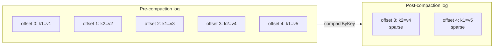
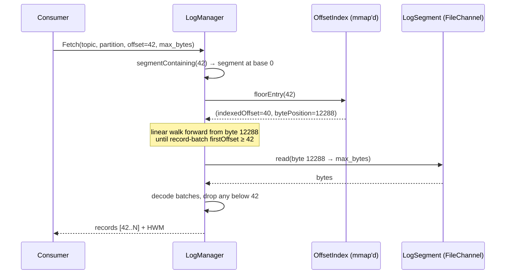

# broker-storage

Per-partition durable log. Owns the on-disk representation — segment files, offset/time indexes, leader-epoch checkpoints, compaction, retention. Every broker has one `LogManager` instance; each partition it replicates gets a `Log` handle.

## Layout on disk

```
<data-dir>/topics/
    format.version                       # on-disk format marker (see below)
    <topic>-<partition>/
        00000000000000000000.log         # segment records
        00000000000000000000.index       # offset → byte position
        00000000000000000000.timeindex   # timestamp → byte position
        00000000000000005000.log
        00000000000000005000.index
        00000000000000005000.timeindex
        leader-epoch-checkpoint
```

The segment filename is the base offset, zero-padded to 20 digits. Rolling to a new segment happens when the active one crosses `segmentBytes` (default 256 MiB).

## Key types

| Type | Purpose |
|---|---|
| `LogManager` | Lifecycle for every `Log` handle on a broker. Validates the on-disk format marker at open, schedules the retention + compaction cleaner. |
| `Log` | Per-partition interface — `append`, `appendControl`, `read`, `nextOffset`, `lastStableOffset`, `abortedTxnsIn`, `force`, `compactByKey`, `retain`. |
| `LogSegment` | Single segment file + its offset/time indexes. Immutable after roll. |
| `OffsetIndex` | Sparse mmap'd offset → byte-position index for fast `read(offset)` resolution. |
| `TimeIndex` | Parallel timestamp index supporting `offsetForTimestamp`. |
| `LeaderEpochCheckpoint` | fsync'd mapping `leader_epoch → end_offset` for the `OffsetsForLeaderEpoch` RPC that drives leader-epoch fencing. |
| `RecordBatch` / `Record` | The Kafka-v2 batch codec — CRC-32C, zigzag varints, the attributes bits below. |
| `Compression` | Batch-level codec carried in the low three attribute bits (0 = none, 2 = zstd; gzip/lz4 ids stay reserved). Only the records section compresses; the 61-byte header stays plaintext so replication, recovery scans and the sparse index work on raw bytes. The codec is a request, not a guarantee — the compressed form is stored only when strictly smaller. |
| `ControlRecord` | The single record a control batch carries: a COMMIT/ABORT transaction marker plus the writing coordinator's epoch. |
| `TransactionState` | Per-log transaction bookkeeping — ongoing ranges (drives the last stable offset) and the aborted-transaction index. |
| `FormatVersion` | The `format.version` directory marker. A binary refuses data written by a newer format instead of guessing. |

## Transactions on disk

Storage's half of the transaction contract: batches carry the flags, the log tracks what's decided, and consumers get exactly the bookkeeping they need to filter aborts.

**Control batches.** Bit 3 of the v2 batch `attributes` marks a control batch; bit 4 marks a data batch as transactional (the low three bits stay the compression codec). A control batch is exactly one record — null key, a `ControlRecord` value (version, COMMIT/ABORT type, the writing coordinator's epoch) — and is never compressed. Both flags live in the plaintext header, so scans and fetch-path trimming never decode records. `Log.appendControl` is the only way a marker lands; a transactional data batch requires producer identity (`producerId >= 0`), because without it no control batch could ever decide it.

**LSO tracking.** `TransactionState` keeps, per log, each producer's ongoing transaction range: a transactional data batch opens or extends it, the producer's control batch closes it. The **last stable offset** is `min(first offset of the earliest ongoing transaction, hwm)` — every offset below it is both replicated and transactionally decided, which is exactly the bound a `read_committed` fetch may serve. Held in memory, rebuilt by the open-time recovery scan (which already decodes every batch) — no sidecar file.

**Aborted-transaction index.** An ABORT closes the range *and* records it. `Log.abortedTxnsIn(fetchStart, fetchEnd)` returns the aborted ranges overlapping a fetch window so the fetch response can attach them for client-side filtering. The index is bounded: retention advancing the log start evicts ranges whose data is gone (`evictAbortedBelow`), and truncation triggers a full rebuild.

**Format version 2 gate.** The `format.version` marker at the data-dir root records what the directory holds. Format 1 is the v2 batch layout (including zstd-compressed record sections); format 2 adds control batches and the transactional bit — a format-1 binary would hand a marker record to applications as payload, so a directory holding control batches must refuse a downgraded binary. Fresh directories stamp 2 at open; a directory still marked 1 keeps its downgrade freedom until the first control batch actually lands, at which point the write path re-stamps **before** the marker bytes hit disk (`Log.ControlAppendGate` → `FormatVersion.ensureAtLeast`). A crash in between over-claims — safe, the downgrade refuses unnecessarily — never under-claims. The stamp itself is a SYNC'd temp file plus atomic rename.

## Compaction + sparse offsets

Log compaction keeps the latest value per key (Kafka-style). The subtle part is **sparse-offset preservation**: a consumer holding a pre-compaction offset must still resolve to the right post-compaction record, even if every intermediate record between its offset and the survivor was tombstoned.



A consumer that last committed offset 2 and resumes after compaction calls `Fetch(topic, partition, offset=2, max_bytes)`. `Log.segmentContaining(2)` falls forward to the segment whose base is above 2 and returns records `[3, 4]` — consumer sees `{k2=v4, k1=v5}` with correct absolute offsets.

Force-compact lets operators trigger compaction synchronously instead of waiting on the 5-minute cleaner cadence. Hit via `POST /api/v1/topics/{name}/partitions/{p}/compact` or the per-partition "Force compact" button on the admin UI.

Compaction **refuses a log holding transaction control batches** (`IOException` from `compactByKey`): the single-batch rewrite cannot preserve marker positions relative to the data they decide, and dropping markers would resurrect decided transactions. Logs that transactions have touched stay on delete retention until the cleaner understands markers.

## Retention

The background cleaner (the broker ticks it every 5 minutes) resolves each topic's effective config through a `TopicLogConfigResolver` the broker wires to its topic catalogue — per-topic `retention.ms`, `retention.bytes`, and `segment.bytes` overrides win over the cluster defaults (7 days, unlimited, 128 MiB). On each tick, per log:

1. `log.retain(cutoff, retentionBytes)` — the time pass deletes closed segments whose last timestamp is older than `now - retention.ms`; the size pass then deletes closed head segments while doing so still leaves at least `retention.bytes` behind, so the log converges to `[retention.bytes, retention.bytes + segment.bytes)`. `-1` disables either pass; the active segment is never eligible.
2. For compact-policy topics, also call `log.compactByKey()` — merges segments, sparse-offset preserving. Compacted topics resolve to unlimited retention: deleting a key's latest value would break the compaction contract (`__consumer_offsets` in particular must not lose idle groups' commits).

Retention interacts with replication: a follower that resumes below the leader's earliest retained offset receives the leader's earliest batch, and `appendRaw` adopts it as a forward gap (base offset ahead of local LEO) — the same sparse-offset shape compaction already produces. Rewinds below the LEO are still rejected.

## Flush policy and crash recovery

The default durability model: the active segment is fsync'd when it rolls (and on explicit `force()`); between fsyncs, durability comes from replication, not the local disk. Two opt-in per-topic knobs bound the unflushed window where a deployment wants local-disk guarantees — `flush.messages` (fsync every N appended records, applied inside the append lock) and `flush.ms` (fsync once unflushed data is older than the window, driven by a 1-second flush tick). The flush tick is also what pushes per-topic config to already-open logs, so `segment.bytes`/flush overrides committed through the metadata log land within about a second.

On restart, the segment scan re-verifies every batch's CRC-32C and truncates at the last intact batch — torn frames from a crash mid-write and bit-level corruption alike. Truncations are logged with the position, bytes dropped, and the offset the log continues from; the log stays writable from that offset.

## Fetch with sparse-index resolution

The offset index is sparse — one entry per ~4 KiB of log. A fetch at offset N walks forward from the largest indexed offset ≤ N until it finds the actual record:



Cost: O(log K) for the binary search (K = number of indexed entries, typically a few thousand) plus O(records-since-last-index) for the linear walk. The fetch path uses `FileChannel.transferTo` (kernel-space `sendfile`) when streaming the bytes to the wire — see `ReplicaFetchHandler` and `FetchHandler`.

## Performance

- Append throughput: sustained >200 MB/s on a laptop SSD, floor of 50 MB/s on GitHub Actions shared disks (see `AppendThroughputTest` — best-of-3 trials).
- Zero-copy fetch path: `LogSegment` exposes a `MappedByteBuffer` slice; `ProduceHandler` writes batches through a `FileChannel.transferFrom` where possible.

## Testing

- ~135 tests: append/read/fsync/recovery, segment roll, offset-index binary search, time-index resolution, compaction tombstoning, sparse-offset fetch, retention eviction, crash recovery with torn frames, batch compression round-trips, control-batch encode/append, transaction-state (LSO + aborted index) tracking, and format-marker semantics.
- Property tests: offset-index binary-search invariants under random insert orders, crash-recovery truncation.
