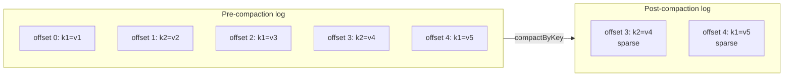
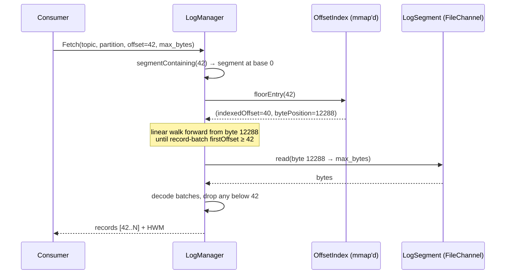

# broker-storage

Per-partition durable log. Owns the on-disk representation — segment files, offset/time indexes, leader-epoch checkpoints, compaction, retention. Every broker has one `LogManager` instance; each partition it replicates gets a `Log` handle.

## Layout on disk

```
<data-dir>/topics/<topic>-<partition>/
    00000000000000000000.log         # segment records
    00000000000000000000.index       # offset → byte position
    00000000000000000000.timeindex   # timestamp → byte position
    00000000000000005000.log
    00000000000000005000.index
    00000000000000005000.timeindex
    leader-epoch-checkpoint
```

The segment filename is the base offset, zero-padded to 20 digits. Rolling to a new segment happens when the active one crosses `segmentBytes` (default 256 MiB).

## Key types

| Type | Purpose |
|---|---|
| `LogManager` | Lifecycle for every `Log` handle on a broker. Schedules the retention + compaction cleaner. |
| `Log` | Per-partition interface — `append`, `read`, `nextOffset`, `force`, `compactByKey`, `retain`. |
| `LogSegment` | Single segment file + its offset/time indexes. Immutable after roll. |
| `OffsetIndex` | Sparse mmap'd offset → byte-position index for fast `read(offset)` resolution. |
| `TimeIndex` | Parallel timestamp index supporting `offsetForTimestamp`. |
| `LeaderEpochCheckpoint` | fsync'd mapping `leader_epoch → end_offset` for the `OffsetsForLeaderEpoch` RPC that drives leader-epoch fencing. |

## Compaction + sparse offsets

Log compaction keeps the latest value per key (Kafka-style). The subtle part is **sparse-offset preservation**: a consumer holding a pre-compaction offset must still resolve to the right post-compaction record, even if every intermediate record between its offset and the survivor was tombstoned.



A consumer that last committed offset 2 and resumes after compaction calls `Fetch(topic, partition, offset=2, max_bytes)`. `Log.segmentContaining(2)` falls forward to the segment whose base is above 2 and returns records `[3, 4]` — consumer sees `{k2=v4, k1=v5}` with correct absolute offsets.

Force-compact lets operators trigger compaction synchronously instead of waiting on the 5-minute cleaner cadence. Hit via `POST /api/v1/topics/{name}/partitions/{p}/compact` or the per-partition "Force compact" button on the admin UI.

## Retention

The background cleaner (the broker ticks it every 5 minutes) resolves each topic's effective config through a `TopicLogConfigResolver` the broker wires to its topic catalogue — per-topic `retention.ms`, `retention.bytes`, and `segment.bytes` overrides win over the cluster defaults (7 days, unlimited, 128 MiB). On each tick, per log:

1. Push the effective `segment.bytes` to the live log, so an override committed after the log opened changes the roll threshold without a restart.
2. `log.retain(cutoff, retentionBytes)` — the time pass deletes closed segments whose last timestamp is older than `now - retention.ms`; the size pass then deletes closed head segments while doing so still leaves at least `retention.bytes` behind, so the log converges to `[retention.bytes, retention.bytes + segment.bytes)`. `-1` disables either pass; the active segment is never eligible.
3. For compact-policy topics, also call `log.compactByKey()` — merges segments, sparse-offset preserving. Compacted topics resolve to unlimited retention: deleting a key's latest value would break the compaction contract (`__consumer_offsets` in particular must not lose idle groups' commits).

Retention interacts with replication: a follower that resumes below the leader's earliest retained offset receives the leader's earliest batch, and `appendRaw` adopts it as a forward gap (base offset ahead of local LEO) — the same sparse-offset shape compaction already produces. Rewinds below the LEO are still rejected.

## Fetch with sparse-index resolution

The offset index is sparse — one entry per ~4 KiB of log. A fetch at offset N walks forward from the largest indexed offset ≤ N until it finds the actual record:



Cost: O(log K) for the binary search (K = number of indexed entries, typically a few thousand) plus O(records-since-last-index) for the linear walk. The fetch path uses `FileChannel.transferTo` (kernel-space `sendfile`) when streaming the bytes to the wire — see `ReplicaFetchHandler` and `FetchHandler`.

## Performance

- Append throughput: sustained >200 MB/s on a laptop SSD, floor of 50 MB/s on GitHub Actions shared disks (see `AppendThroughputTest` — best-of-3 trials).
- Zero-copy fetch path: `LogSegment` exposes a `MappedByteBuffer` slice; `ProduceHandler` writes batches through a `FileChannel.transferFrom` where possible.

## Testing

- ~35 tests: append/read/fsync/recovery, segment roll, offset-index binary search, time-index resolution, compaction tombstoning, sparse-offset fetch, retention eviction, crash recovery with torn frames.
- Property tests: offset-index binary-search invariants under random insert orders.
