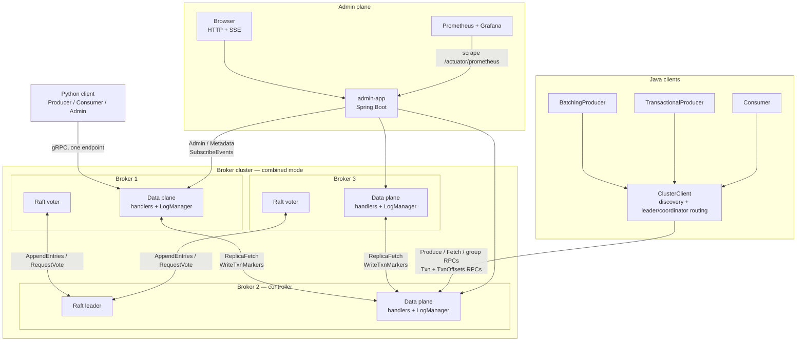
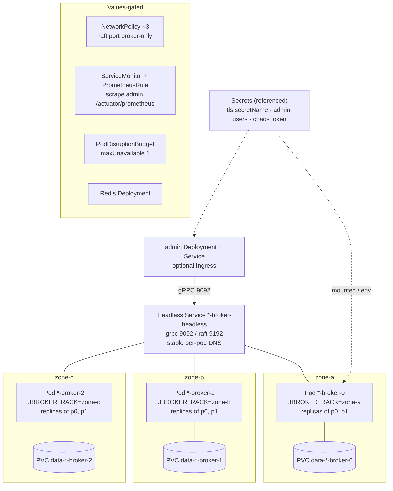
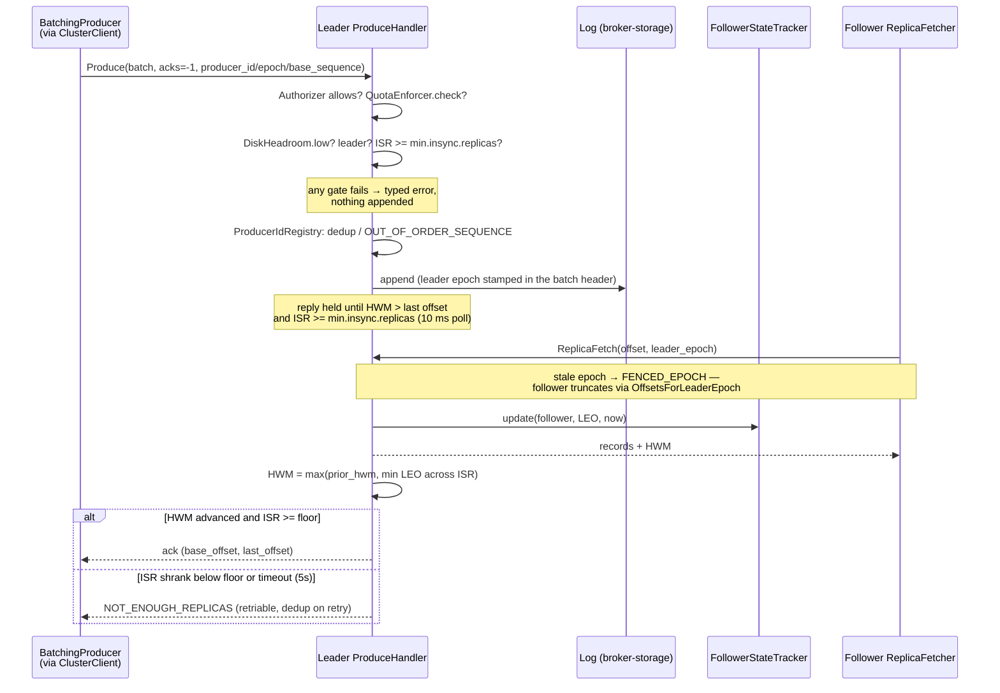
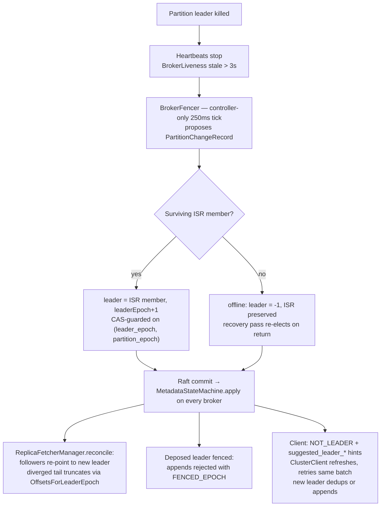
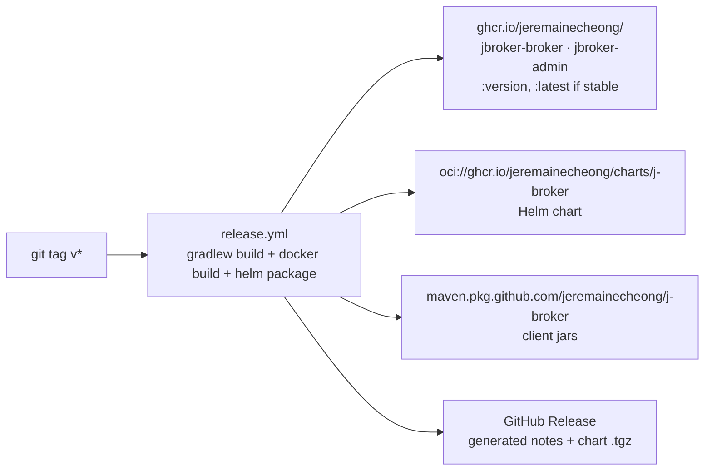

# Architecture

Diagrams of the running system: components, the Kubernetes topology the Helm
chart creates, the produce and transaction paths, leader-failure handling, and
the release artifact flow. Every box names a real class, topic, RPC, or
Kubernetes resource; the code is the ground truth and the module READMEs
([`broker-core`](../../broker-core/README.md),
[`raft-core`](../../raft-core/README.md),
[`broker-storage`](../../broker-storage/README.md)) carry the design detail.

## Contents

1. [System components](#system-components)
2. [Kubernetes deployment topology](#kubernetes-deployment-topology)
3. [Produce path (acks=all)](#produce-path-acksall)
4. [Transaction two-phase commit](#transaction-two-phase-commit)
5. [Leader failure handling](#leader-failure-handling)
6. [Release artifacts](#release-artifacts)

## System components

Every broker runs both planes: a Raft voter for cluster metadata and a data
plane serving the client-facing gRPC services (`Produce`, `Fetch`, consumer
groups, transactions, admin). The Java clients — `BatchingProducer`,
`TransactionalProducer`, and `Consumer` — route through a shared
`ClusterClient` that discovers brokers, follows `NOT_LEADER` /
`NOT_COORDINATOR` hints, and retries idempotently across failovers. The Python
client (`clients/python`) is a minimal single-endpoint reference that speaks
the same protos and record-batch bytes. The admin app (Spring Boot) fans
`Metadata.DescribeMetrics` across brokers and serves the merged snapshot at
`/actuator/prometheus`, which is what Prometheus scrapes.

Verified against `broker-core/src/main/java/jbroker/broker/client/`
(`BatchingProducer`, `TransactionalProducer`, `ClusterClient`,
`consumer/Consumer`), `BrokerGrpcServices` (service bindings for `Producer`,
`Consumer`, `Txn`, `TxnOffsets`, `TxnMarkers`, `ReplicaConsumer`),
`clients/python/jbroker/`, and the ServiceMonitor comment in
`deploy/helm/j-broker/templates/servicemonitor.yaml`.

## Kubernetes deployment topology

`helm install` creates a broker StatefulSet (`podManagementPolicy: Parallel`,
so a first deploy can form a Raft quorum without ordered-startup deadlock)
behind a headless Service that gives each pod stable DNS for voter discovery,
with one PVC per pod from the `data` volumeClaimTemplate. The admin app is a
Deployment behind its own Service (optionally an Ingress). Values-gated
extras: NetworkPolicies restricting the Raft port to broker peers, a
ServiceMonitor and PrometheusRule for the Prometheus operator, a
PodDisruptionBudget (`maxUnavailable: 1`), an external client Service, and a
single-replica Redis for cluster-wide quotas. Secrets are referenced, never
created: `tls.secretName` (cert/key/CA mounted at `/etc/jbroker/tls`),
`admin.auth.existingSecret` (admin UI users), `broker.chaosTokenSecret`.

With `broker.rack.enabled`, each pod reads its own
`topology.kubernetes.io/zone` pod label through the downward API into
`JBROKER_RACK`. The broker declares that rack on every `BrokerHeartbeat`
(`BrokerHeartbeatSender`), peers record it in `BrokerRegistry.noteRack`, and
`ReplicaPlacer.place` round-robins racks at topic creation — so a partition's
replicas span zones and a whole-zone outage cannot take out every copy.
Pod anti-affinity (soft, `kubernetes.io/hostname`) additionally prefers one
broker per node.

Verified against `deploy/helm/j-broker/templates/` (`broker-statefulset.yaml`,
`broker-service.yaml`, `admin-deployment.yaml`, `networkpolicy.yaml`,
`servicemonitor.yaml`, `prometheusrule.yaml`, `broker-pdb.yaml`,
`redis.yaml`, `_helpers.tpl`), `values.yaml` (`broker.rack`,
`broker.podAntiAffinity`), and the rack pipeline in code:
`ServerConfig` (`JBROKER_RACK` → `rack`), `BrokerHeartbeatSender`,
`BrokerHeartbeatHandler` → `BrokerRegistry.noteRack`, `ReplicaPlacer.place`.

## Produce path (acks=all)

`ProduceHandler.handle` runs its gates in a fixed order: ACL (`Authorizer`),
quota (`QuotaEnforcer`, `QUOTA_VIOLATED` with a `throttle_ms` hint), batch
size (`MESSAGE_TOO_LARGE`, fatal), disk headroom (`DiskHeadroom`,
`STORAGE_FULL`, retriable), leadership (`NOT_LEADER`), and — for `acks=-1` —
the `min.insync.replicas` floor *before* the append (`NOT_ENOUGH_REPLICAS`,
nothing written). `ProducerIdRegistry` dedups idempotent retries. After the
append, followers pull via `ReplicaConsumer.ReplicaFetch`; the leader records
each follower's LEO in `FollowerStateTracker` and recomputes
`HWM = max(prior_hwm, min(LEO across ISR))`. The produce completes only when
the HWM passes the batch's last offset with the ISR still at or above the
floor; an ISR shrink below the floor mid-wait fails the produce with a
retriable error instead of false-acking.

Verified against `ProduceHandler.handle` and
`ProduceHandler.waitForIsrReplication`
(`broker-core/src/main/java/jbroker/broker/ProduceHandler.java`),
`FollowerStateTracker`, `ReplicaFetcher` / `ReplicaFetchHandler`
(`broker-core/.../replication/`), and the acks table in
`broker-core/README.md`.

## Transaction two-phase commit

The coordinator for a `transactional_id` is the leader of its
`__transaction_state` partition (`TxnStateTopic.partitionFor`); `TxnHandler`
routes, `TxnCoordinatorRuntime` executes the pure `TxnCoordinator` core's
effects in a pinned order — every state record is appended and replicated
(acks=all) before the client sees a response or a marker leaves the broker.
`EndTxn` durably logs `PREPARE_COMMIT` / `PREPARE_ABORT`, after which the
outcome is irrevocable and any successor coordinator can regenerate the marker
set from the log. Markers land as control batches through `TxnMarkerWriter` —
locally for partitions this broker leads, via the `TxnMarkers.WriteTxnMarkers`
RPC for the rest — each confirmed only after its own ISR replication wait.
A marker on `__consumer_offsets` triggers `ConsumerHandler.onTxnMarker`:
`TxnOffsetStaging` folds the staged offsets into `OffsetCache` on commit,
discards them on abort. Only when every partition confirms is
`COMPLETE_COMMIT` logged. A `read_committed` fetch is capped at the last
stable offset — `min(first offset of the earliest ongoing transaction, HWM)` —
and ships aborted ranges for the consumer to drop.

```mermaid
sequenceDiagram
    participant TP as TransactionalProducer
    participant TC as Txn coordinator<br/>(leader, __transaction_state p)
    participant PL as Partition leader<br/>(orders-0)
    participant GC as Group coordinator<br/>(leader, __consumer_offsets p)
    participant C as Consumer<br/>(read_committed)

    TP->>TC: Txn.InitTransactions(transactional_id)
    TC->>TC: epoch bump — fences zombies,<br/>aborts any in-flight txn — state record acks=all
    TC-->>TP: producer_id, producer_epoch

    TP->>TC: Txn.AddPartitionsToTxn(orders-0) — first touch
    TP->>PL: Produce(transactional batch, producer_id/epoch)
    TP->>TC: Txn.AddOffsetsToTxn(group) — registers group's offsets partition
    TP->>GC: TxnOffsets.TxnOffsetCommit(group, offsets)
    GC->>GC: append TRANSACTIONAL batch,<br/>stage in TxnOffsetStaging — committed view untouched

    TP->>TC: Txn.EndTxn(commit=true)
    TC->>TC: append PREPARE_COMMIT (acks=all) — outcome decided
    TC-->>TP: OK (markers delivered broker-side)

    TC->>PL: WriteTxnMarkers → control batch + ISR wait
    TC->>GC: WriteTxnMarkers → control batch + ISR wait
    GC->>GC: onTxnMarker: fold staged offsets into OffsetCache
    TC->>TC: all confirmed → append COMPLETE_COMMIT

    C->>PL: Fetch(isolation_level=read_committed)
    PL-->>C: records capped at LSO + aborted ranges
```

Verified against `broker-core/src/main/java/jbroker/broker/txn/`
(`package-info.java` two-phase contract, `TxnCoordinator`,
`TxnCoordinatorRuntime`, `TxnHandler`, `TxnMarkerWriter`,
`TxnMarkersHandler`, `TxnStateTopic.NAME`), the marker-listener wiring in
`broker-app/src/main/java/jbroker/app/Broker.java`,
`ConsumerHandler.txnOffsetCommit` / `onTxnMarker`,
`group/TxnOffsetStaging`, `client/TransactionalProducer`, and the LSO cap in
`FetchHandler` + `broker-storage/.../TransactionState.lastStableOffset`.

## Leader failure handling

Liveness is point-to-point: every broker heartbeats every peer each 250 ms
(`Cluster.BrokerHeartbeat`), and receivers timestamp the last contact in
`BrokerLiveness`. The `BrokerFencer` — a controller-only 250 ms tick — declares
a broker dead after 3 s of silence and proposes `PartitionChangeRecord`s:
leadership moves to a surviving ISR member (never a replica outside the ISR),
with the leader epoch bumped and the proposal CAS-guarded by the
`(leader_epoch, partition_epoch)` it was derived from. If no ISR member
survives, the partition goes offline (`leader = -1`) with its ISR preserved,
and the fencer's recovery pass re-elects a preserved-ISR member once it
heartbeats again. After the Raft commit, `MetadataStateMachine` applies the
change on every broker: `ReplicaFetcherManager.reconcile` re-points follower
fetchers at the new leader (a diverged follower truncates to the
`OffsetsForLeaderEpoch` boundary first), the deposed leader's writes bounce
with `FENCED_EPOCH`, and clients follow `NOT_LEADER` + `suggested_leader_*`
hints to retry the same idempotent batch — which the new leader dedups or
appends fresh.

Verified against `BrokerFencer`, `BrokerLiveness`, `ReplicaFetcherManager`
(re-point contract in its class javadoc), `MetadataStateMachine`
(`broker-core/src/main/java/jbroker/broker/` and `.../replication/`),
`ClusterClient` (`suggested_leader_*` handling), and the durability model in
`broker-core/README.md` (ISR-only election, preserved offline ISR,
CAS-guarded metadata).

## Release artifacts

Pushing a `v*` tag runs `.github/workflows/release.yml`: full Gradle build and
test, two Docker images (`Dockerfile.broker`, `Dockerfile.admin`), the
packaged Helm chart, and the client jars — all published with the workflow's
own `GITHUB_TOKEN`. Semver prereleases (any hyphen) never move the floating
`latest` image tags and mark the GitHub Release as a prerelease. A
`workflow_dispatch` with `dry_run=true` (the default) builds and packages
everything but pushes nothing; branch dispatches are always forced to dry-run
because there is no tag to derive a version from.

Verified against `.github/workflows/release.yml` (version derivation,
publish/stable gating, per-artifact push steps) and the repo-root
`Dockerfile.broker` / `Dockerfile.admin`.
