# integration-tests

Real 3-node loopback-cluster ITs and heavy scenario tests. Anything that boots multiple `Broker`s and exercises cross-broker interactions lives here; single-broker handler tests live in `broker-core/` and `broker-app/`.

## Test tier policy

```mermaid
flowchart TD
    PR[PR / push to main] --> Always{Always run on CI}
    Always --> Fast[Fast IT suite<br/>~60 tests · ~2 min]
    Always --> PerfGate[Perf gates<br/>PerfGateIT +<br/>AppendThroughputTest best-of-3]
    Always --> VTPin[VT-pinning gate<br/>VtPinningBenchScaleIT · 2000 produce + 2000 fetch]

    Manual[Manual / nightly] --> Slow["@slow tag<br/>JBROKER_RUN_SLOW_TESTS=1<br/>1M-record compaction · 10k clients ·<br/>Testcontainers-Redis"]
    Manual --> Stress[stressTest<br/>100 randomised election cycles]

    Fast --> Verdict{green?}
    PerfGate --> Verdict
    VTPin --> Verdict
    Verdict -->|yes| Merge[Mergeable]
    Verdict -->|no| Block[Block · root-cause fix<br/>NO RERUNS]
```



Flake policy: every CI failure gets a root-cause fix, not a rerun. See "Flake policy" below for the failure modes the project has explicitly hardened against.

## Scenarios

| Test | What it covers |
|---|---|
| `MultiBrokerStartupIT` | 3-node cluster elects a single leader within 15s, every broker's registry converges to know all 3 peers. |
| `MultiBrokerReplicationIT` | Three brokers replicate identically by byte under steady produce. |
| `MultiBrokerFailoverIT` | Kill the partition leader → new leader elected + produces succeed to new leader within the CI budget (30s). |
| `MultiBrokerHeartbeatIT` | Point-to-point heartbeats converge across all 3 brokers. |
| `OffsetCommitFetchEndToEndIT` | Consumer-group commit + fetch round-trip; commit survives broker restart. |
| `GroupMetadataRestartIT` / `FindCoordinatorEndToEndIT` | Coordinator broker killed → group re-coordinates on a survivor. |
| `PreferredLeaderBalancerRebalanceIT` | After a failover, preferred-leader balancer moves leadership back to `replicas[0]` within the compressed 2-3s window. |
| `ForceCompactIT` | `Admin.ForceCompactPartition` fans to every replica and returns `records_kept` summed. |
| `TenThousandClientsCiGradeIT` | 10k concurrent clients (CI variant); heavier @Tag("slow") version runs 1M records. |
| `ChaosKillBrokerIT` | Kills random brokers via the chaos HTTP endpoint; cluster survives. |
| `PerfGateIT` | Perf regression floor on a 3-node cluster — produces + consumes with rps assertions. |

## the spec E2E matrix — scenario ID → covering test

Every scenario ID from the spec's end-to-end matrix, mapped to the test(s) that cover it today. IDs whose dedicated test lives in another module are linked by name; two scenarios were descoped and are called out honestly at the bottom.

| spec ID | Scenario | Covered by |
|---|---|---|
| | Create topic, list topics | `BrokerEndToEndIT`, `AdminCliIT`, `CreateTopicViaRestIT` |
| | Describe topic | `MetadataServiceWireUpIT`, `AdminCliIT` |
| | Delete topic | `DeleteTopicViaRestIT` + `AdminHandler` unit tests |
| | Produce N, consume all in order | `HighVolumeSmokeTest` (100k round-trip), `BrokerEndToEndIT` |
| | Produce with compression | **Descoped** — see below |
| | Broker restart preserves topics + records | `BrokerEndToEndIT` (restart + re-read), broker-storage crash-recovery tests |
| | Produce to unknown topic errors | `ProduceHandler`/`FetchHandler` error-path unit tests (broker-core) |
| | acks=all lands on all 3 replicas | `MultiBrokerAcksAllIT` |
| | Kill partition leader → failover <5s | `MultiBrokerFailoverIT` |
| | Zero data loss (acked == consumed) | `AcksAllIsrShrinkIT`, `scenario-chaos-with-load.sh` (10-min SIGKILL soak) |
| | Slow follower shrinks out of ISR | `AcksAllIsrShrinkIT` |
| | Caught-up follower rejoins ISR | `AcksAllIsrShrinkIT` |
| | Follower log truncation on leader change | `OffsetsForLeaderEpochHandlerTest`, `ReplicaFetcherTest` (unit level — no full-cluster IT) |
| | Idempotent dedup | `IdempotentProduceEndToEndIT` |
| | Producer state survives leader change | `IdempotentFailoverIT` |
| | acks=1 behaviour | Default produce path (`BrokerEndToEndIT`, bench) |
| | acks=0 behaviour | **Descoped** — see below |
| | Rolling restart, zero loss under load | `BrokerChaosSoakIT`, `scenario-chaos-with-load.sh` |
| €¦7-5 | Assignment / join / leave / session-timeout rebalances | `ConsumerGroupsE2EIT`, `GroupChurnIT`, `GroupHeartbeatEndToEndIT` |
| | Offset commit + restart resumes at N | `OffsetCommitFetchEndToEndIT`, `GroupMetadataRestartIT` |
| | No >2× consumption under churn | `GroupChurnIT` |
| | Static membership (`instance_id`) | `GroupCoordinatorStaticMembershipTest` (unit level) |
| | Coordinator failover | `FindCoordinatorEndToEndIT`, `GroupMetadataRestartIT` |
| | Dead-letter routing | `DeadLetterRoutingIT` |
| | Incremental fetch sessions | `IncrementalFetchSessionIT` |
| €¦8-7 | Admin REST + SSE + UI | `ClusterEndpointIT` … `UiTopologyPageIT` (1:1, admin-app) |
| | Prometheus scrape | `PrometheusEndpointIT` |
| | JFR events under load | `JfrEventEmissionIT` |
| | Chaos kill/pause/partition endpoints | `ChaosKillBrokerIT` |
| | Network partition: minority stalls, heal converges | `AsymmetricPartitionIT` |
| | 1M-record compaction | `MillionRecordCompactionIT` (`@slow`) |
| | Quota enforcement | `ProduceQuotaIntegrationTest`, `RedisQuotaEnforcerIT` (Testcontainers, `@slow`) |
| | Preferred-leader rebalance | `PreferredLeaderBalancerRebalanceIT` |
| | 10k concurrent clients | `TenThousandClientsIT` (`@slow`), `TenThousandClientsCiGradeIT` (CI) |
| | Zero VT pinning on hot paths | `VirtualThreadPinningIT`, `VtPinningBenchScaleIT` |

**Descoped scenarios** (planned in the spec, consciously not built):

- **batch compression (gzip/snappy/zstd)** — the v2 batch format reserves the compression bits in `attributes` (the spec) but no codec was ever wired in. Nothing else in the system depends on it.
- **acks=0 (fire-and-forget)** — the client exposes `acks=1` and `acks=all` only. acks=0 adds a third produce path with no correctness content; skipped.

The one soft spot worth knowing about: (follower truncation via `OffsetsForLeaderEpoch`) is covered at unit level on both the handler and fetcher sides but has no full-cluster IT that forces a divergent follower log through a real rejoin.

## Running

```bash
# Normal ITs (fast — ~60 tests in 2 min)
./gradlew :integration-tests:test

# Stress — 100 randomized election cycles against a real 3-node cluster
./gradlew :integration-tests:stressTest

# Include @Tag("slow") heavy tests (1M records, Testcontainers-Redis, 10k concurrent clients)
JBROKER_RUN_SLOW_TESTS=1 ./gradlew :integration-tests:test
```

## CI behaviour

GitHub Actions runs the standard IT set + both perf-gate jobs on every PR. Slow tests are opt-in; nightly or manual. The `JBROKER_CI=1` env var makes deadline-based assertions use CI budgets (2-3× longer) automatically.

## Flake policy

Per the project's `feedback_no_flaky_tests` rule: every CI failure gets a root-cause fix, not a rerun. Common flake root causes fixed in this tree:

- **Port-0-then-bind TOCTOU** — `freePort()` returns a port just before something else grabs it. Every fresh cluster/broker start now goes through `jbroker.app.testkit` (`BindRetry` / `TestBrokerCluster` / `TestBrokers`, PRs #111/#113/#117): whole-attempt retry with fresh ports, since voter lists bake every peer's port into every broker's config.
- **Single-trial perf tests** on shared CI disks — replaced with best-of-N (see `AppendThroughputTest`).
- **Insufficient convergence budgets** under noisy-neighbour load — documented worst-case latency per scenario and widened the budget accordingly (see `MultiBrokerFailoverIT`'s 20s→30s bump).
- **"Flaky" failures that were real bugs** — the reason this policy exists. `MultiBrokerFailoverIT`'s CI failure was an unfenceable never-heard-from partition leader (#110); `CompactionFollowerFetchIT`'s was a compaction segment swap closing channels under concurrent reads (#116); the chaos soak's duplicate records were dedup state lost across broker restarts (#114).
