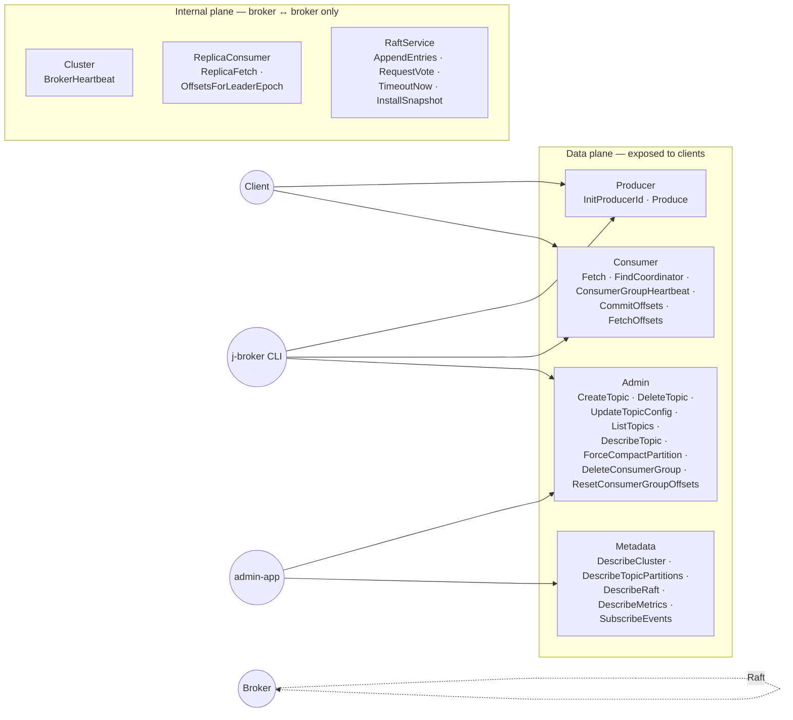

# proto

Single source of truth for every RPC + on-wire record type in the cluster. `src/main/proto/*.proto` → generated Java stubs via the `com.google.protobuf` + `io.grpc:protoc-gen-grpc-java` plugins.

## Service surface at a glance



Public services are reachable from any client; internal services are only used between brokers and require mTLS in production deployments.

## Services

| Service | File | Consumers |
|---|---|---|
| `Producer` | `broker.proto` | Client produce path — `InitProducerId`, `Produce`. |
| `Consumer` | `broker.proto` | Client fetch path — `Fetch`, `FindCoordinator`, `ConsumerGroupHeartbeat`, `CommitOffsets`, `FetchOffsets`. |
| `Admin` | `broker.proto` | `CreateTopic`, `DeleteTopic`, `UpdateTopicConfig`, `ListTopics`, `DescribeTopic`, `ForceCompactPartition`, `DeleteConsumerGroup`, `ResetConsumerGroupOffsets`. |
| `Metadata` | `broker.proto` | `DescribeCluster`, `DescribeTopicPartitions`, `DescribeRaft`, `DescribeMetrics`, `SubscribeEvents`. |
| `Cluster` | `broker.proto` | Broker ↔ broker: `BrokerHeartbeat`. |
| `ReplicaConsumer` | `broker.proto` | Leader ↔ follower: `ReplicaFetch`, `OffsetsForLeaderEpoch`. |
| `RaftService` | `raft.proto` | Raft plane: `AppendEntries`, `RequestVote`, `TimeoutNow`, `InstallSnapshot`. |

## Wire format conventions

- JSON rendered by `admin-app` is **snake_case** (Jackson configured in `admin-app/src/main/resources/application.yml`). Protobuf field names translate 1:1.
- Error envelopes embed an `error_code` int and an optional `hint` map — callers can pull `suggested_leader_id`, `suggested_leader_host`, `suggested_leader_port` for `NOT_LEADER` redirects.
- Offset sentinels: `-1` means "unknown / not yet available" across HWM, LEO, committed_offset, lag. Aggregators that fan out across brokers must merge these explicitly, not mean-average them.

## Build

```bash
./gradlew :proto:generateProto   # one-shot codegen
./gradlew :proto:build           # compile + lint
```

Generated code lives in `proto/build/generated/source/proto/main/java/` — not committed.

## Compat policy

Field numbers never get reused. Bumping a schema field keeps the old number reserved. Breaking changes (renaming services, deleting fields) are avoided in favour of adding new fields and deprecating old ones — see `broker.proto`'s comment blocks for ongoing deprecation markers.
