# raft-core

Pure-Java Raft consensus. Zero IO, zero threads, zero Spring/gRPC — ArchUnit enforces these at build time. The step-function `RaftCore.step(RaftEvent) → List<RaftEffect>` makes the core deterministic and side-effect-free, which is what lets the `simulator/` module exhaustively chaos-test election safety across 10k seeds.

This README walks the Raft algorithm section by section as the paper presents it, and shows where each rule lives in `DefaultRaftCore.java`.

## Architecture

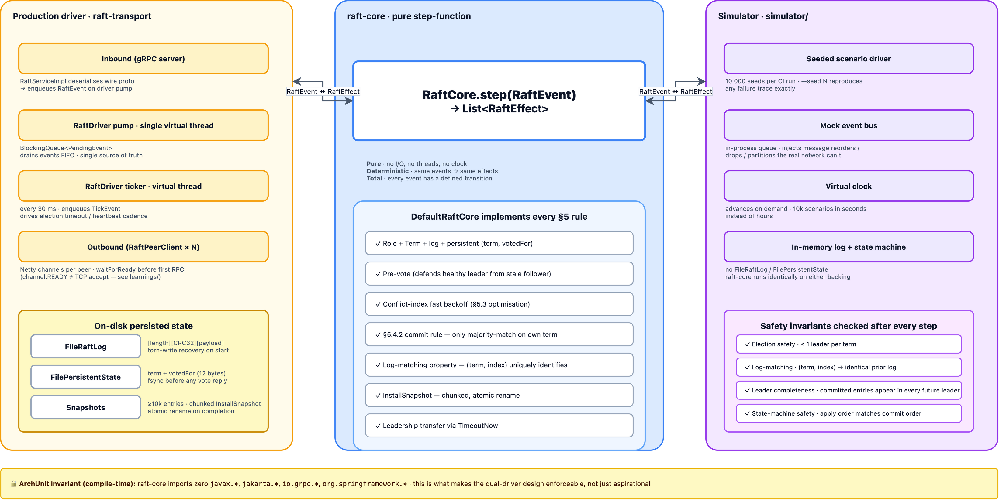

> Source: [`docs/diagrams/raft-architecture.drawio`](../docs/diagrams/raft-architecture.drawio) · regenerate via `python3 scripts/diagrams/generate-raft-architecture.py`.

The same `RaftCore` instance can be driven by either path:

- **Production** (`raft-transport/`) — real gRPC, real timers, fsync'd `FileRaftLog` + `FilePersistentState`, Netty channel readiness checks, chunked `InstallSnapshot`.
- **Simulator** (`simulator/`) — seeded scenario driver, mock event bus, virtual clock, in-memory log + state. Runs 10 000 scenarios per CI in seconds with deterministic reproduction via `--seed N`.

ArchUnit enforces the invariant: `raft-core` cannot import `javax.*`, `jakarta.*`, `io.grpc.*`, or `org.springframework.*`. That compile-time gate is what makes the simulator's coverage trustworthy.

---

# The Raft paper

Diego Ongaro and John Ousterhout, *In Search of an Understandable Consensus Algorithm*, USENIX ATC '14. The canonical short paper:

- **Paper PDF**: <https://raft.github.io/raft.pdf>
- **Extended thesis** (Ongaro, Stanford 2014): <https://github.com/ongardie/dissertation> — adds membership changes, leadership transfer, pre-vote, batching/pipelining.
- **Visualisation**: <https://raft.github.io/> — interactive cluster simulator that's the easiest way to develop intuition.

The rest of this README follows the section numbering of the short paper. For each rule, "**Paper**:" shows what the paper says (with pseudocode lifted from Figure 2 where applicable), and "**j-broker**:" shows where it lives in our code.

---

## §5.1 Raft basics

### Server roles

**Paper** (§5.1, Figure 4): each server is in exactly one of three states.

```
Follower  ────────► Candidate ────────► Leader
   ▲                    │                  │
   └────────────────────┴──────────────────┘
        higher term observed → step down
```

**j-broker**: `Role` enum has four values — `FOLLOWER`, `PRE_CANDIDATE`, `CANDIDATE`, `LEADER`. `PRE_CANDIDATE` is the pre-vote intermediate state described in [Optimisations beyond the paper](#optimisations-beyond-the-paper).

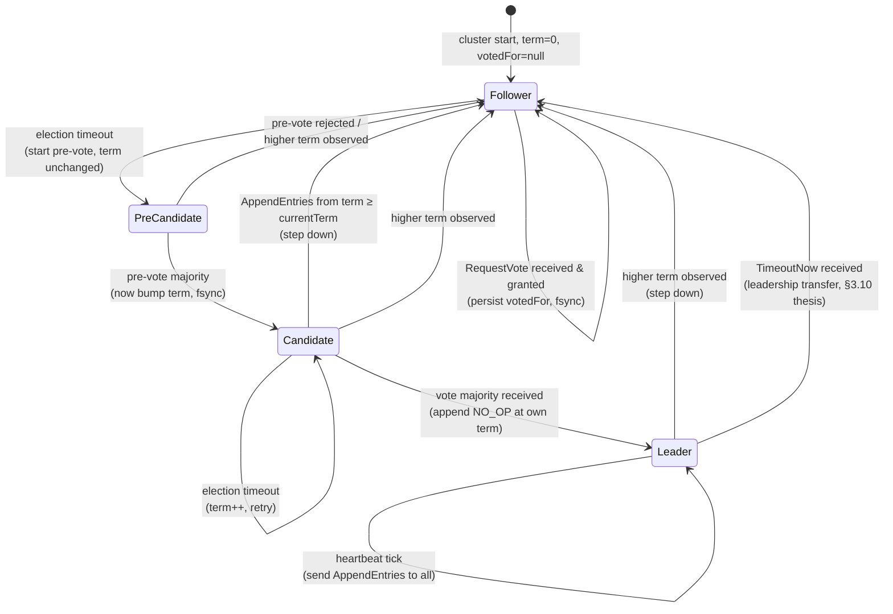

### Persistent and volatile state

**Paper** (Figure 2):

```
Persistent state on all servers
(Updated on stable storage before responding to RPCs):
  currentTerm   latest term server has seen
                (initialized to 0 on first boot, increases monotonically)
  votedFor      candidateId that received vote in current term
                (or null if none)
  log[]         log entries; each entry contains command for state machine
                and term when entry was received by leader (first index is 1)

Volatile state on all servers:
  commitIndex   index of highest log entry known to be committed
                (initialized to 0, increases monotonically)
  lastApplied   index of highest log entry applied to state machine
                (initialized to 0, increases monotonically)

Volatile state on leaders (Reinitialized after election):
  nextIndex[]   for each server, index of the next log entry to send to that server
                (initialized to leader last log index + 1)
  matchIndex[]  for each server, index of highest log entry known to be replicated on server
                (initialized to 0, increases monotonically)
```

**j-broker**:

| Paper field | j-broker location | Notes |
|---|---|---|
| `currentTerm`, `votedFor` | `FilePersistentState.java` | fsync'd before any vote-grant reply |
| `log[]` | `FileRaftLog.java` | append-only, length-prefixed frames, no CRC (sanity-cap recovery) |
| `commitIndex` | `DefaultRaftCore.java:24` (`private long commitIndex`) | volatile field |
| `lastApplied` | implicit — `RaftEffect.ApplyEntries` carries the bound | the state machine outside `raft-core` tracks its own applied watermark |
| `nextIndex[]`, `matchIndex[]` | `DefaultRaftCore.java` (`Map<NodeId, Long>` fields) | leader-only, reinitialised on `becomeLeader` |

### Quorum

**Paper** (§5.1): "Raft uses a heartbeat mechanism to trigger leader election... at any given time each server is in one of three states."

Cluster size determines fault tolerance:

| Cluster size | Quorum (majority) | Tolerates |
|---|---|---|
| 3 | 2 | 1 failure |
| 5 | 3 | 2 failures |
| 7 | 4 | 3 failures |

**j-broker** defaults to 3 (configured via `--voters` or the Helm chart's `broker.replicaCount: 3`). Three is the smallest cluster that tolerates a node loss; odd numbers prevent the "split majority" pathology of partitioned clusters where two halves both believe they're a quorum.

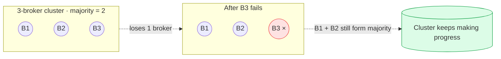

---

## §5.2 Leader election

### RequestVote RPC

**Paper** (Figure 2):

```
RequestVote RPC
(Invoked by candidates to gather votes — §5.2):

  Arguments:
    term            candidate's term
    candidateId     candidate requesting vote
    lastLogIndex    index of candidate's last log entry
    lastLogTerm     term of candidate's last log entry

  Results:
    term            currentTerm, for candidate to update itself
    voteGranted     true means candidate received vote

  Receiver implementation:
    1. Reply false if term < currentTerm (§5.1)
    2. If votedFor is null or candidateId, and candidate's log is at
       least as up-to-date as receiver's log, grant vote (§5.2, §5.4.1)
```

**j-broker**: `DefaultRaftCore.onVoteReq()` (around line 800) implements both rules. The "at least as up-to-date" check is `candidateLogUpToDate(...)` at line 826, lifting paper §5.4.1 verbatim:

```java
private boolean candidateLogUpToDate(long candidateLastIdx, Term candidateLastTerm) {
    long localLast = log.lastIndex();
    Term localLastTerm = log.termAt(localLast).orElse(Term.ZERO);
    int cmp = candidateLastTerm.compareTo(localLastTerm);
    if (cmp != 0) return cmp > 0;             // higher last-term wins
    return candidateLastIdx >= localLast;     // same term: longer log wins
}
```

### Election flow

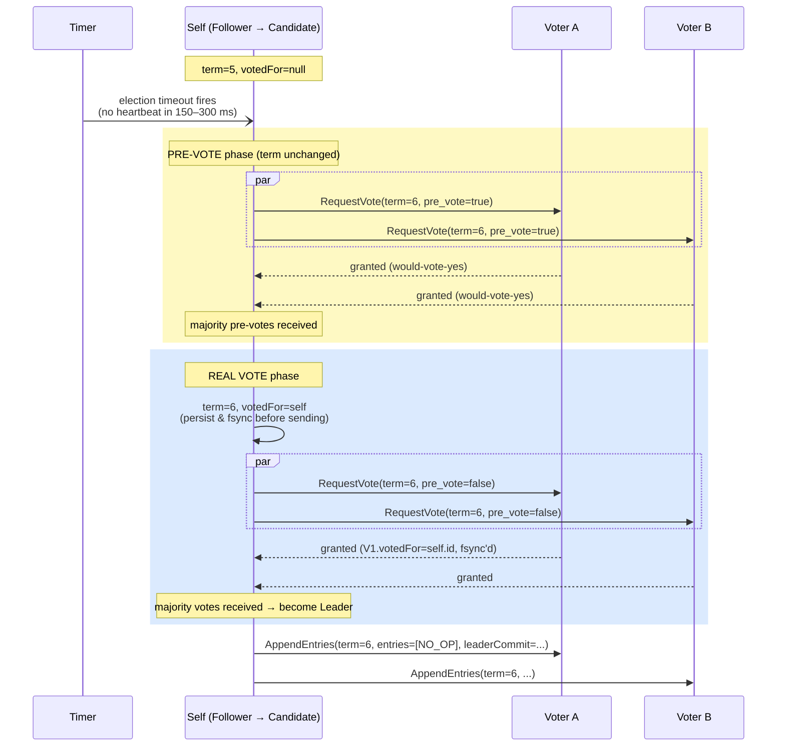

The NO_OP at the new leader's term is a §5.4.2 requirement — see [Safety](#54-safety).

### Split-vote recovery

**Paper** (§5.2): "Raft uses randomized election timeouts to ensure that split votes are rare and that they are resolved quickly."

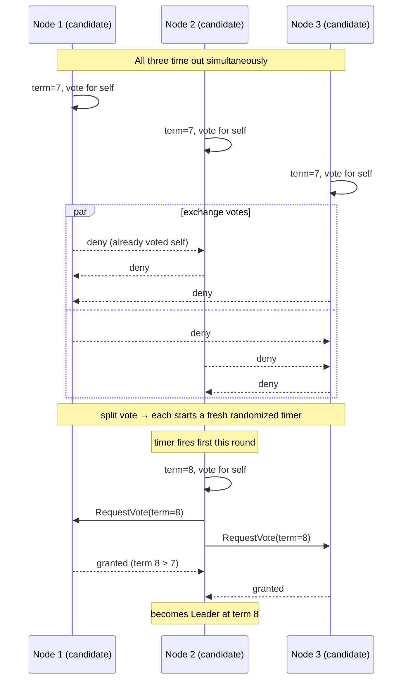

**j-broker**: election timeout is jittered 150–300 ms by default (`RaftConfig`). The randomisation is the only thing preventing perpetual split-vote livelock.

---

## §5.3 Log replication

### AppendEntries RPC

**Paper** (Figure 2):

```
AppendEntries RPC
(Invoked by leader to replicate log entries — §5.3;
 also used as heartbeat — §5.2):

  Arguments:
    term            leader's term
    leaderId        so follower can redirect clients
    prevLogIndex    index of log entry immediately preceding new ones
    prevLogTerm     term of prevLogIndex entry
    entries[]       log entries to store
                    (empty for heartbeat; may send more than one for efficiency)
    leaderCommit    leader's commitIndex

  Results:
    term            currentTerm, for leader to update itself
    success         true if follower contained entry matching prevLogIndex and prevLogTerm

  Receiver implementation:
    1. Reply false if term < currentTerm (§5.1)
    2. Reply false if log doesn't contain an entry at prevLogIndex
       whose term matches prevLogTerm (§5.3)
    3. If an existing entry conflicts with a new one (same index but
       different terms), delete the existing entry and all that follow it (§5.3)
    4. Append any new entries not already in the log
    5. If leaderCommit > commitIndex, set commitIndex = min(leaderCommit, last new entry index)
```

**j-broker**: `DefaultRaftCore.onAppendEntriesReq()` at line 462 implements every step. Plus the conflict-index optimisation: when step 2 fails, the reply carries `(conflictTerm, firstIndexOfConflictTerm)` so the leader can fast-backoff in O(number-of-term-boundaries) instead of O(log-length). See [Optimisations](#optimisations-beyond-the-paper).

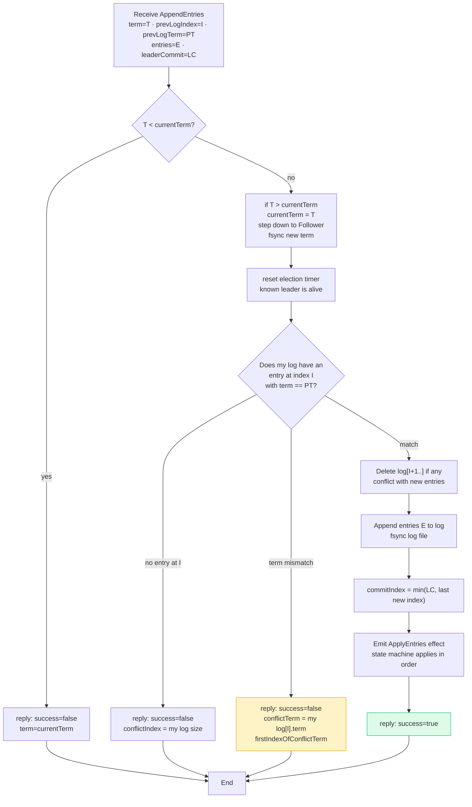

### Log matching property

**Paper** (§5.3, Properties): two key invariants of any Raft log.

```
Log Matching Property:
  (a) If two entries in different logs have the same index and term,
      then they store the same command.
  (b) If two entries in different logs have the same index and term,
      then the logs are identical in all preceding entries.
```

**j-broker**: enforced by the `(prevLogIndex, prevLogTerm)` consistency check on every `AppendEntries` (Figure 2 step 2) plus leader-only writes. Once enforced at every step, the property is what allows the leader to detect divergence with a single pair of fields instead of having to compare entire logs.

---

## §5.4 Safety

### §5.4.1 Election restriction (the up-to-date check)

**Paper** (§5.4.1): "Raft uses the voting process to prevent a candidate from winning an election unless its log contains all committed entries."

```
A candidate must contact a majority of the cluster in order to be elected,
which means that every committed entry must be present in at least one of
those servers. If the candidate's log is at least as up-to-date as any
other log in that majority (where "up-to-date" is defined below), then it
will hold all the committed entries.

"Up-to-date":
  - If the logs have last entries with different terms, then the log
    with the later term is more up-to-date.
  - If the logs end with the same term, then whichever log is longer
    is more up-to-date.
```

**j-broker**: `DefaultRaftCore.candidateLogUpToDate()` at line 826 (shown verbatim above).

Why this matters — the leader-completeness chain:

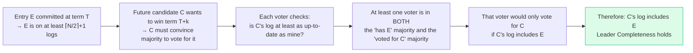

### §5.4.2 Committing entries from previous terms

This is the rule I shipped wrong first.

**Paper** (§5.4.2): "Raft never commits log entries from previous terms by counting replicas. Only log entries from the leader's current term are committed by counting replicas; once an entry from the current term has been committed in this way, then all prior entries are committed indirectly because of the Log Matching Property."

This is the figure-8 scenario. If you commit entries from prior terms based purely on majority-replication, a future leader can overwrite them:

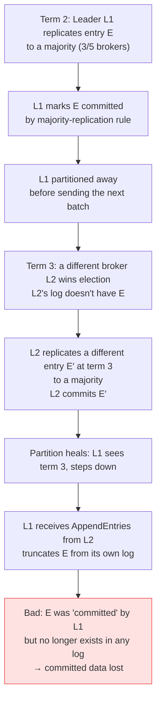

The fix: a leader can only advance `commitIndex` past previous-term entries by virtue of replicating an entry from its own term to a majority. Once an entry from the current term is committed, log-matching guarantees every preceding entry is durable too.

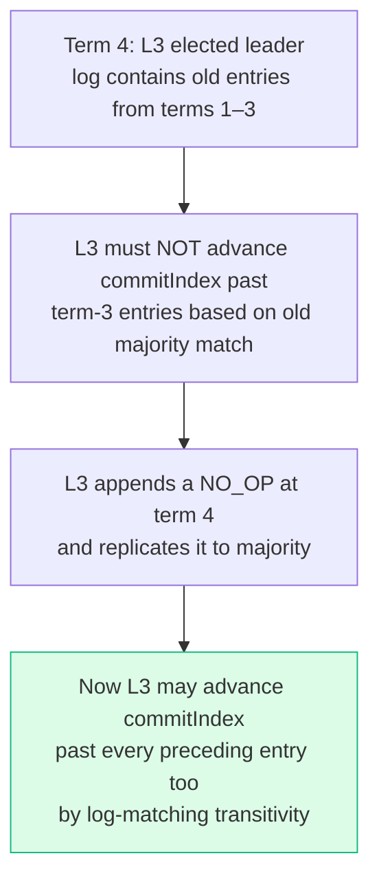

**j-broker** has two pieces of implementation supporting this rule:

1. **NO_OP on election win** (`DefaultRaftCore.java:404-411`):

   ```java
   // Append a NO_OP at the new leader's term (Raft §8 / §5.4.2).
   // Without this, previous-term entries can never commit on a
   // restarted cluster — the commit-safety rule forbids counting
   // replicas for entries whose term != currentTerm. The NO_OP's
   // own commit transitively advances commitIndex past every
   // preceding entry, unlocking apply.
   long noOpIdx = lastIdx + 1;
   var noOp = new LogEntry(noOpIdx, persistentState.currentTerm(),
                            LogEntry.Type.NO_OP, new byte[0]);
   log.append(List.of(noOp));
   ```

2. **Term check on commitIndex advancement** (`DefaultRaftCore.java:639-666`):

   ```java
   private void maybeAdvanceLeaderCommit(List<RaftEffect> effects) {
       var currentTerm = persistentState.currentTerm();
       long lastIdx = log.lastIndex();
       for (long n = lastIdx; n > commitIndex; n--) {
           Term entryTerm = log.termAt(n).orElse(Term.ZERO);
           if (!entryTerm.equals(currentTerm)) {
               continue;                          // §5.4.2: only count own-term entries
           }
           int count = activeVoters.contains(config.selfId()) ? 1 : 0;
           for (var peer : activeVoters) {
               if (peer.equals(config.selfId())) continue;
               if (matchIndex.getOrDefault(peer, 0L) >= n) count++;
           }
           if (count >= quorum()) {
               advanceCommit(n, effects);         // commit transitively pulls predecessors
               break;
           }
       }
   }
   ```

The simulator caught the wrong version of this on a specific seed. After the fix, 10 000 seeds × dozens of scenarios per seed pass the `commit-monotonicity` and `state-machine-safety` invariants every CI run.

---

## §7 Log compaction (snapshots)

**Paper** (§7): "Raft's log grows during normal operation to incorporate more client requests, but in a practical system, it cannot grow without bound." Raft uses snapshots: periodically write the entire current state machine to durable storage, then discard log entries up to that point.

```
InstallSnapshot RPC
(Invoked by leader to send chunks of a snapshot to a follower —
 leaders always send chunks in order):

  Arguments:
    term              leader's term
    leaderId          so follower can redirect clients
    lastIncludedIndex the snapshot replaces all entries up through and including this index
    lastIncludedTerm  term of lastIncludedIndex
    offset            byte offset where chunk is positioned in the snapshot file
    data[]            raw bytes of the snapshot chunk, starting at offset
    done              true if this is the last chunk

  Results:
    term              currentTerm, for leader to update itself

  Receiver implementation:
    1. Reply immediately if term < currentTerm
    2. Create new snapshot file if first chunk (offset is 0)
    3. Write data into snapshot file at given offset
    4. Reply and wait for more data chunks if done is false
    5. Save snapshot file, discard any existing or partial snapshot
       with a smaller index
    6. If existing log entry has same index and term as snapshot's
       last included entry, retain log entries following it and reply
    7. Discard the entire log
    8. Reset state machine using snapshot contents
       (and load snapshot's cluster configuration)
```

**j-broker**: `DefaultRaftCore.onInstallSnapshotReq()` at line 706 + `onInstallSnapshotResp()` at line 775. Triggered when `nextIndex[follower] <= log.lastIncludedIndex()` — i.e. the leader has compacted past what the follower needs.

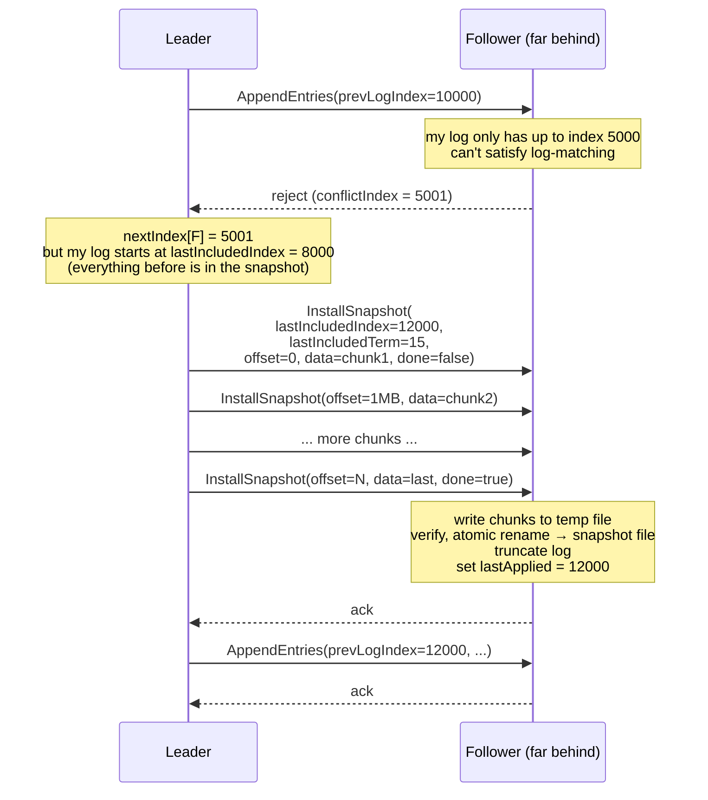

j-broker chunks at 1 MB. The follower writes to a temp file and atomic-renames on completion, so a crash mid-snapshot leaves the prior snapshot intact.

---

## Optimisations beyond the paper

These two optimisations aren't in the short paper but are in the thesis and every production implementation. j-broker has both.

### Pre-vote (Ongaro thesis §9.6)

**Original problem**: a stale follower returning from a network partition will time out, increment its term, and start an election. Other servers see the higher term, step down, and a re-election happens — deposing a perfectly healthy leader for no reason.

**Pre-vote fix**: before incrementing its term, the candidate sends a `RequestVote` with `pre_vote=true`. Other nodes apply the same up-to-date check and reply with whether they *would* grant a vote, but **without updating any state** (no term bump, no `votedFor` write). Only on a pre-vote majority does the candidate actually start a real election.

A stale follower fails the up-to-date check (its log is behind), gets no pre-vote majority, and never disrupts the cluster.

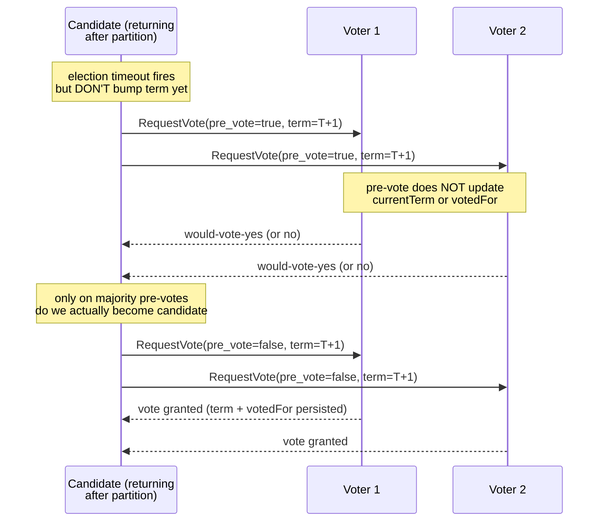

**j-broker**: `Role.PRE_CANDIDATE`, `RaftEvent.PreVoteReq` / `PreVoteResp`, and `DefaultRaftCore.onPreVoteReq()` at line 836. Critical implementation note from the file's own comment: pre-vote receivers do **not** reset their election deadline on grant — early versions did, and that introduced a liveness bug where lost pre-vote responses kept resetting the granter's deadline indefinitely.

### Conflict-index fast backoff (paper §5.3 footnote)

**Original problem**: textbook Raft on `AppendEntries` reject decrements `nextIndex[follower]` by 1 and retries. With a follower 100 000 entries behind, that's 100 000 round-trips to find the divergence point.

**Fast-backoff fix**: the rejecting follower returns `(conflictTerm, firstIndexOfConflictTerm)` along with the rejection. The leader jumps `nextIndex` directly past the conflicting term. Worst case is now bounded by the number of leader changes the follower missed — typically O(1).

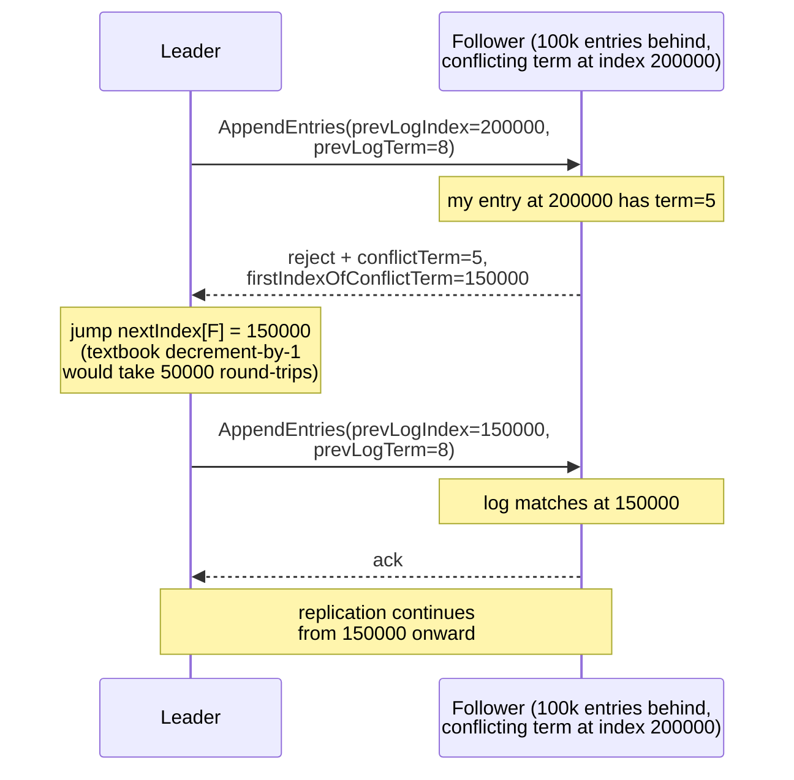

**j-broker**: `RaftEvent.AppendEntriesResp` carries `conflictTerm` + `firstIndexOfConflictTerm`. `DefaultRaftCore.onAppendEntriesResp()` at line 593 uses them to update `nextIndex` directly.

The wrong version of this — "first index *past* the conflicting term" — silently truncates committed entries on certain split-vote paths. The simulator caught it on seed 4127 within the first 1 000 scenarios.

---

## Persistence: what's fsync'd and when

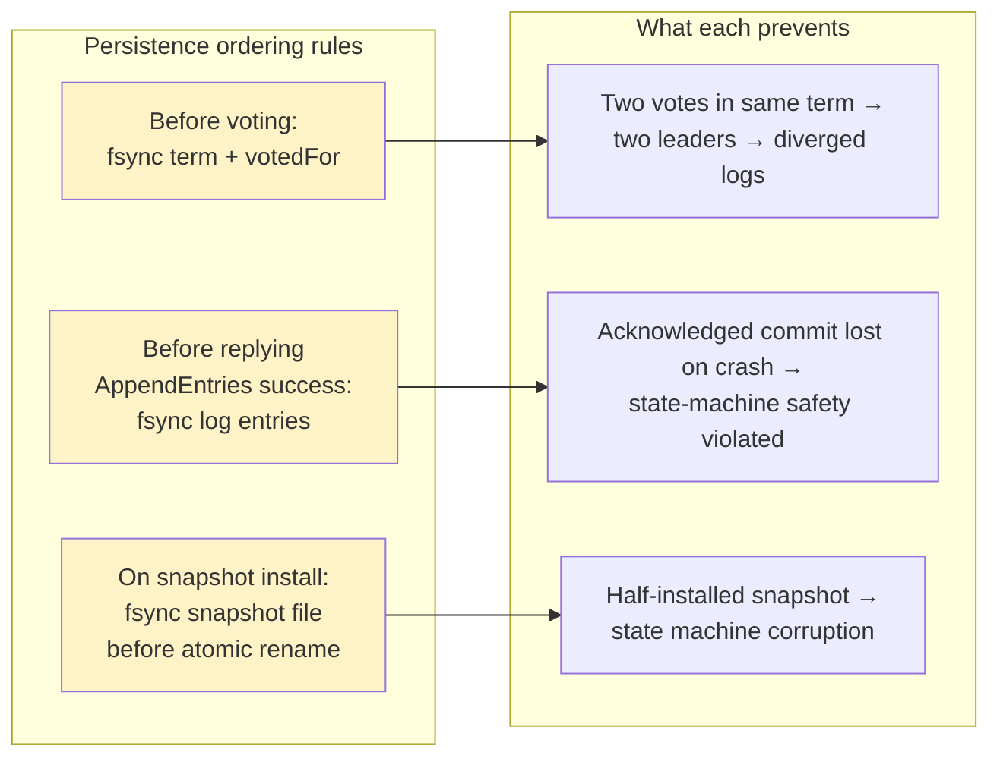

`FilePersistentState.update` calls `channel.force(true)` before returning (`FilePersistentState.java:68`). `FileRaftLog.append` calls it before the `RaftEffect.PersistLog` effect is dispatched, which in turn is before any `RaftEffect.SendAppendEntriesResp` with `success=true` goes back. There are three `force(true)` call sites in `FileRaftLog.java` (lines 187, 249, 285) covering append, truncate, and snapshot install.

The Raft log's frame format is:

```
[int32 length][int64 index][int64 term][int32 type][int32 payloadLen][byte[] payload]
```

No CRC — recovery uses the length prefix sanity-checked against a 64 MiB max-frame cap. Torn writes are dropped on next start; the leader detects the missing entry and replays. (CRC-framed logs do exist in `broker-storage`'s record-batch v2, but that's the data-plane partition log, not the Raft metadata log.)

---

## Common Raft pitfalls

| Pitfall | What goes wrong | j-broker history |
|---|---|---|
| Decrement `nextIndex` by 1 on AppendEntries reject | O(N) round-trips to catch up far-behind followers | Shipped naive version first; replaced with conflict-index fast backoff |
| "Naive commit" rule (majority replication = committed) | Committed entries can be overwritten across term boundaries | Shipped naive version; simulator caught it on a specific seed; fix is the §5.4.2 own-term rule + NO_OP on election |
| Skipping pre-vote | Stale follower returning from partition disrupts a healthy leader | Shipped without pre-vote initially; added once the disruption showed up in cluster tests |
| Pre-vote granter resets election deadline on grant | Lost pre-vote responses keep the granter from running its own election → liveness loss | Caught on CI; fix is *no state mutation* on pre-vote grant. Documented in `DefaultRaftCore.onPreVoteReq` |
| `synchronized` blocks on hot paths (in driver / state machine) | Pins virtual thread carriers, kills throughput | Shipped with `synchronized` on Log/LogSegment; switched to `ReentrantLock` once JFR showed the pinning |
| TCP accept ≠ gRPC channel ready | First election RPCs arrive before HTTP/2 handshake completes; first vote lost | Caught while stabilising first cluster bring-up; fix is `channel.getState(true) == READY` |
| Follower-originated proposals | Silently dropped — only leader can propose | Wasted two days on a Raft-log-based broker liveness scheme before switching to point-to-point heartbeats |
| Single-vote elections (no `currentTerm` fsync) | Crash between vote-grant and reply leaves the node free to vote again in the same term | Caught early — `FilePersistentState` was fsync-from-day-one |

---

## Modules & key types

| Type | Purpose |
|---|---|
| `RaftCore` | The step function. Takes events, returns effects. No side-channel state. |
| `DefaultRaftCore` | Production implementation — all the §5 rules, leadership transfer, pre-vote, snapshots. |
| `RaftLog` | Abstract log; `FileRaftLog` is the on-disk implementation with length-prefixed frames. |
| `FilePersistentState` | fsync'd `currentTerm` + `votedFor` + last-snapshot metadata. |
| `NodeId`, `Role`, `RaftEvent`, `RaftEffect`, `Term`, `LogEntry` | Value types surfacing through the step API. Records, sealed interfaces. |

---

## Architectural invariants (ArchUnit)

Enforced by `raft-core/src/test/java/.../ModuleBoundaryTest.java`:

- `raft-core` imports no `org.springframework..`
- `raft-core` imports no `io.grpc..`
- `raft-core` imports no `jakarta..`

All I/O stays behind the `RaftLog` / `PersistentState` interfaces. The simulator depends on this to substitute in-memory implementations.

---

## Testing

- ~80 unit tests across election safety, log-matching, conflict-index backoff, commit rule, snapshot install + truncate.
- Property tests (jqwik) cover log-matching invariants across random insert/truncate sequences.
- `simulator/` drives `RaftCore` with deterministic seeded chaos across 10k scenarios per CI run, checking the four invariants from `Invariants.java`:
  - **Election safety** — at most one leader per term.
  - **State-machine safety** — no two nodes apply different entries at the same index.
  - **Log matching** — if two logs have an entry at the same `(index, term)`, every preceding entry matches.
  - **Commit monotonicity** — a node's committed entry at some index is never replaced.

---

## Further reading

- **Raft paper** — <https://raft.github.io/raft.pdf> (read §5.4.2 carefully if nothing else).
- **Raft thesis** — <https://github.com/ongardie/dissertation> (membership changes, pre-vote, leadership transfer, batching).
- **Visualisation** — <https://raft.github.io/> (interactive cluster simulator).
- **TLA+ spec** — <https://github.com/ongardie/raft.tla> (formal model).
- **etcd's Raft** — <https://github.com/etcd-io/raft> (reference production-grade Go implementation).
- **CockroachDB on Raft** — blog series, particularly the "Living Without Atomic Clocks" and "How to Make a Raft Implementation" posts.
- **j-broker `simulator/`** — the deterministic chaos harness that catches Raft bugs in seconds instead of months.
