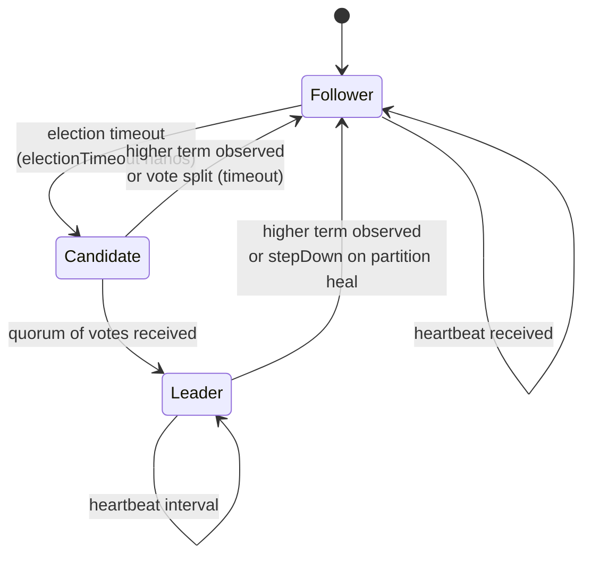

# raft-core

Pure-Java Raft consensus. Zero IO, zero threads, zero Spring/gRPC — ArchUnit enforces these at build time. The step-function `RaftCore.step(RaftEvent) → List<RaftEffect>` makes the core deterministic and side-effect-free, which is what lets the `simulator/` module exhaustively chaos-test election safety across 10k seeds.

## State machine

## Key design decisions

- **Pure step-function** — `RaftCore.step(RaftEvent) → List<RaftEffect>`. The event loop and I/O live in `raft-transport`'s `RaftDriver`; the core is deterministic, which made the chaos simulator trivial.
- **Pre-vote** — candidates issue `pre_vote=true` `RequestVote` before incrementing their term. Stale nodes can't disrupt a healthy leader by forcing re-elections.
- **Conflict-index fast backoff** — on `AppendEntries` rejection, follower returns the first index of its conflicting term. Leader jumps `nextIndex[peer]` there directly instead of decrementing by 1 ().
- **Commit rule §5.4.2** — leader only advances `commitIndex` by majority-match on entries of *its own term*. Prevents overwrite of already-committed entries after a term change.
- **fsync'd persistent state** — `currentTerm` and `votedFor` are flushed to disk before any outbound `RequestVote` reply. `FilePersistentState` uses a checksum-prefixed length-framed format; torn writes are recovered by skipping the incomplete trailing frame.
- **Install-snapshot** — `DefaultRaftCore` supports chunked `InstallSnapshot` RPCs so a far-behind follower can bootstrap from the leader's latest snapshot instead of streaming the full log.

## Modules & key types

| Type | Purpose |
|---|---|
| `RaftCore` | The step function. Takes events, returns effects. No side-channel state. |
| `DefaultRaftCore` | Production implementation — all the §5 rules, leadership transfer, pre-vote, snapshots. |
| `RaftLog` | Abstract log; `FileRaftLog` is the on-disk implementation with checksummed framing. |
| `FilePersistentState` | fsync'd `currentTerm` + `votedFor` + last-snapshot metadata. |
| `NodeId`, `Role`, `RaftEvent`, `RaftEffect` | Value types surfacing through the step API. |

## Architectural invariants (ArchUnit)

- `raft-core` imports no `javax.*`, `jakarta.*`, `io.grpc.*`, or `org.springframework.*`.
- All I/O stays behind the `RaftLog` / `PersistentState` interfaces.

## Testing

- ~80 unit tests across election safety, log-matching, conflict-index backoff, commit-rule, snapshot install + truncate.
- Property tests (jqwik) cover log-matching invariants across random insert/truncate sequences.
- `simulator/` drives `RaftCore` with deterministic seeded chaos across 10k scenarios per run.
