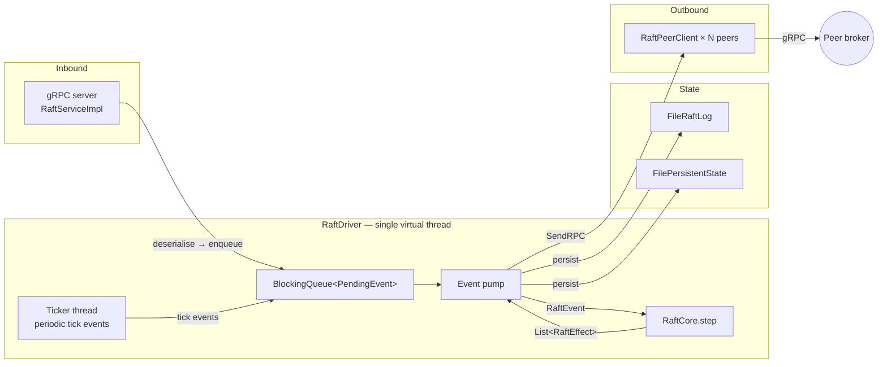

# raft-transport

The gRPC shell around `raft-core`. Responsible for turning the pure step-function into a live cluster: hosting the Raft peer RPC server, dialing peers, and running the event loop that feeds `RaftCore.step` with timer / inbound-RPC / apply-response events.

## Event-loop architecture

All state mutations happen on the pump thread. gRPC handlers are synchronous — they submit a request event and await a response future, so the core stays single-threaded without callbacks.

## Key types

| Type | Purpose |
|---|---|
| `RaftDriver` | The event loop. Pulls from a bounded queue, calls `RaftCore.step`, dispatches emitted `RaftEffect`s (send RPC, reset timer, persist state). Single virtual thread — no shared mutable state with outside callers. |
| `RaftPeerClient` | Outbound gRPC client for `AppendEntries`, `RequestVote`, `TimeoutNow`, `InstallSnapshot`, `Propose`. |
| `RaftGrpcService` | Inbound gRPC service. Translates wire proto into `RaftEvent`s the driver enqueues. |
| `RaftMessageCodec` | Wire ↔ `RaftEvent`/`RaftEffect` translation shared by client and service. |
| `TlsConfig`, `TlsContexts` | mTLS bundle (`jbroker.tls`). Optional — brokers without TLS configured get a plain Netty channel. |

## Propose forwarding

A node that receives a local propose while not leader forwards the payload to the node it believes is leader (`Raft.Propose`), instead of silently dropping it — background proposers live on whatever broker owns a partition (ISR flips, leadership drains) and would otherwise freeze whenever that broker is not also the Raft leader. Hops are counted and capped, bounding ping-pong during leadership churn; a propose reply means "enqueued", never "committed" — callers own retries, and duplicate commits are tolerated by design (partition changes are CAS-guarded, producer-id assignment is idempotent under replay).

## Why separate from raft-core

The same `RaftCore` instance is driven by both `RaftDriver` (production) and the deterministic simulator. Extracting I/O into `raft-transport` means the core has no dependency on gRPC, no thread affinity, no time source — every non-determinism gets injected as an event.

## Architectural invariants (ArchUnit)

- `raft-transport` can import `raft-core` but `raft-core` cannot import `raft-transport`.
- No Spring dependency — brokers wire it by hand in `broker-app`.

## Testing

- ~10 tests for the event-loop plumbing: RPC deserialisation, effect dispatch, queue back-pressure.
- Broker-app ITs run real 3-node clusters against this transport; see `integration-tests/README.md`.
