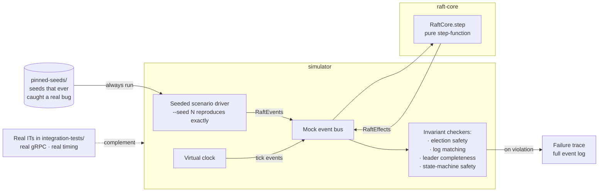

# simulator

Deterministic Raft chaos simulator. Drives `raft-core`'s `RaftCore.step` with seeded random scenarios — node crashes, network partitions, message drops, message reorders — and asserts safety invariants never fire.

## Architecture



The pure step-function design in `raft-core` is what enables this: no I/O, no threads, no clock, so the entire scenario state space is deterministic given a seed. 10k seeds run in seconds; a real-cluster IT alternative would take hours and still miss reorderings the simulator can exercise directly.

## What it checks

Across 10k seeded scenarios per CI run:
- **Election safety** — at most one leader per term.
- **Log-matching** — two logs with the same (term, index) entry agree on every prior entry.
- **Leader-completeness** — any committed entry is present in the log of every future leader.
- **State-machine safety** — followers apply entries in commit order.

## Why separate from integration-tests

Integration tests boot real `Broker` JVMs with real gRPC and real timing — they catch deployment-reality bugs but are slow and non-deterministic. The simulator runs `RaftCore` directly with a mock event bus and virtual clock, which is:
- **Fast** — 10k scenarios in seconds instead of hours.
- **Deterministic** — every run reproduces from `--seed N`.
- **Comprehensive** — can exercise impossible-in-real-life edge cases like reordering messages inside the network buffer, or dropping a single AppendEntries while delivering the rest.

This split is what the pure step-function design in `raft-core` (no IO, no threads, no clock) exists to enable.

## Running

```bash
./gradlew :simulator:test               # 10k scenarios, random seeds
./gradlew :simulator:test --seed 42     # reproduce one seed
```

A failed seed prints the full event trace leading to the invariant violation so you can replay it in the `raft-core` debugger.

## Counterexample archive

Seeds that ever surfaced real bugs get pinned in `simulator/src/test/resources/pinned-seeds/` so regressions land as clean failures instead of slipping back in.
