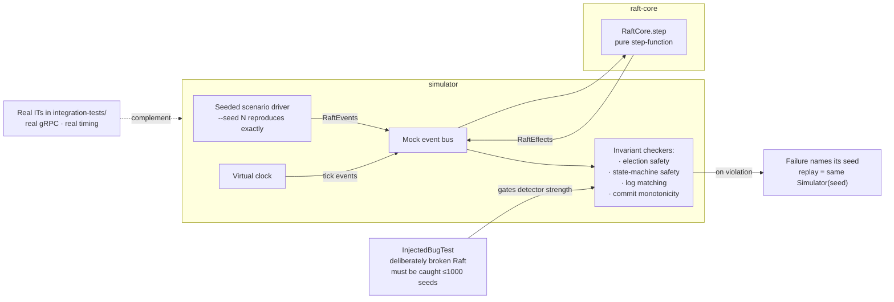

# simulator

Deterministic Raft chaos simulator. Drives `raft-core`'s `RaftCore.step` with seeded random scenarios — node crashes, network partitions, message drops, message reorders — and asserts safety invariants never fire.

## Architecture



The pure step-function design in `raft-core` is what enables this: no I/O, no threads, no clock, so the entire scenario state space is deterministic given a seed. 10k seeds run in seconds; a real-cluster IT alternative would take hours and still miss reorderings the simulator can exercise directly.

## What it checks

Across 10k seeded scenarios per CI run (`ChaosSoakTest` under message loss/duplication, `MembershipSoakTest` under config churn), the four invariants from `Invariants.java`:
- **Election safety** — at most one leader per term.
- **State-machine safety** — no two nodes apply different entries at the same index.
- **Log matching** — two logs with the same (index, term) entry agree on every prior entry.
- **Commit monotonicity** — a node's committed entry at some index is never replaced.

## Why separate from integration-tests

Integration tests boot real `Broker` JVMs with real gRPC and real timing — they catch deployment-reality bugs but are slow and non-deterministic. The simulator runs `RaftCore` directly with a mock event bus and virtual clock, which is:
- **Fast** — 10k scenarios in seconds instead of hours.
- **Deterministic** — every run reproduces from `--seed N`.
- **Comprehensive** — can exercise impossible-in-real-life edge cases like reordering messages inside the network buffer, or dropping a single AppendEntries while delivering the rest.

This split is what the pure step-function design in `raft-core` (no IO, no threads, no clock) exists to enable.

## Running

```bash
./gradlew :simulator:test   # seeds 1..10,000 under chaos + membership churn
```

The seed range is fixed, so every CI run covers the same scenario space. A violation fails with the offending seed in the assertion message; reproduce it by constructing `new Simulator(seed, nodes, chaos)` with that seed in a scratch test and stepping it under the `raft-core` debugger — same seed, same event order, every time.

## Detector strength

`InjectedBugTest` keeps the checkers honest: it runs a deliberately broken Raft (persists `currentTerm` but drops `votedFor` — a node can vote twice in one term) and asserts the invariants catch it within 1000 seeds. Bugs the simulator found in the real implementation were fixed and then pinned as deterministic unit tests in `raft-core` (see the conflict-index and commit-rule entries in that README's pitfalls table), so regressions land as clean failures.
